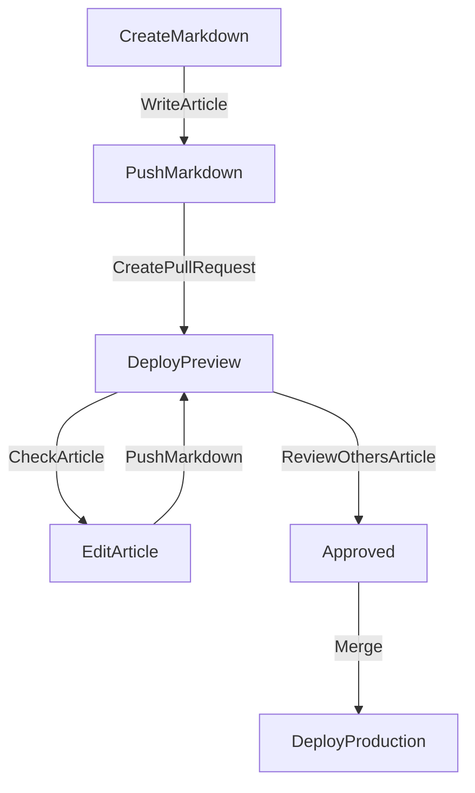

# Blog

> Super powerfully all-packaged blog system 

[](https://twitter.com/intent/tweet?text=LikeThis:&url=https%3A%2F%2Fblog.tubone-project24.xyz)
[](https://app.netlify.com/sites/pensive-lamport-5822d2/deploys)
[](https://github.com/tubone24/blog/actions?query=workflow%3ADeployToNetlifyPRD)
[](https://coveralls.io/github/tubone24/blog?branch=master)
[](https://www.codefactor.io/repository/github/tubone24/blog)
[](https://blog-storybook.netlify.app/)
[](https://wakatime.com/badge/github/tubone24/blog)
<a href="https://validator.w3.org/feed/check.cgi?url=https%3A//blog.tubone-project24.xyz/rss.xml"></a>
[](https://blog.tubone-project24.xyz)

## What is this?

This is tubone's Blog by Gatsby and Netlify.

[https://blog.tubone-project24.xyz/](https://blog.tubone-project24.xyz/)


### Templated by?

[Gatsby Starter - Calpa's Blog](https://github.com/calpa/gatsby-starter-calpa-blog)

Special, thanks!

## Features

### Structure

- Gatsby.js v4, Static site generating
  - Use [Preact](https://preactjs.com/), faster than [React](https://ja.reactjs.org/)
  - All Components writen by [TypeScript](https://www.typescriptlang.org/)
  - Use [Bootstrap5](https://getbootstrap.jp/) for CSS Framework
  - Use [Sass(Scss)](https://sass-lang.com/) and Scoped by CSS Modules
  - All articles (Datasource) made by [Markdown](https://www.markdown.jp/what-is-markdown/) and save to this repository
- For Search Engine Optimization, generate header meta tag and [OGP](https://www.popwebdesign.net/what-is-ogp.html)
- High Performance, [purge CSS](https://purgecss.com/) to [Bootstrap5](https://getbootstrap.jp/), optimise SVG and minify HTML, CSS and JS
- Use [Google Analytics v4](https://support.google.com/analytics/answer/10089681?hl=ja)
- Site inner searching by [Algolia search](https://www.algolia.com/)
- Code syntax highlighting by [Prism.js](https://prismjs.com/)
- [PWA](https://developer.mozilla.org/ja/docs/Web/Progressive_web_apps) Support, and prefetch page-data.json
- Deploy [Netlify](https://www.netlify.com/)
  - Managed by [Terraform Cloud](https://cloud.hashicorp.com/products/terraform) for Netlify settings
- Image hosted by [imgur](https://imgur.com)
- Use [Gitalk](https://gitalk.github.io/) for blog comment system
- Icons used by [Fontawesome](https://fontawesome.com/), and optimised to [Icomoon](https://icomoon.io/)
- Sitemap generate
- RSS feed generate
- Compliant with [a11y](https://waic.jp/docs/WCAG20/Overview.html), top page Lighthouse's accessibility score is 100!
- Use [Sentry](https://sentry.io/welcome/) for detecting error and check performance

### For Developer

- Use [ESLint](https://eslint.org/) and [stylelint](https://stylelint.io/) for lint codes
- Use [EditorConfig](https://editorconfig.org/) formatting and indent
- Use [husky](https://typicode.github.io/husky/#/) run linter before git commit and push
- Use [Jest](https://jestjs.io/ja/) and [React Testing Library](https://testing-library.com/docs/react-testing-library/intro/) for Unit and React Component testing
- Use [Snapshot tests](https://storybook.js.org/docs/react/writing-tests/snapshot-testing) for Snapshot tests
- Use [Cypress](https://www.cypress.io/) for End-To-End testing
- Components managed by [Storybook](#storybook)
  - Generate all preview-deploy and production-deploy
- Each production-deploy is measured by [Lighthouse](#Lighthouse) and [reports](https://tubone24.github.io/blog/lh/report.html) are output
- Each production-deploy is measured by [Bundle Analyzer](#bundle-analyzer) and [reports](https://tubone24.github.io/blog/ba/index.html) are output
- unused dependencies check by [depcheck](https://www.npmjs.com/package/depcheck) in [depcheck_action](https://github.com/tubone24/depcheck_action)
- Update dependencies by [Renovate](https://www.whitesourcesoftware.com/free-developer-tools/renovate/)
- Detect browser's memory leaks by [memlab](https://github.com/facebookincubator/memlab)

### For contributor of articles

- Post articles in `/src/content/*.md`, and Create [GitHub Pull Request](https://docs.github.com/ja/pull-requests/collaborating-with-pull-requests/proposing-changes-to-your-work-with-pull-requests/about-pull-requests) to master branch
  - Deploy netlify in preview environment and check your articles
- Or use [Netlify CMS](https://www.netlifycms.org/) in `/admin/`
- Use [textlint](#textlint) before merge master by GitHub Actions



## How to develop?

### Running at local

Run **at local**, execute commands below, and access [http://localhost:8000](http://localhost:8000)

```
$ yarn install
$ yarn start
```

### Build

Or Build Artifact, execute commands below

```
yarn build
```

### lint, format codes

Fix your code format by [TSC](https://www.typescriptlang.org/docs/handbook/compiler-options.html), [ESLint](https://eslint.org/) and  [stylelint](https://stylelint.io/)

```
yarn typecheck
yarn format:fix
yarn format-style:fix
```

You can also fix YAML format by [yamllint](https://github.com/adrienverge/yamllint)

```
yarn format-yml
```

### Testing

Testing React Component and Unit testing, execute commands below

And also, you can test Storybook Snapshot test!

```
yarn test
yarn test:storybook
yarn test:e2e
```

If you want to check testing coverage, execute commands below

```
yarn test:cov
```

### Cleaning

If you error occurred on gatsby build, execute commands below

```
> Error loading a result for the page query in "/". Query was not run and no cached result was found.

yarn clean
```

Also, you want to clean dependencies, execute commands below

```
yarn clean-all
```

### Update Browsers List

This project use Browsers List, so you can update it

```
yarn browserslist:update
```

### benchmark (Lighthouse)

If you want to check benchmark, you can use Lighthouse script below

```
yarn benchmark "https://blog.tubone-project24.xyz" $(git rev-parse HEAD)
```

### Storybook

If you want to check storybook, execute commands below

```
yarn storybook
```

### memlab

If you want to detect browser's memory leaks, you can use memlab script below

```
yarn memlab
```

Or if you want to test against a specific URL, set an environment variable.

```
URL=https://63ad31c571f88e60f37399ec--pensive-lamport-5822d2.netlify.app yarn memlab
```

## Environment variables

Copy `.env.example` to create the `.env` file

```
cp .env.example .env
```

| Key                              | Description                                              | Default |
|----------------------------------| -------------------------------------------------------- | ------- | 
| GATSBY_ALGOLIA_ADMIN_API_KEY     | Algolia search's ADMIN API KEY, use index post content   | -       | 
| GATSBY_ALGOLIA_APP_ID            | Algolia search's APP ID                                  | -       | 
| GATSBY_ALGOLIA_INDEX_NAME        | Algolia search's index name                              | posts   | 
| GATSBY_ALGOLIA_SEARCH_API_KEY    | Algolia search's search API KEY, use view search on site | -       | 
| STORYBOOK_ALGOLIA_APP_ID         | Algolia search's ADMIN API KEY, use index post content   | -       | 
| STORYBOOK_ALGOLIA_INDEX_NAME     | Algolia search's APP ID                                  | posts   | 
| STORYBOOK_ALGOLIA_SEARCH_API_KEY | Algolia search's index name                              | -       | 
| GATSBY_GITHUB_CLIENT_ID          | GitHub oAuth Client ID, use Gitalk                       | -       | 
| GATSBY_GITHUB_CLIENT_SECRET      | GitHub oAuth Client Secret, use Gitalk                   | -       | 
| FAUNADB_SERVER_SECRET            | FaunaDB's Secret, use FaunaDB                            | -       | 

## CI/CD

This repository uses [GitHub Actions](https://github.co.jp/features/actions) as CI. There are two workflows, one for preview deployments and one for production deployments.

[](https://github.com/tubone24/blog/actions?query=workflow%3ADeployToNetlifyPreview)
[](https://github.com/tubone24/blog/actions?query=workflow%3ADeployToNetlifyPRD)

## Code with Codesandbox

Use the button below to code with the blog system:

[](https://codesandbox.io/s/github/tubone24/blog/tree/master/)

## Storybook

The components used in my blog are managed using Storybook.

<https://blog-storybook.netlify.app/>


## Lighthouse

After production deploy, Run and report Lighthouse.


<https://tubone24.github.io/blog/lh/report.html>

Also, create PR, Check Lighthouse score via [pagespeedapi.runpagespeed](https://developers.google.com/speed/docs/insights/rest/v5/pagespeedapi/runpagespeed) and Comment your PR.


## Bundle Analyzer

After production deploy, Run and report Bundle Analyzer.

<https://tubone24.github.io/blog/ba/index.html>

## Deploy at Netlify

Push the button below.

[](https://app.netlify.com/start/deploy?repository=https://github.com/tubone24/blog)

## textlint

I use [textlint](https://textlint.github.io/) to proofread my blog text.

```
yarn textlint
```

## Change Netlify Config

Use Terraform Cloud to change Netlify configuration values.

[Workspace](https://app.terraform.io/app/tubone24-test/workspaces/blog)

## Detect credentials leak

[Gitguardian](https://www.gitguardian.com/)

## Alert monitoring

Use [Sentry](https://sentry.io/organizations/tubone-project24/projects/)

## Automatic security vulnerability

[Brightsec](https://brightsec.com/)

# License

- The source code under the MIT LICENSE.
- `src/content` under the CC-BY [](http://creativecommons.org/licenses/by/4.0/)

[tubone boyaki]: https://blog.tubone-project24.xyz  "tubone boyaki"
