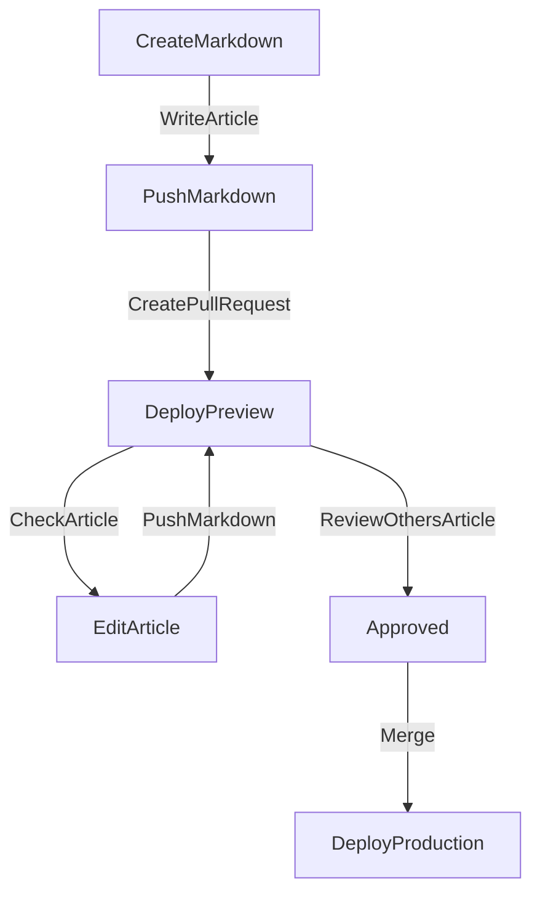

# Blog

> Super powerfully all-packaged blog system

[](https://twitter.com/intent/tweet?text=LikeThis:&url=https%3A%2F%2Ftubone-project24.xyz)
[](https://github.com/tubone24/blog/releases/latest)
[](https://app.netlify.com/sites/pensive-lamport-5822d2/deploys)
[](https://github.com/tubone24/blog/actions?query=workflow%3ADeployToNetlifyPRD)
[](https://www.codefactor.io/repository/github/tubone24/blog)
[](https://blog-storybook.netlify.app/)
[](https://wakatime.com/badge/github/tubone24/blog)
<a href="https://validator.w3.org/feed/check.cgi?url=https%3A//tubone-project24.xyz/rss.xml"></a>

[](https://tubone-project24.xyz)
[](https://www.buymeacoffee.com/tubone24)
[](https://github.com/tubone24/blog/blob/master/CONTRIBUTING.md)

## What is this?

This is tubone's Blog built with **Astro 5** and deployed on Netlify.

[https://tubone-project24.xyz/](https://tubone-project24.xyz/)

> Migrated from Gatsby 5 to Astro 5 in March 2026.

## Preview

[Screenshots](https://github.com/tubone24/blog/tree/screenshot) from the last deployment on the master branch.

### Desktop

Width 1200px


### Mobile

Width 400px


## Features

### Structure

- [Astro 5](https://astro.build/), Static site generating
  - Use [React 18](https://react.dev/) via [@astrojs/react](https://docs.astro.build/en/guides/integrations-guide/react/) for interactive components
  - All Components written in [TypeScript](https://www.typescriptlang.org/)
  - Use [Bootstrap 5](https://getbootstrap.jp/) for CSS Framework
  - Use [Sass (SCSS)](https://sass-lang.com/) and Scoped by CSS Modules
  - All articles managed by [Astro Content Collections](https://docs.astro.build/en/guides/content-collections/) in Markdown
- Markdown processing with rehype/remark plugins
  - [rehype-prism-plus](https://github.com/timlrx/rehype-prism-plus) for code syntax highlighting
  - [rehype-slug](https://github.com/rehypejs/rehype-slug) + [rehype-autolink-headings](https://github.com/rehypejs/rehype-autolink-headings) for heading anchors
  - [rehype-external-links](https://github.com/rehypejs/rehype-external-links) for external link attributes
  - [remark-toc](https://github.com/remarkjs/remark-toc) for table of contents generation
  - Custom rehype plugin for lazy image loading
- SEO: meta tags, [OGP](https://ogp.me/), Schema.org structured data
- [Google Analytics v4](https://support.google.com/analytics/answer/10089681?hl=ja)
- Site search by [Algolia](https://www.algolia.com/)
- Deploy on [Netlify](https://www.netlify.com/)
  - Managed by [Terraform Cloud](https://cloud.hashicorp.com/products/terraform) for Netlify settings
- Image hosted by [imgur](https://imgur.com)
- OGP with dynamic Twitter card image generation
- [Gitalk](https://gitalk.github.io/) for blog comment system
- Icons by [Fontawesome](https://fontawesome.com/), optimised with [Icomoon](https://icomoon.io/)
- Custom sitemap generation (`src/pages/sitemap.xml.ts`)
- RSS feed generation (`src/pages/rss.xml.ts`)
- [Sentry](https://sentry.io/welcome/) for error detection and performance monitoring

### Project Structure

```text
src/
├── content/
│   ├── config.ts          # Astro Content Collections config
│   └── blog/              # Markdown articles
├── layouts/
│   └── Layout.astro       # Common layout with SEO
├── pages/
│   ├── index.astro        # Home
│   ├── [...slug].astro    # Article pages
│   ├── tags.astro         # Tag list
│   ├── tag/[tag]/         # Tag filtered list
│   ├── [year]/            # Yearly/monthly summary
│   ├── pages/[page]/      # Pagination (/pages/2/ etc.)
│   ├── about.astro
│   ├── privacy-policies.astro
│   ├── 404.astro
│   ├── rss.xml.ts
│   └── sitemap.xml.ts
├── components/            # React components
├── lib/                   # rehype plugins etc.
└── styles/global.scss     # Bootstrap imports
```

### For Developer

- Use [ESLint](https://eslint.org/) and [stylelint](https://stylelint.io/) for lint codes
- Use [EditorConfig](https://editorconfig.org/) for formatting and indent
- Use [husky](https://typicode.github.io/husky/#/) to run linter before git commit and push
- Use [Jest](https://jestjs.io/ja/) and [React Testing Library](https://testing-library.com/docs/react-testing-library/intro/) for unit and component testing
- Use [Cypress](https://www.cypress.io/) for End-To-End testing
- Components managed by [Storybook](#storybook)
- Each production deploy is measured by [Lighthouse](#lighthouse) and [reports](https://tubone24.github.io/blog/lh/report.html) are output
- Update dependencies by [Renovate](https://www.whitesourcesoftware.com/free-developer-tools/renovate/)
- Detect vulnerability by [Snyk](https://app.snyk.io/)
- Capture [some width screenshots](https://github.com/tubone24/blog/tree/screenshot) every PR and push master

### For contributor of articles

- Post articles in `/src/content/blog/*.md`, and Create [GitHub Pull Request](https://docs.github.com/ja/pull-requests/collaborating-with-pull-requests/proposing-changes-to-your-work-with-pull-requests/about-pull-requests) to master branch
  - Deploy netlify in preview environment and check your articles
- Use [textlint](#textlint) before merge master by GitHub Actions


```mermaid
flowchart TB
CreateMarkdown -->|WriteArticle| PushMarkdown
PushMarkdown --->|CreatePullRequest| DeployPreview
EditArticle --->|PushMarkdown| DeployPreview
DeployPreview --->|CheckArticle| EditArticle
DeployPreview --->|ReviewOthersArticle| Approved
Approved --->|Merge| DeployProduction
```

## How to develop?

### Running at local

Run **at local**, execute commands below, and access [http://localhost:4321](http://localhost:4321)

```sh
yarn install
yarn start
```

### Build

Build artifact, execute commands below. Output goes to `dist/` directory.

```sh
yarn build
```

### lint, format codes

Fix your code format by [TSC](https://www.typescriptlang.org/docs/handbook/compiler-options.html), [ESLint](https://eslint.org/) and [stylelint](https://stylelint.io/)

```sh
yarn typecheck
yarn format:fix
yarn format-style:fix
```

You can also fix YAML format by [yamllint](https://github.com/adrienverge/yamllint)

```sh
yarn format-yml
```

### Testing

Testing React Component and Unit testing, execute commands below

```sh
yarn test
yarn test:e2e
```

If you want to check testing coverage, execute commands below

```sh
yarn test:cov
```

### Cleaning

If you encounter build errors, execute commands below

```sh
yarn clean
```

Also, to clean dependencies:

```sh
yarn clean-all
```

### Update Browsers List

This project uses Browsers List, so you can update it

```sh
yarn browserslist:update
```

### benchmark (Lighthouse)

If you want to check benchmark, you can use Lighthouse script below

```sh
yarn benchmark "https://tubone-project24.xyz" $(git rev-parse HEAD)
```

### Storybook

If you want to check storybook, execute commands below

```sh
yarn storybook
```

## Environment variables

Copy `.env.example` to create the `.env` file

```sh
cp .env.example .env
```

| Key                              | Description                                              | Default |
|----------------------------------|----------------------------------------------------------|---------|
| PUBLIC_ALGOLIA_ADMIN_API_KEY     | Algolia search's ADMIN API KEY, use index post content   | -       |
| PUBLIC_ALGOLIA_APP_ID            | Algolia search's APP ID                                  | -       |
| PUBLIC_ALGOLIA_INDEX_NAME        | Algolia search's index name                              | posts   |
| PUBLIC_ALGOLIA_SEARCH_API_KEY    | Algolia search's search API KEY, use view search on site | -       |
| STORYBOOK_ALGOLIA_APP_ID         | Algolia search's APP ID (for Storybook)                  | -       |
| STORYBOOK_ALGOLIA_INDEX_NAME     | Algolia search's index name (for Storybook)              | posts   |
| STORYBOOK_ALGOLIA_SEARCH_API_KEY | Algolia search's search API KEY (for Storybook)          | -       |
| PUBLIC_GITHUB_CLIENT_ID          | GitHub oAuth Client ID, use Gitalk                       | -       |
| PUBLIC_GITHUB_CLIENT_SECRET      | GitHub oAuth Client Secret, use Gitalk                   | -       |
| FAUNADB_SERVER_SECRET            | FaunaDB's Secret, use FaunaDB                            | -       |

## CI/CD

This repository uses [GitHub Actions](https://github.co.jp/features/actions) as CI. There are two workflows, one for preview deployments and one for production deployments.

[](https://github.com/tubone24/blog/actions?query=workflow%3ADeployToNetlifyPreview)
[](https://github.com/tubone24/blog/actions?query=workflow%3ADeployToNetlifyPRD)

## Storybook

The components used in my blog are managed using Storybook.

<https://blog-storybook.netlify.app/>


## Lighthouse

After production deploy, Run and report Lighthouse.


<https://tubone24.github.io/blog/lh/report.html>

Also, create PR, Check Lighthouse score via [pagespeedapi.runpagespeed](https://developers.google.com/speed/docs/insights/rest/v5/pagespeedapi/runpagespeed) and Comment your PR.


## Deploy at Netlify

Push the button below.

[](https://app.netlify.com/start/deploy?repository=https://github.com/tubone24/blog)

## textlint

I use [textlint](https://textlint.github.io/) to proofread my blog text.

```sh
yarn textlint
```

## Infrastructure

### Change Netlify Config

Use Terraform Cloud to change Netlify configuration values.

[Workspace](https://app.terraform.io/app/tubone24-test/workspaces/blog)

## Alert monitoring

Use [Sentry](https://sentry.io/organizations/tubone-project24/projects/)

## Automatic security and vulnerability check

### Detect credentials leak

There is a security risk of credentials getting into the code, but we use [Gitguardian](https://www.gitguardian.com/) to check each PR to make sure they are not mixed in.

### static code analysis for vulnerability

We use [Snyk](https://app.snyk.io/org/tubone24/project/f01f63e7-832e-45ca-a080-eb4d0da4b8e6) for static code analysis.
In addition to detecting vulnerabilities in the libraries used, we scan code and IaC tools.

If you create PR, check security vulnerability for [snyk CLI](https://docs.snyk.io/snyk-cli) and push PR comment.


## CI Healthy

Last 14 days, CI Score by [meercode.io](https://meercode.io)

### CI Score


### CI Count


### CI Success Rate


## Change log and versioning

This Blog's CHANGELOG integrated [GitHub Releases](https://github.com/tubone24/blog/releases)

And this blog's versioning policy is [semver](https://semver.org/) like `1.0.1`

- MAJOR version when you make incompatible API changes
- MINOR version when you add functionality in a backwards compatible manner or **create articles**.
- PATCH version when you make backwards compatible bug fixes or **update (include delete) articles**.

## License

- The source code under the MIT LICENSE.
- `src/content` under the CC-BY [](http://creativecommons.org/licenses/by/4.0/)
