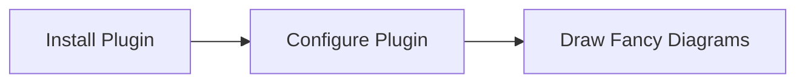

# Test投稿

## Table of Contents

```toc

```

## test

aaaa
bbbb

### Iframe

`youtube:https://www.youtube.com/embed/t54TNjoZ210`

### Twitter

<blockquote class="twitter-tweet"><p lang="ja" dir="ltr">【デレステ4周年カウントダウン】<br>4周年まであと「2日」です！<br>本日は杏仁豆腐先生より、黒埼ちとせちゃん、白雪千夜ちゃん、久川凪ちゃん、久川颯ちゃん、辻野あかりちゃん、砂塚あきらちゃん、夢見りあむちゃんのイラストをいただきました！<a href="https://twitter.com/hashtag/%E3%83%87%E3%83%AC%E3%82%B9%E3%83%86?src=hash&amp;ref_src=twsrc%5Etfw">#デレステ</a> <a href="https://twitter.com/hashtag/%E3%83%87%E3%83%AC%E3%82%B9%E3%83%864%E5%91%A8%E5%B9%B4?src=hash&amp;ref_src=twsrc%5Etfw">#デレステ4周年</a> <a href="https://t.co/Y9G7uOB6PV">pic.twitter.com/Y9G7uOB6PV</a></p>&mdash; スターライトステージ (@imascg_stage) <a href="https://twitter.com/imascg_stage/status/1167814328797450241?ref_src=twsrc%5Etfw">August 31, 2019</a></blockquote>

### Code

```javascript{numberLines: 5}{1,5-9}:title=gatsby-config.js
// In your gatsby-config.js
const {
  NODE_ENV,
  URL: NETLIFY_SITE_URL = "https://blog.tubone-project24.xyz",
  DEPLOY_PRIME_URL: NETLIFY_DEPLOY_URL = NETLIFY_SITE_URL,
  CONTEXT: NETLIFY_ENV = NODE_ENV,
  GATSBY_GITHUB_CLIENT_ID,
  GATSBY_GITHUB_CLIENT_SECRET,
  GATSBY_GITHUB_SHA,
} = process.env;
const isNetlifyProduction = NETLIFY_ENV === "production";
const siteUrl = isNetlifyProduction ? NETLIFY_SITE_URL : NETLIFY_DEPLOY_URL;
module.exports = {
  pathPrefix: "/",
  siteMetadata: {
    title: "tubone BOYAKI",
    description: "tubone BOYAKI is a tubone blog",
    siteUrl,
    author: "tubone",
  },
  plugins: [
    "gatsby-plugin-preact",
    "gatsby-plugin-typegen",
    "gatsby-plugin-react-helmet",
    {
      resolve: "gatsby-plugin-react-helmet-canonical-urls",
      options: {
        siteUrl: NETLIFY_SITE_URL,
        noQueryString: true,
      },
    },
    "gatsby-plugin-sass",
    {
      resolve: "gatsby-plugin-minify-classnames",
      options: {
        enable: isNetlifyProduction,
      },
    },
    {
      resolve: `gatsby-plugin-purgecss`,
      options: {
        printRejected: true, // Print removed selectors and processed file names
        develop: true, // Enable while using `gatsby develop`
        // tailwind: true, // Enable tailwindcss support
        // ignore: ['/ignored.css', 'prismjs/', 'docsearch.js/'], // Ignore files/folders
        purgeOnly: ["src/styles/global.scss"], // Purge only these files/folders
        purgeCSSOptions: {
          // https://purgecss.com/configuration.html#options
          // safelist: ['safelist'], // Don't remove this selector
        },
        // More options defined here https://purgecss.com/configuration.html#options
      },
    },
    {
      resolve: "gatsby-remark-copy-linked-files",
    },
    {
      resolve: "gatsby-plugin-webpack-bundle-analyser-v2",
      options: {
        analyzerMode: "static",
        reportFilename: "bundle-report.html",
      },
    },
    {
      resolve: "gatsby-source-filesystem",
      options: {
        path: `${__dirname}/src/content`,
        name: "pages",
        ignore: [`${__dirname}/src/__generated__/*.ts`],
      },
    },
    {
      resolve: "gatsby-plugin-robots-txt",
      options: {
        resolveEnv: () => NETLIFY_ENV,
        env: {
          production: {
            policy: [{ userAgent: "*" }],
          },
          "branch-deploy": {
            policy: [{ userAgent: "*", disallow: ["/"] }],
            sitemap: null,
            host: null,
          },
          "deploy-preview": {
            policy: [{ userAgent: "*", disallow: ["/"] }],
            sitemap: null,
            host: null,
          },
        },
      },
    },
    {
      resolve: "gatsby-plugin-feed",
      options: {
        query: `
          {
            site {
              siteMetadata {
                title
                description
                siteUrl
                site_url: siteUrl
              }
            }
          }
        `,
        feeds: [
          {
            // eslint-disable-next-line max-len
            serialize: ({ query: { site, allMarkdownRemark } }) =>
              allMarkdownRemark.edges.map((edge) => ({
                ...edge.node.frontmatter,
                title: edge.node.frontmatter.title,
                date: edge.node.frontmatter.date,
                url: `${site.siteMetadata.siteUrl}/${edge.node.fields.slug}`,
                guid: `${site.siteMetadata.siteUrl}/${edge.node.fields.slug}`,
              })),
            query: `
              {
                allMarkdownRemark(
                  sort: { order: DESC, fields: [frontmatter___date] },
                  limit: 20,
                ) {
                  edges {
                    node {
                      excerpt
                      html
                      rawMarkdownBody
                      fields { slug }
                      frontmatter {
                        title
                        date(formatString: "ddd, DD MMM YYYY, h:mm:ss +0900")
                      }
                    }
                  }
                }
              }
            `,
            output: "/rss.xml",
            title: "tubone BOYAKI",
            feed_url: "https://blog.tubone-project24.xyz/rss.xml",
            site_url: "https://blog.tubone-project24.xyz",
            docs: "http://github.com/dylang/node-rss",
          },
        ],
      },
    },
    {
      resolve: "gatsby-plugin-algolia",
      // eslint-disable-next-line global-require
      options: require("./gatsby-plugin-algolia-config.js"),
    },
    {
      resolve: "gatsby-transformer-remark",
      options: {
        plugins: [
          "gatsby-remark-embed-youtube",
          "gatsby-plugin-twitter",
          {
            resolve: "gatsby-remark-table-of-contents",
            options: {
              exclude: "Table of Contents",
              tight: false,
              fromHeading: 2,
              toHeading: 4,
            },
          },
          "gatsby-remark-numbered-footnotes",
          {
            resolve: "gatsby-remark-embed-soundcloud",
            options: {
              width: "80%", // default is "100%"
              height: 200, // default is 300
              color: "#6cff8c", // default is #ff5500
              autoplay: false, // default is false
            },
          },
          "gatsby-remark-prismjs-title",
          {
            resolve: "gatsby-remark-prismjs",
            options: {
              classPrefix: "language-",
              inlineCodeMarker: null,
              aliases: {},
              showLineNumbers: false,
              noInlineHighlight: false,
            },
          },
          "gatsby-remark-autolink-headers",
          {
            resolve: "gatsby-remark-external-links",
            options: {
              rel: "noopener noreferrer",
            },
          },
        ],
      },
    },
    {
      resolve: "gatsby-plugin-layout",
      options: {
        component: require.resolve("./src/components/Layout/layout.tsx"),
      },
    },
    {
      resolve: "gatsby-plugin-sitemap",
      options: {
        output: "/",
      },
    },
    {
      resolve: "gatsby-plugin-nprogress",
      options: {
        color: "#1bd77f",
      },
    },
    "gatsby-plugin-optimize-svgs",
    {
      resolve: "gatsby-plugin-manifest",
      options: {
        name: "tubone BOYAKI",
        short_name: "tuboneBOYAKI",
        description: "tubone Blog",
        lang: "ja",
        start_url: "/",
        background_color: "#ededed",
        theme_color: "#33b546",
        display: "minimal-ui",
        icons: [
          {
            src: "/favicons/android-chrome-192x192.png",
            sizes: "192x192",
            type: "image/png",
            purpose: "any maskable",
          },
          {
            src: "/favicons/android-chrome-512x512.png",
            sizes: "512x512",
            type: "image/png",
            purpose: "any maskable",
          },
        ],
      },
    },
    {
      resolve: "gatsby-plugin-minify",
      options: {
        caseSensitive: false,
        collapseBooleanAttributes: true,
        useShortDoctype: true,
        removeEmptyElements: false,
        removeComments: true,
        removeAttributeQuotes: false,
        minifyCSS: true,
        minifyJS: true,
      },
    }, // put this after gatsby-plugin-manifest
    "gatsby-plugin-cdn-files",
    "gatsby-plugin-offline",
    {
      resolve: "gatsby-plugin-netlify", // make sure to put last in the array
      options: {
        headers: {
          "/*.html": ["cache-control: public, max-age=0, must-revalidate"],
          "/*.json": ["cache-control: public, max-age=0, must-revalidate"],
          "/page-data/*": ["cache-control: public, max-age=0, must-revalidate"],
          "/static/*": ["cache-control: public, max-age=31536000, immutable"],
          "/assets/*": ["cache-control: public, max-age=31536000, immutable"],
          "/favicons/*": ["cache-control: public, max-age=31536000, immutable"],
          "/icons/*": ["cache-control: public, max-age=31536000, immutable"],
          "/fonts/*": ["cache-control: public, max-age=31536000, immutable"],
          "/sw.js": ["cache-control: public, max-age=0, must-revalidate"],
          "/**/*.js": ["cache-control: public, max-age=31536000, immutable"],
          "/**/*.css": ["cache-control: public, max-age=31536000, immutable"],
        },
      },
    },
  ],
};

```

### Gist

Jupyter notebook

`gist:tubone24/0cda077c3bc9d4159379292aba31b2a3`

### Spotify

https://open.spotify.com/track/2ZQIyi8trYDzngljWptCaj

### Slideshare

https://www.slideshare.net/tubone24/github-badges-2019

### codepen

https://codepen.io/tubone24/pen/GRKYyZz

### SoundCloud

https://soundcloud.com/user-453736300/uma

### assets test


### marmaid



### footnote

This is normal body copy.[^also] It includes a couple footnotes.[^thing]

[^also]:
  This is a footnote.

[^thing]:
  This is another footnote.
