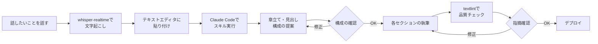

この記事は、まさにこれから紹介するワークフローで執筆されています。

## Table of Contents

```toc

```

## はじめに

現在、私は育休を取得して家で過ごしています。育休中は当然ながら仕事から離れることになりますが、技術者として技術のキャッチアップやアウトプットができない状況が続くと、どうしても焦りを感じてしまいます...。

そんななかで、[Claude Code](https://code.claude.com/docs/en/overview)などのAIコーディングツールの進化によって、プロダクトを作り上げるスピードが向上しました。実際、育休中にも関わらず個人プロジェクトで[SottoMe](https://sottome.digital/)というサービスを開発し、[開発の記事](https://qiita.com/tubone/items/0c4f62d87a091b055b39)も公開しています。**しかし、ブログを書くことに関しては、どうしてもハードルが高いままでした。**

この記事では、[whisper-realtime](https://github.com/tubone24/whisper-realtime)という自作の音声文字起こしツールと[Claude Code](https://code.claude.com/docs/en/overview)を組み合わせることで、育休中でもブログ執筆ができる仕組みを構築した話を紹介します。

## 育休中のエンジニアが抱える課題

育休中のエンジニアとして、技術との向き合い方について考える機会が増えました。結論から言えば、**技術のインプットについては、AIの力を借りることで対応可能**です。しかし、ブログ執筆だけはどうしても難しいという壁にぶつかりました。

### 技術のインプットはAIとObsidianで効率化できる

技術のインプットについては、[Obsidian](https://obsidian.md/)を活用することで限られた時間のなかでも効率的に進められています。

Obsidianには[デイリーノート](https://publish.obsidian.md/help-ja/%E3%83%97%E3%83%A9%E3%82%B0%E3%82%A4%E3%83%B3/%E3%83%87%E3%82%A4%E3%83%AA%E3%83%BC%E3%83%8E%E3%83%BC%E3%83%88)という機能があり、日付ごとに自動でノートを作成してくれます。私はこれを日々の雑記として利用しています。スマートフォンとPCの間は[GitHub](https://github.com/)リポジトリを同期のベースにすることで、シームレスにノートを共有できる環境を構築しています。

具体的な使い方としては、飼い犬の[むぎ](https://www.instagram.com/mugimugi.cutedog/)の散歩中に聴いたラジオの内容や、トイレで漁ったXやZennの記事をスマートフォンで軽くメモしたりリンクを貼ったりしておき、落ち着いた時間にObsidianで簡単なメモ書きとして整理するという流れを取っています。

加えて、AIによる技術記事の翻訳や、情報の裏付けリサーチなども可能になったため、以前に比べてはるかに速いスピードでインプットができるようになっています。

### しかしブログ執筆は難しい

一方で、**ブログを書くということに関しては、依然としてハードルが高いまま**でした。

文章を書くとなると、まとまった時間が必要です。記事の構成を考え、リサーチを行ない、画像を作成し、推敲を重ねる。これらの作業を子育ての合間に行なうのは現実的ではありません。PCに向き合う物理的な時間や環境がどうしても必要になるため、なかなか執筆に踏み切れない状況が続いていました。

この「ブログが書けない」というモヤモヤが、私のなかでずっと引っかかっていました。困りましたね。

## AquaVoiceという選択肢と自前環境への思い

そんななかで、[AquaVoice](https://aquavoice.com/)という音声入力サービスが注目されていることを知りました。

AquaVoiceは、音声入力に対して精度の高い日本語テキストを生成してくれるサービスです。料金体系は、無料のStarterプランで1,000語まで試用でき、本格的に使うならProプラン（月額$10、または年額$96で月あたり$8）で無制限利用が可能となっています。日本語の認識精度は高く、カスタム辞書機能で専門用語にも対応しています（[AquaVoice 公式サイト](https://aquavoice.com/)より）。

しかし、私が考えたのは別のアプローチでした。AquaVoiceはインターネット接続が必要なクラウドサービスであるため、入力した内容が外部に送信されることになります(これはブログ執筆の観点では気になりませんが、業務でプロンプトを音声で打つ際に問題になります)。また、継続的に利用するとなると費用もかかってきます。育休中でお金がないので、月額課金はできれば避けたいところです。

なので、**できればローカル環境で動作し、無料で使えるものを自分で作りたい**と考えました。せっかくなら自分で作ってみましょう。

## whisper-realtimeの開発

そこで開発したのが[whisper-realtime](https://github.com/tubone24/whisper-realtime)です。

whisper-realtimeは、[whisper.cpp](https://github.com/ggml-org/whisper.cpp)をベースにしたリアルタイム音声文字起こしツールです。whisper.cppは[OpenAI](https://openai.com/)のWhisperモデルをC/C++で実装したもので、[Apple Silicon](https://support.apple.com/ja-jp/116943)向けに最適化されています。ローカル環境でも高速な文字起こしが可能です。

マイクやシステム音声からのリアルタイム文字起こしが可能で、ライブテキスト更新と修正機能を備えています。話者識別機能により、複数人の会話でも誰が話しているかを判別できます。また、独自に定義した220以上の音韻パターンを用いた後処理ベースのASR誤り訂正機能も搭載しており、文字起こしの精度を高めています。

### Macネイティブアプリとしての提供

whisper-realtimeはコマンドラインツールとしてだけでなく、**Macネイティブアプリとしても利用できます**。

[Raycast](https://www.raycast.com/)拡張機能として統合することで、「文字起こしを開始」コマンドでリアルタイム文字起こしを表示したり、「音声入力」コマンドで素早くテキスト変換したりできます。

また、WhisperMenuBarという[Swift](https://www.swift.org/)製のメニューバーアプリも用意しており、F9ホットキーで即座に音声入力を開始し、結果を自動的にクリップボードへコピーする機能を提供しています。


## 音声入力からブログ執筆への応用

[whisper-realtime](https://github.com/tubone24/whisper-realtime)を作った当初は、主にAIへのプロンプト入力を高速化する目的で使っていました。しかし、正直なところ個人的にはキーボードでプロンプトを打つほうが頭のなかが整理されるため、開発作業ではあまり使っていませんでした。せっかく作ったのに、すみません。

ところが、**ブログ執筆という文脈では、音声入力がめちゃくちゃ相性が良い**ことに気づきました。

ブログは自分の考えを言葉で表現するものです。構成や推敲は必要ですが、まずは話したいことを話してしまい、それをAIにゴーストライターとして整えてもらうという流れがとても自然に感じられました。

## AIによるブログ執筆についての注意点

ここで、AIを使ったブログ執筆について触れておく必要があります。

AIによる創作活動については、世間的にはまだ議論の余地があります。私自身も、質の低いAI生成コンテンツが読み手の時間を奪ってしまうことについては問題意識を持っています。

そのため、このブログでは**AIを活用して執筆した記事については、記事冒頭にその旨を明示する**ようにしています。具体的には、ブログのFront Matterに `useAi` というパラメータを追加し、これが `true` の場合に記事先頭にエクスキューズのコンポーネントを表示する機能をあらかじめ実装しています。

この記事の冒頭にも表示されているはずです。

そして、重要なのは、AIはあくまでゴーストライターとしての役割であり、記事の主体は筆者である私にあるという点です。話している内容、伝えたいこと、記事の構成は私が考えており、AIはそれを読みやすい文章に整える手伝いをしているという位置づけです。

## ブログ執筆ワークフロー

実際のワークフローを説明します。



まず、[whisper-realtime](https://github.com/tubone24/whisper-realtime)を使って文字起こしを行ないます。この段階では構成や誤字脱字、誤変換については一切気にせず、話したいことをどんどん話していきます。コンテキストが多いほどAIが解釈しやすくなるため、情報は多めに話すようにしています。

文字起こしした内容はテキストエディタに貼り付けていきます。ある程度まとまったら、[Claude Code](https://code.claude.com/docs/en/overview)を起動し、あらかじめ作成しておいたブログ執筆用のスキルを実行します。

スキルを実行すると、Claude Code（[Opus 4.5](https://www.anthropic.com/claude/opus)）が文字起こし内容を解析し、章立てや見出し構成を提案してきます。確認と調整を経て構成が確定したら、各セクションの執筆に進みます。

記事が完成したら、[textlint](https://textlint.org/)を使って文章の品質チェックを行ないます。最終的にはCIを通してブログをデプロイするという流れです。

## Claude Codeのブログ執筆スキル

このワークフローの要となるのが、**Claude Codeのブログ執筆スキル**です。スキルの出来によってブログの品質がほぼ決まるため、ここはかなり重要な部分です。

[Claude Code](https://code.claude.com/docs/en/overview)では `.claude/skills` ディレクトリにスキルを配置することで、特定のタスクに特化した指示をまとめておくことができます。

### スキルの全体像

ブログ執筆スキルの構成は以下のようになっています。

```yaml
---
name: writing-blog
description: tubone24のブログ記事作成スキル。音声入力で文章の素案を作り、それをもとにブログ記事を完成させる。
tools: Write, Read, Edit, Grep
model: opus
---
```

Front Matterでは、使用するツールとモデルを指定しています。ここで重要なのは `model: opus` の指定です。ブログ記事の執筆には[Sonnet](https://www.anthropic.com/claude/sonnet)や[Haiku](https://www.anthropic.com/claude/haiku)ではなく、[Opus](https://www.anthropic.com/claude/opus)レベルの性能が必要だと考えています。従来のLLMが出力する文章の範囲を超えた自然な文体を得るためには、より高性能なモデルが必要です。

### 概要セクション

概要セクションでは、入力が音声文字起こしであることを明示しています。

```markdown
ユーザープロンプトの形で与えられるテキストは、Whisper.cppなどの音声システムを利用して文字起こしした内容です。
文字起こしには、誤認識や脱字、句読点の欠落が含まれる可能性がありますし、論理の飛躍、繰り返し、冗長な表現、話し言葉特有の曖昧さなども含まれます。
```

これにより、AIは入力テキストに誤りがあることを前提として処理を行ないます。

### 記事の主体性

スキルのなかで強調しているのは、**記事の主体性は筆者にある**という点です。

```markdown
記事の主体性は筆者(tubone24)にあります。なので、ユーザープロンプトの内容が不完全であったり、曖昧であったりする場合は、必要に応じてユーザーに確認を取ってください。取りすぎても問題ありません。（取らないで進めるほうが困ります）
```

AIに勝手に解釈されて進められるよりも、確認を取りながら進めてもらうほうが安心です。

### AI特有の文体を避けるルール

AIが生成した文章にありがちな文体を避けるためのルールも定義しています。

見出しに絵文字や太字、コロンを使わないこと。文中で「実行します:」のようにコロンを使わないこと。過度な強調タグを避けること。そして「革新的な」「画期的な」「魔法のように」といったハイプ表現を避けること。

これらのルールは[textlint-rule-preset-ai-writing](https://github.com/textlint-ja/textlint-rule-preset-ai-writing)というtextlintのルールセットを参考にしています。スキルの指示としても含めつつ、最終的にはtextlintでも機械的にチェックする二重のガードを設けています。

### 参考文献の重視

技術ブログにおいて参考文献は重要です。スキルでは、公式ドキュメントや信頼できる情報源へのリンクを必ず含めるよう指示しています。

```markdown
掲載する情報には参考文献がとても重要です。公式ドキュメントや信頼できる情報源へのリンクを必ず含めてください。
Web Searchやfetchツールを使って、最新の情報を確認し、必要に応じてリンクを追加してください。
```

私が話した内容と公式ドキュメントが異なる場合は、必ず確認を取るようにも指示しています。

## サブエージェントによるコンテキスト制御

ブログ執筆スキルとは別に、2つのサブエージェントも用意しています。

1つのエージェントだけでブログ記事を書かせると、Web記事をfetchした際の全データがコンテキストに乗ってしまいます。これではコンテキストウィンドウを早く消費してしまい、**記事の後半になるほど品質が低下する**という問題が起きます。そこで、特定の役割をサブエージェントに切り出すことで、メインエージェントのコンテキストを温存する設計にしています。

### tech-term-researcher

1つ目は技術用語調査用のサブエージェントです。

技術ブログでは、言及するツール名やサービス名に対して正確な公式リンクを貼る必要があります。しかし、1つ1つの用語についてWebSearchとWebFetchを繰り返すと、取得したWebページの内容がすべてコンテキストに蓄積されていきます。

このサブエージェントは、技術用語のリストを受け取り、それぞれについて公式サイトや公式ドキュメントのURLを調査して返します。調査結果だけがメインエージェントに渡されるため、コンテキストの消費を抑えられます。

### article-reviewer

2つ目は記事レビュー用のサブエージェントです。

こちらは、引用しているリンクが本当に公式ドキュメントなのか、記事で述べている技術的な内容が正確かどうかを検証します。ワークフローの最後のタイミングで、AI自らがこのサブエージェントを呼び出す形を取っています。

レビュー結果として、SKILLルールの遵守状況、リンク検証結果、技術的正確性のチェック結果が返ってくるため、最終的な品質担保に役立っています。

## 余談 - 育休中の悩みと技術への向き合い方

余談ですが、育休中は精神的に不安定になりがちな時期でもありました。

技術に触れ合う時間が物理的に減ること、そして技術分野が好きな人間としてそれらを伸ばすことができない状況は、想像以上にストレスでした。

XやZennを見ると、多くのエンジニアがアウトプットを続けていたり、最新技術をキャッチアップしていたりする姿が目に入ります。所属している会社に優秀なエンジニアがどんどん入っていくのを見ると、気が焦ってしまうこともありました...。

それを払拭するために、[Claude Code](https://code.claude.com/docs/en/overview)を活用してコードを書いたり、新しいサービスを試したりしてきましたが、ブログのアウトプットだけはどうしても難しい状況が続いていました。

だからこそ、**今回のようなワークフローを構築できたことは、個人的には大きな意味があります**。

すべての人がこのようなアプローチを取る必要はないと思いますが、育休中や働きながら子育てをしているエンジニアが、少ない工数で品質の高いアウトプットを出せる仕組みが広がればいいなと思っています。

そして、実際に音声入力でブログを書いてみて、キーボードを使わないことのメリットも感じることができました。

まず、**両手が空く**というのは想像以上に大きいです。子供を抱っこしていたり、料理をしている間でも、話しかけるだけで入力ができます。このスタイルのおかげで、かなり早くブログを書くことができました。

次に、**作業環境に依存しにくい**という点もあります。私は普段、肩こりがひどいので[HHKB](https://happyhackingkb.com/jp/)を2台並べて左右それぞれで入力するというスタイルを取っています。富豪のスタイルですね、すみません。しかし、育休中はリビングなど作業環境ではない場所でパソコンを開くことが多くなります。子供から目を離すわけにはいかないので、自分の書斎に籠もるわけにもいきません。そうなると、普段の開発環境（分割配置のキーボードや4Kディスプレイ）が用意できなくなります。音声入力であればキーボードを使わないので、単純に手が痛くならないというのも地味に助かっています。

一方で課題もあります。カフェや電車など、人の目が気になるときには音声入力は難しいですし、会社でも、フォンブースなどを借りない限り周囲に人がいると話しにくいなと思います（会社でブログを書くことはないですが）。このあたりはどうやって解決すればいいのか、自分なりにこれから答えを見つけていこうかなと思います。

ちなみに、子供がぐずっているときに、パソコンに向けてではなく子供に向けて話しかけて、それを音声入力にしてブログを書かせるというアクロバットな方法もなくはないです。子供のテンポに合わせて話すという工夫が必要ですが、一石二鳥かもしれません。

## 最後に

[whisper-realtime](https://github.com/tubone24/whisper-realtime)と[Claude Code](https://code.claude.com/docs/en/overview)を組み合わせることで、音声入力からブログ記事を作成するワークフローを構築してみました。

実際にこの記事自体がこのワークフローで書かれているわけですが、思った以上に自然な文章になったのではないかと感じています。もちろん、AIが書いた部分と私が話した内容の境界は曖昧ですし、完璧なワークフローとは言えません。それでも、**PCに長時間向き合えない状況でもブログを書き続けることができるようになった**のは大きな収穫です。

今後もスキルの改善やサブエージェントの活用など、より私らしい文章が書けるようなチューニングを続けていきたいと思います。

音声入力でブログが書けそうな予感がするこの頃です。
