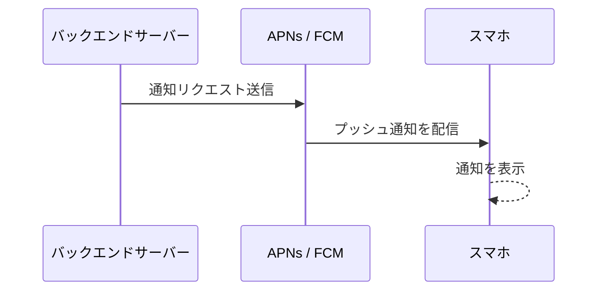

この記事は、まさにこれから紹介する仕組みに助けられながら、通勤電車のなかで執筆されています。

## Table of Contents

```toc

```

## はじめに

[Claude Code](https://code.claude.com/docs/en/overview)に[Remote Control](https://code.claude.com/docs/en/remote-control)という機能が登場しました。

Remote Controlは、ローカルのPCで動いているClaude Codeのセッションを、スマートフォンやタブレット、別のPCのブラウザからそのまま操作できる機能です。自宅のPCでClaude Codeにタスクを投げておいて、外出先のスマートフォンからそのセッションの状態を確認したり、承認を出したりできるわけです。

これ、めちゃくちゃ便利じゃないですか？**PCの前にいなくてもClaude Codeが使える**ようになったのは、個人的にはかなりデカい変化です。しかし、実際に使ってみると1つ困ることがあります。Claude Codeが承認待ちになっていても、スマートフォンに通知が飛んでこないのです。困りましたね。

この記事では、[Slack](https://slack.com/)の[Incoming Webhook](https://api.slack.com/messaging/webhooks)とClaude Codeの[Hooks](https://code.claude.com/docs/en/hooks)機能を組み合わせて、承認待ちをスマートフォンに通知する仕組みを作った話を紹介します。

## Claude Code Remote Controlの仕組み

まずRemote Controlについてざっくり説明します。

Remote Controlは、ローカルのClaude Codeセッションをクラウド経由で[claude.ai/code](https://claude.ai/code)や[Claude](https://apps.apple.com/us/app/claude-by-anthropic/id6473753684)のモバイルアプリに接続する機能です。 `/remote-control` コマンドを実行するとセッションが開始され、表示されるQRコードをスマートフォンで読み取るだけで接続できます（[Remote Control公式ドキュメント](https://code.claude.com/docs/en/remote-control)より）。

ここで重要なのは、**Claude Codeのセッション自体はあくまでローカルのPCで動き続ける**という点です。スマートフォンやブラウザはそのセッションへの**窓**にすぎません。ローカルのファイルシステム、[MCPサーバー](https://code.claude.com/docs/en/mcp)、プロジェクト設定、全部そのまま使えます。

一方で、[Claude Code on the Web](https://code.claude.com/docs/en/claude-code-on-the-web)という機能もあって、こちらはAnthropicのクラウドインフラ上でセッションが動作します。リポジトリをクローンしていなくても作業を始められる手軽さがありますが、ローカル環境にしかないリソースにはアクセスできません。

で、この**ローカル環境にしかないリソースにアクセスできる**という特性こそ、Remote Controlの真価だと思っています。コーディングエージェントとしてClaude Codeを使うだけなら、Claude Code on the Webでリポジトリを指定して作業すればいいんですが、実際にはコーディングの枠を超えた使い方をすることが増えてきました。Googleカレンダーの確認やメールの確認、ローカルにある資料の参照など、**PCでしか実行できない操作**ってどうしてもあるんですよね。そういった場面で、ローカルのMCPサーバーや連携先のサービスと通信できるRemote Controlはめちゃくちゃ頼もしいです。

## 承認待ちに気づけない問題

Remote Controlのおかげで、PCの前にいなくてもClaude Codeのセッションを操作できるようになりました。しかし、1つ課題があります。

Claude Codeがターミナル上で承認を求めている状態（ツール実行の許可待ちや選択肢の提示など）になったとき、**スマートフォンには何の通知も飛んでこない**のです。Remote Controlはあくまでセッションの同期を提供する機能であって、プッシュ通知の仕組みは含まれていません。承認待ちに気づくには、スマートフォンでClaudeアプリを自分で開いて確認するしかないわけです。これだと、結局こまめにアプリを開く羽目になってしまいます。

Claude Codeの通知を受け取る手段としては、Hooksを使って[macOSの通知センター](https://support.apple.com/ja-jp/guide/mac-help/mchl2fb1258f/mac)に飛ばすアプローチが以前から流行りましたよね。[AppleScript](https://developer.apple.com/library/archive/documentation/AppleScript/Conceptual/AppleScriptLangGuide/introduction/ASLR_intro.html)で `display notification` を実行して、バックグラウンドのターミナルで動いているClaude Codeから通知を表示させるというやつです。

```json
{
  "Notification": [
    {
      "matcher": "*",
      "hooks": [
        {
          "type": "command",
          "command": "osascript -e 'display notification \"Claude Codeが許可を求めています\" with title \"Claude Code\" subtitle \"確認待ち\" sound name \"Glass\"'"
        }
      ]
    }
  ]
}
```

この方法はPCの前にいるときにはめちゃくちゃ便利ですし、実際に多くのClaude Codeユーザーが設定しています（[claude-code-notification](https://github.com/wyattjoh/claude-code-notification)のようなOSSも登場しました）。ただ、これはあくまでmacOS上の通知であって、スマートフォンには届きません。

Remote Controlを使ってPCから離れた場所で作業しているときに、PCの通知が鳴っても意味がないですよね。**スマートフォンに直接通知を飛ばす仕組み**が欲しいわけです。

## スマートフォンにプッシュ通知を飛ばすには

スマートフォンに通知を届ける仕組みといえば、プッシュ通知ですよね。

iOSの場合は[APNs](https://developer.apple.com/documentation/usernotifications)（Apple Push Notification service）、Androidの場合は[FCM](https://firebase.google.com/docs/cloud-messaging)（Firebase Cloud Messaging）という仕組みが使われています。アプリのバックエンドサーバーから各プッシュ通知サービスにリクエストを送り、そこからデバイスに通知が配信されるという流れです。



しかし、APNsやFCMを直接使うとなると、サーバー側の実装やデバイストークンの管理が必要になってきます。個人の開発環境からの通知にそこまでやるのは、さすがに大げさです。

プッシュ通知を手軽に送れるサードパーティのサービスもいくつかあります。[ntfy](https://ntfy.sh/)はオープンソースでセルフホストもできるプッシュ通知サービスですし、[Pushover](https://pushover.net/)は買い切り型でAPIからHTTPリクエストを送るだけでスマートフォンに通知が届きます。[Pushbullet](https://www.pushbullet.com/)もデバイス間の通知共有サービスとして有名ですね。

ただ、これらのサービスにはメッセージ数の制限があったり、有料プランが必要だったりするんですよね。Claude Codeを日常的に回していると承認待ちの通知はそれなりの頻度で飛んでくるので、地味にコストが気になります。できれば無料で済ませたい...。貧乏人はつらいです。

## Slackという選択肢

そこで目をつけたのが、[Slack](https://slack.com/)です。

実は我が家では、家族用のSlackワークスペースをProプランで契約しています。家族間のやり取りだけでなく、家の自動化にまつわる通知やコマンド操作のインテグレーション先としてもSlackを使っていて、もはや我が家のインフラみたいな存在です。せっかく課金しているなら、これをClaude Codeの通知にも使わない手はありません。元を取りたいですしね。

Slackの[Incoming Webhook](https://api.slack.com/messaging/webhooks)を使えば、外部からSlackのチャンネルにメッセージをPOSTする仕組みがサクッと作れます。[Slack App](https://api.slack.com/start)を作成してIncoming WebhookのURLを発行するだけ。Webhook自体に追加料金はかかりません（[Slack API公式ドキュメント](https://api.slack.com/messaging/webhooks)より）。

レートリミットは1メッセージ/秒/Webhook URLですが、Claude Codeの承認待ち通知がそこまでの頻度で飛んでくることはまずないので、まったく問題なしです。**Slackに課金している環境であれば、追加コストゼロで通知が飛ばし放題**。これはありがたい。

そしてもう1つ大きいのが、Slackアプリがスマートフォンに入ってさえいれば、Slackへの投稿がそのままスマートフォンのプッシュ通知として届くという点です。つまり、Slackに投稿する仕組みさえ作ってしまえば、APNsやFCMの実装は一切不要。楽ちんです。

## Claude Code HooksのNotificationで通知を飛ばす

さて、ここからが実装の話です。

[Claude Code Hooks](https://code.claude.com/docs/en/hooks)は、Claude Codeのライフサイクルの特定のタイミングで、任意のシェルコマンドやHTTPリクエストを実行できる仕組みです。ツール実行前後やセッション開始時など、いろんなイベントに対してフックを仕掛けられます。

今回使うのは **Notification** イベント。Notificationは、Claude Codeがユーザーに通知を送るタイミングで発火します。 `matcher` で通知の種類をフィルタリングでき、以下の種類があります（[Hooks公式ドキュメント](https://code.claude.com/docs/en/hooks)より）。

| matcher値 | 発火タイミング |
|---|---|
| `permission_prompt` | ツール実行の許可待ち |
| `idle_prompt` | Claude Codeがアイドル状態 |
| `auth_success` | 認証成功時 |
| `elicitation_dialog` | ユーザーへの質問ダイアログ |

Notification hookが発火すると、標準入力（stdin）にJSON形式でコンテキスト情報が渡されます。JSONには以下のようなフィールドが含まれています。

```json
{
  "session_id": "abc123",
  "transcript_path": "/Users/.../.claude/projects/.../session.jsonl",
  "cwd": "/Users/your-name/project",
  "permission_mode": "default",
  "hook_event_name": "Notification",
  "message": "Claude needs your permission to use Bash",
  "title": "Permission needed",
  "notification_type": "permission_prompt"
}
```

`message` に通知の内容、 `title` にタイトル、 `cwd` に作業ディレクトリのパスが入ってきます。これらを抽出してSlackに投げればよいわけです。シンプルですね。

### Slack通知用シェルスクリプト

以下が実際に使っているシェルスクリプトです。

```bash
#!/bin/bash
# Claude Code Notification → Slack 通知スクリプト
# SLACK_WEBHOOK_URL を環境変数に設定してください

input=$(cat)

# ~/.claude/.env から環境変数を読み込む
if [ -f "$HOME/.claude/.env" ]; then
  set -a
  source "$HOME/.claude/.env"
  set +a
fi

WEBHOOK_URL="${SLACK_WEBHOOK_URL:-}"
if [ -z "$WEBHOOK_URL" ]; then
  echo "[Slack Hook] SLACK_WEBHOOK_URL not set, skipping" >&2
  echo "$input"
  exit 0
fi

# フック入力からメッセージを抽出
message=$(echo "$input" | jq -r '.message // "Claude Codeが許可を求めています"')
title=$(echo "$input" | jq -r '.title // "Claude Code"')
cwd=$(echo "$input" | jq -r '.cwd // "unknown"')
timestamp=$(date '+%Y-%m-%d %H:%M:%S')
project_name=$(basename "$cwd")

# Block Kit形式のリッチ通知ペイロード
payload=$(jq -n \
  --arg fallback "${title}: ${message}" \
  --arg message "$message" \
  --arg cwd "$cwd" \
  --arg project "$project_name" \
  --arg ts "$timestamp" \
  '{
    text: $fallback,
    blocks: [
      {
        type: "header",
        text: {
          type: "plain_text",
          text: "Claude Code - 確認待ち",
          emoji: true
        }
      },
      {
        type: "section",
        text: {
          type: "mrkdwn",
          text: $message
        }
      },
      {
        type: "divider"
      },
      {
        type: "section",
        fields: [
          {
            type: "mrkdwn",
            text: ("*:file_folder: プロジェクト:*\n" + $project)
          },
          {
            type: "mrkdwn",
            text: ("*:round_pushpin: パス:*\n`" + $cwd + "`")
          }
        ]
      },
      {
        type: "context",
        elements: [
          {
            type: "mrkdwn",
            text: (":clock1: " + $ts + " | :robot_face: Claude Code")
          }
        ]
      }
    ]
  }')

curl -s -X POST -H 'Content-type: application/json' \
  --data "$payload" \
  "$WEBHOOK_URL" > /dev/null 2>&1

echo "$input"
```

このスクリプトのポイントをざっくり説明します。

まず `input=$(cat)` で標準入力からJSONペイロードを丸ごと受け取ります。Claude Code Hooksではコマンドフックへの入力がstdin経由で渡されるので、こういう書き方になります。

そこから[jq](https://jqlang.github.io/jq/)で `message` 、 `title` 、 `cwd` を抜き出して、 `basename` でプロジェクト名を取得しています。複数のプロジェクトでClaude Codeを並行して回していると、どのプロジェクトからの通知かわからなくなるので、ここは地味に大事です。

通知の見た目にはSlackの[Block Kit](https://api.slack.com/block-kit)を使っています。Block Kitを使うと、ヘッダーやプロジェクト情報、タイムスタンプをきれいに整理して表示できるので、通勤中にスマートフォンでちらっと見ただけでも状況がパッとわかります。普通のテキストメッセージだとどうしても味気ないので、ここはこだわりたいところです。

あと、最後の `echo "$input"` を忘れずに。Claude Code Hooksではコマンドの標準出力がClaude Codeに返されるので、入力をそのまま出力しておかないとClaude Codeの動作に影響が出てしまいます。

### settings.jsonの設定

このスクリプトをClaude Code Hooksに登録するのは簡単で、 `~/.claude/settings.json` に以下を追加するだけです。

```json
{
  "hooks": {
    "Notification": [
      {
        "matcher": "*",
        "hooks": [
          {
            "type": "command",
            "command": "~/.claude/hooks/slack-notify.sh"
          }
        ],
        "description": "Slack通知"
      }
    ]
  }
}
```

`matcher` に `"*"` を指定しているので、すべての通知タイプ（`permission_prompt` 、 `idle_prompt` など）でスクリプトが走ります。特定の通知タイプだけに絞りたければ、 `matcher` の値を変えるだけでOKです。

ちなみに、macOSのデスクトップ通知と併用したい場合は、同じ `Notification` イベントに複数のフックを登録できます。PC作業中はmacOS通知、外出中はSlack通知、みたいな使い分けもできるわけです。

```json
{
  "hooks": {
    "Notification": [
      {
        "matcher": "*",
        "hooks": [
          {
            "type": "command",
            "command": "~/.claude/hooks/slack-notify.sh"
          },
          {
            "type": "command",
            "command": "osascript -e 'display notification \"Claude Codeが許可を求めています\" with title \"Claude Code\" subtitle \"確認待ち\" sound name \"Glass\"'"
          }
        ],
        "description": "Slack通知 + macOS通知"
      }
    ]
  }
}
```

## 通勤時間を生産的にする

ここまでの仕組みを作ったのには、実は通勤時間を活用したいという動機もあります。

日本の通勤時間って、世界的に見てもかなり長い部類に入るんですよ。[総務省統計局の令和3年社会生活基本調査](https://www.stat.go.jp/data/shakai/2021/rank/index.html)によると、なんと日本の平均通勤時間は往復で**約1時間19分**です!!!

首都圏に至っては、神奈川県が往復100分、東京都・千葉県が95分と、毎日1時間半以上を通勤に費やしています。これはなかなかしんどいですね。

OECDの国際比較データでも、日本の通勤時間はアメリカやヨーロッパ諸国の1.5〜2倍にあたります。片道40分という日本の平均に対して、スウェーデンやフィンランドは18〜21分程度です（[OECD Time Use Database](https://www.oecd.org/en/data/datasets/time-use-database.html)より）。

究極を言えば、リモートワークで通勤時間がゼロになるのが一番幸せだと思います。実際、リモートワークを望む理由として「通勤がしたくない」というのは上位に来るのではないでしょうか。とはいえ、会社の事情もありますし、そう簡単にはいかないのが現実です...。

**ならば、通勤時間を少しでも生産的な時間に変えたい**というのが自然な発想です。Remote Controlでスマートフォンからセッションを操作でき、Slack通知で承認待ちにすぐ気づける環境があれば、電車のなかでもClaude Codeと一緒に作業を進めることができます。PCの前に張り付く必要がなくなることで、通勤時間が**ただの移動時間**ではなく**開発の一部**になる可能性が出てきます。

## 最後に

Claude CodeのRemote ControlとSlack通知を組み合わせた仕組みを構築してみました。

やっていることはシェルスクリプト1つとsettings.jsonの設定だけなので、仕組みとしてはとてもシンプルです。それでも、承認待ちにすぐ気づけるようになったことで、Remote Controlの使い勝手が思った以上に向上しました。PCから離れていても安心してClaude Codeにタスクを任せられるのは、精神的にもだいぶ楽です...。

Slackをすでに使っている方であれば、数分で設定できると思います。ntfyやPushoverのような専用サービスを使うのも1つの手ですが、既存のSlackワークスペースがあるなら追加コストもかからないのでおすすめです。

通勤時間にスマートフォンでClaude Codeを操作する未来が、意外と近くに来ている予感がするこの頃です。
