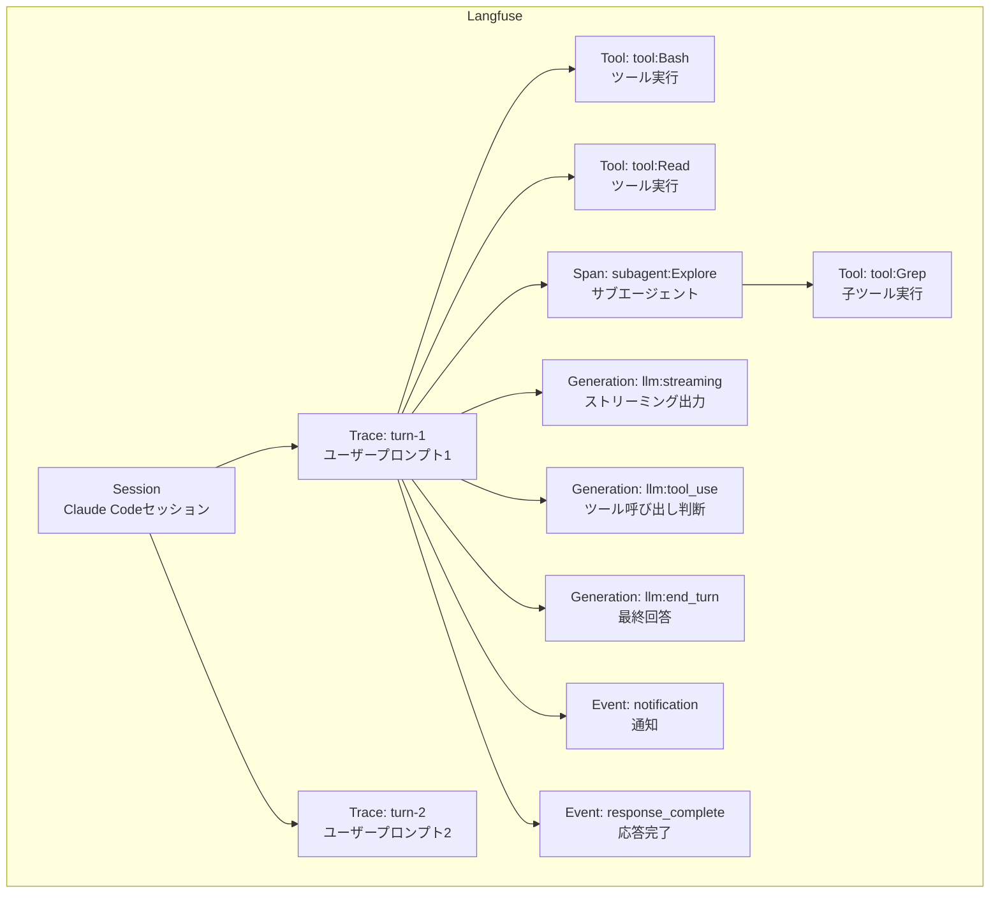

暖かくなってきましたね。桜の季節です。花粉もすごいです。

## Table of Contents

```toc

```

## 超結論

この記事のすべては下記のシェルスクリプトである。

<https://github.com/tubone24/claude-code-settings/blob/main/hooks/scripts/langfuse-logger.sh>

## はじめに

[Claude Code](https://docs.anthropic.com/en/docs/claude-code/overview)を毎日のように使っていると、ふと気になることってありませんか？

> 今の開発セッションで、こいつはどれだけのトークンを消費して、何回ツールを呼んで、どんな思考プロセスを経て、最終的にあの回答にたどり着いたんだろう？

Claude Codeは[Max plan](https://www.anthropic.com/pricing)を使っているので、コスト面ではそこまで気にしてないんですが、それでもやっぱり一回の開発でどれくらいのリソースが使われているのか、どのツールがどんな頻度で呼ばれているのかは知りたくなるんですよね。

そして何より、Claude Codeの内部の動きを観察することは、**自分がこれから作るAIエージェントの設計にめちゃくちゃ参考になる**はずです。

で、今回はそういうモチベーションから、[Langfuse](https://langfuse.com/)とClaude Codeの[Hooks](https://docs.anthropic.com/en/docs/claude-code/hooks)機能を組み合わせて、コーディングエージェントのオブザーバビリティを確保する仕組みを構築してみました。

## Claude Codeをトレースしたくなった理由

そもそもなんでClaude Codeをトレースしたいのかという話なんですが、理由はいくつかあります。

まず、**ツール呼び出しのパターンを知りたかった**。Claude Codeは `Read` や `Bash` 、 `WebSearch` など多数のツールを駆使しますが、どのツールがどのタイミングで、どんな入力で呼ばれているのかを俯瞰できると、**エージェントの振る舞いへの理解がぐっと深まります**。結局これが自分でエージェントを作るときの一番の参考になるんですよね。

あとは、[Extended Thinking](https://docs.anthropic.com/en/docs/build-with-claude/extended-thinking)や[サブエージェント](https://code.claude.com/docs/ja/sub-agents)の挙動も気になっていました。エフォートレベルを上げたときにthinkingがどう変わるのか、サブエージェントを使ったときのインプットとアウトプットがどうなっているのかを観察して、コンテキストウィンドウの制約があるなかでも質の高い出力ができる設計を自分のエージェントにも取り入れたいなと。

そして、**自分のプロンプトの癖を振り返りたかった**というのもあります。最近は `/insights` コマンドや[プロンプトレビューのスキル](https://github.com/tokoroten/prompt-review)が充実してきましたが、どういう指示の出し方をしたときにうまくいって、どういうときにコケているのかを体系的に振り返るには、やっぱりLLMOpsツールの力を借りるのが一番です。

## LangfuseとOpenTelemetryの現状

### Langfuseとは

[Langfuse](https://langfuse.com/)は、LLMアプリケーション向けのオープンソースのオブザーバビリティプラットフォームです。トレーシング、評価、プロンプト管理、データセット機能を提供していて、OSSなのでセルフホストもできます。LLMOpsが好きすぎてこのツール群にハマったのが私です。

Langfuseについては過去に[AWSマネージドサービスでLangfuse v3を構築する記事](/2024/12/30/building-langfuse-v3-with-aws-managed-services/)や[Langfuse v3を安く運用する方法](/2025/02/16/cost-effective-langfuse-v3-deployment/)を書いてますので、基盤構築の話はそちらを参照ください。

### Claude CodeのOTELサポート

Claude Codeには[OpenTelemetry](https://opentelemetry.io/)（OTEL）のネイティブサポートが組み込まれています（[公式ドキュメント](https://docs.anthropic.com/en/docs/claude-code/monitoring)より）。環境変数を設定するだけでテレメトリデータを送信できます。

```bash
export CLAUDE_CODE_ENABLE_TELEMETRY=1
export OTEL_METRICS_EXPORTER=otlp
export OTEL_EXPORTER_OTLP_ENDPOINT=http://localhost:4317
```

OTELで取得できるメトリクスは以下のようなものがあります。

| メトリクス | 内容 |
|-----------|------|
| `claude_code.session.count` | セッション開始数 |
| `claude_code.token.usage` | トークン使用量（input/output/cache別） |
| `claude_code.cost.usage` | コスト（USD） |
| `claude_code.lines_of_code.count` | コード変更行数 |
| `claude_code.code_edit_tool.decision` | 編集ツールの許可/拒否数 |

イベント（ログ）としては `claude_code.tool_result` や `claude_code.api_request` なども取得可能で、運用メトリクスとしてはかなり充実しています。

### OTELだけでは足りなかった理由

ところが、いざOTELでLangfuseに直接送ろうとすると困ったことになります。

Claude CodeのOTELは**メトリクス**と**ログ/イベント**をエクスポートしますが、**トレース**（Spans）はエクスポートしません。 一方で、LangfuseのOTELエンドポイントは**トレース**（Spans）しか受け入れません。

つまり、Claude Codeが出すデータ形式とLangfuseが受け入れるデータ形式が噛み合わないんです（[GitHub Issue #9584](https://github.com/anthropics/claude-code/issues/9584)で機能要望が出されているが、現時点で対応予定なし）。困りましたね。

「じゃあOTELコレクターを間に挟めばいいのでは？」と思うかもしれませんが、ログをトレースに変換する標準的な方法がないので、これでもパッとは解決しません。

さらに根本的な課題として、OTELではLLMのレスポンス内容（assistant output）やthinkingの内容、ツール実行の入出力の詳細が取れません。 `tool_result_size_bytes` のようなサイズ情報はあっても、実際にどんなコマンドが打たれて何が返ってきたかまでは見えないんですよね。

| 情報 | OTEL | Hooks |
|------|------|-------|
| トークン使用量・コスト | 取得可能 | transcript経由で取得可能 |
| LLMのレスポンス内容 | 取得不可 | transcript経由で取得可能 |
| thinking内容 | 取得不可 | transcript経由で一部取得可能 |
| ツール入力の詳細 | 一部のみ | 完全なJSON取得可能 |
| ツール出力の詳細 | サイズのみ | 完全なJSON取得可能 |
| セッションの会話履歴 | 取得不可 | transcript経由で取得可能 |

**ならば、Hooksを使って泥臭くやるしかない**。そう決めて、シェルスクリプトでLangfuseのIngestion APIを直接叩く方針に切り替えました。

## データモデルの設計

さて、ここからが設計の話です。Claude Codeの概念をLangfuseのデータモデルにどうマッピングするか、というやつですね。

Langfuseのデータモデルは**Session → Trace → Observation**の3層構造になっています。Observationの基本的な種類として**Span**（期間のある汎用操作）、**Generation**（LLM呼び出し専用）、**Event**（単発イベント）、**Tool**（ツール）などがあり、今回のマッピングではこれらを使います。Generationは `model` や `usageDetails` 、 `costDetails` といったLLM固有のフィールドを持っているのがミソです。

この構造をClaude Codeの動きに対応させると、こんな感じになります。



| Claude Codeの概念 | Langfuseのデータ型 | 説明 |
|-------------------|-------------------|------|
| セッション（ `session_id` ） | Session | Claude Code起動から終了まで |
| ユーザープロンプト | Trace | 1つの質問・指示が1つのトレース |
| ツール実行 | Tool | `PreToolUse` で開始、 `PostToolUse` で完了 |
| サブエージェント | Span（親） | 子ツールの `parentObservationId` として機能 |
| LLM呼び出し | Generation | transcript解析で `stop_reason` ごとに生成 |
| 通知・コンパクション | Event | 単発イベントとして記録 |

## Hooksとシェルスクリプトによる実装

### Hooksの設定

[Claude Code Hooks](https://docs.anthropic.com/en/docs/claude-code/hooks)は、Claude Codeのライフサイクルイベントに応じてユーザー定義のシェルコマンドを実行できる機能です。ツール実行前後やセッションの開始・終了など、いろんなタイミングにフックを仕込めます。前回の記事で紹介した[Slack通知の仕組み](/2026/03/05/claude-code-remote-control-slack-notification/)もこのHooksを使っています。

で、今回のアプローチでは、**すべてのHookイベントに同一のシェルスクリプト `langfuse-logger.sh` を登録**するというなかなかの力技なことをしています。 `settings.json` の設定はこんな感じです。

```json{file: "~/.claude/settings.json"}
{
  "hooks": {
    "PreToolUse": [
      {
        "matcher": "",
        "hooks": [{ "type": "command", "command": "bash ~/.claude/hooks/scripts/langfuse-logger.sh", "timeout": 10 }]
      }
    ],
    "PostToolUse": [
      {
        "matcher": "",
        "hooks": [{ "type": "command", "command": "bash ~/.claude/hooks/scripts/langfuse-logger.sh", "timeout": 10 }]
      }
    ],
    "Stop": [
      {
        "matcher": "",
        "hooks": [{ "type": "command", "command": "bash ~/.claude/hooks/scripts/langfuse-logger.sh", "timeout": 10 }]
      }
    ]
  }
}
```

実際にはこれだけでなく、 `SessionStart` 、 `SessionEnd` 、 `UserPromptSubmit` 、 `PostToolUseFailure` 、 `SubagentStart` 、 `SubagentStop` 、 `Notification` 、 `PreCompact` 、 `PermissionRequest` 、 `InstructionsLoaded` 、 `ConfigChange` の全イベントに登録しています。 `matcher` を空文字列にすることですべてのツール・イベントにマッチするようにしています。

Hookスクリプトには標準入力を通じてJSON形式のコンテキスト情報が渡されます。全イベント共通のフィールドとして `session_id` 、 `hook_event_name` 、 `transcript_path` 、 `cwd` 、 `permission_mode` があり、さらにツール系イベント（`PreToolUse` / `PostToolUse` 等）では `tool_name` や `tool_input` といったイベント固有のフィールドも含まれます。これらを解析してLangfuseに送信するわけです。

### セッションとトレースの管理

`SessionStart` イベントが発火すると、セッションの初期化を行ないます。Claude Codeの `session_id` をそのままLangfuseのSession IDとして使い、初期トレースを作成します。同時にGit情報（ブランチ名、コミットハッシュ）も取得してメタデータに含めます。

```bash{file: "~/.claude/hooks/scripts/langfuse-logger.sh"}
SessionStart)
    TRACE_ID="${SESSION_ID}-init"
    echo "$TRACE_ID" > "$STATE_DIR/current-trace-id"

    # Git情報をキャプチャ
    capture_git_info "$CWD"
    # （中略）
    send "$PAYLOAD"
    ;;
```

ユーザーがプロンプトを入力すると `UserPromptSubmit` イベントが発火し、**新しいトレースを作成**します。ターンカウンターをインクリメントして `{session_id}-turn-{n}` というIDを振り、ユーザーの入力をトレースの `input` に記録します。

```bash{file: "~/.claude/hooks/scripts/langfuse-logger.sh"}
UserPromptSubmit)
    TURN=$(next_turn)
    TRACE_ID="${SESSION_ID}-turn-${TURN}"
    echo "$TRACE_ID" > "$STATE_DIR/current-trace-id"

    PROMPT=$(echo "$INPUT" | jq -r '.prompt // ""' | head -c 10240)
    echo "$PROMPT" > "$STATE_DIR/prompt"
    # （中略）
    ;;
```

**状態管理**には `/tmp/claude-langfuse/{session_id}/` ディレクトリを使っています。現在のトレースID、ターン番号、モデル名、Gitブランチなどをファイルとして保存し、イベント間で共有する仕組みです。めちゃくちゃ泥臭いですが、シェルスクリプトで状態を持つにはこれが一番シンプルなんですよね。すみません。

### ツール実行の記録

ツールの実行は `PreToolUse` と `PostToolUse` のペアで記録します。

`PreToolUse` が発火するとToolを作成して、**ツール名や入力パラメータを記録します**。ちょっと工夫しているのが、 `tool_input` からキーフィールドを抽出して `input_summary` としてメタデータに入れているところです。Bashならコマンド文字列、Readならファイルパス、WebSearchならクエリ文字列を抜き出しておくことで、Langfuse上でパッと見てどんな操作だったかわかるようにしてあります。地味に便利です。

```bash{file: "~/.claude/hooks/scripts/langfuse-logger.sh"}
INPUT_SUMMARY=$(echo "$INPUT" | jq -c '{
    file_path: .tool_input.file_path,
    command: (.tool_input.command // .tool_input.description),
    pattern: .tool_input.pattern,
    url: .tool_input.url,
    query: .tool_input.query,
    prompt: (.tool_input.prompt // null | if . then .[0:200] else null end),
    skill: .tool_input.skill
} | with_entries(select(.value != null))' 2>/dev/null || echo '{}')
```

`PostToolUse` ではToolを更新して `endTime` とツールのレスポンスを記録します。 `PreToolUse` と `PostToolUse` のペアリングには `tool_use_id` を使っています。Claude Codeはツールを並列に呼び出すことがあるので、**ツール名だけではどのToolに対応するかが一意に決まらないため**です。

`PostToolUseFailure` が発火した場合は、Toolのレベルを `ERROR` に設定してエラーメッセージを記録します。これがあるおかげで、Langfuse上でセッションやトレースをざっと眺めたときに、**どこでエラーが起きたかが一目で分かる**ようになっています。


ちなみに、Claude Codeはサンドボックス機能を持っていて、特定のディレクトリやネットワークホストへのアクセスを制限できます。たまにサンドボックスを無効化しなければならない場面があるんですが、その場合は `dangerouslyDisableSandbox: true` というフラグが `tool_input` に含まれるので、それもメタデータとして記録しています。

あとで集計すれば、サンドボックスの`allowWrite`などに入れておくべきディレクトリの候補を洗い出すのに役立ちそうです。

### サブエージェントの追跡

Claude Codeには[サブエージェント](https://docs.anthropic.com/en/docs/claude-code/sub-agents)という機能があります。メインで動くエージェントの子どもになるエージェントを作って、コンテキストを分離したり並列で実行したりできるやつです。これがまた強力なんですよね。

サブエージェントもObservation（Agent）として記録しています。 `SubagentStart` でObservationを作成し、そのObservation IDを `subagent-{agent_id}` というファイルに保存します。サブエージェント内でツールが呼ばれると、 `agent_id` フィールドが標準入力に含まれるので、それを使って親のSpan IDを探し、 `parentObservationId` として設定します。これにより、Langfuse上でサブエージェントのなかでどんなツールが呼ばれたかが親子構造で表示されます。

`SubagentStop` ではSpanを更新して、 `last_assistant_message` をアウトプットに記録します。サブエージェントのインプットについてはエージェントの種類（`agent_type`）くらいしか取れる情報がないんですが、アウトプットはかなり参考になります。

サブエージェントがどんな分析をして何を出しているのかが見えるので、エージェント設計の勉強になります。

### Generationの取得

さて、ここまで読んできた方のなかには「肝心なことを忘れていないか？」と気づいた方もいらっしゃるんじゃないかなと思います。

そう。**LLMの入出力、つまりGenerationのデータです。**

Langfuseの真価って、LLMに何を入力して何が出力されたかを記録する**Generation**にあるんですよね。普通のオブザーバビリティツールとの違いはまさにこの部分です。ところが、残念ながらClaude CodeのHooksからは**LLMの入出力を直接取得する手段がありません**。

そもそもClaude CodeのHooksは何のための機能かというと、Claude Codeを**安全に**・**便利に**運用するためのちょっとした仕掛けです。ツールを使うときに事前チェックを入れたり、 `.env` ファイルへのアクセスをブロックしたり、セッション終了時に通知を飛ばしたり...。

**LLMが何を考えて何を出したか**をキャプチャする用途は、そもそもHooksの設計思想にないわけです。LLMが何かアクションをしようとしたときに何かを動かすための仕組みであって、LLMそのものの出力を見るためのものじゃない、ということですね。

じゃあどうやってGenerationを記録するかというと、ちょっと面倒くさいことをします。**Stopフックのタイミングでtranscriptファイルを読みに行く**のです。

Claude Codeはセッションの履歴をJSONL形式のtranscriptファイルとして `~/.claude/projects/` 配下に保存しています（[公式ドキュメント](https://docs.anthropic.com/en/docs/claude-code/monitoring)より）。

このファイルには、ユーザーの入力、アシスタントの応答、ツール呼び出しとその結果、thinkingブロックなど、セッションの全情報が含まれています。

`Stop` フックが発火するのは、LLMがトークンの出力を止めたタイミングです。このタイミングでtranscriptファイルの差分（`UserPromptSubmit` 以降に追加された行）を読み取り、 `type: "assistant"` のメッセージからGenerationを構築します。

```bash{file: "~/.claude/hooks/scripts/langfuse-logger.sh"}
# ターン内の全LLM呼び出しを個別 Generation として記録
TURN_LINES=$(tail -n +"$((TRANSCRIPT_OFFSET + 1))" "$TRANSCRIPT_PATH" 2>/dev/null \
    | tr -d '\000-\011\013\014\016-\037')

GENERATION_BATCH=$(echo "$TURN_LINES" \
    | jq -sc --arg traceId "$TRACE_ID" \
      --argjson pInput "$P_INPUT" --argjson pOutput "$P_OUTPUT" \
      --argjson pCacheRead "$P_CACHE_READ" --argjson pCacheCreate "$P_CACHE_CREATE" '
      [.[] | select(.type == "assistant" and .message.usage != null)] |
      # （中略：thinking-onlyメッセージのマージ、generation batchへの変換）
    ')
```

ここで重要なのが、Generationを `stop_reason` によって分類しているところです。transcriptのassistantメッセージには `stop_reason` フィールドがあり、主に `null` 、 `"tool_use"` 、 `"end_turn"` の3つの値を取ります。（おそらく。すべてのパターンを観測しているわけではないので他にもあるかもです。`max_tokens`とかありそう。）

| `stop_reason` | 意味 | Generationの種類                   |
|---------------|------|---------------------------------|
| `null` | 中間メッセージ | Extended Thinkingの中間状態や進捗報告テキスト |
| `"tool_use"` | ツール呼び出しで応答終了 | どのツールを呼ぶか判断した結果                 |
| `"end_turn"` | 自然に応答完了 | ユーザーへの最終回答                      |

実際のtranscriptを眺めると、 `stop_reason: null` のメッセージが最も多く、全体の6〜7割を占めます。Extended Thinkingの思考フェーズ中のメッセージや、エージェント間の調整用メッセージ（進捗報告など）がこれに該当します。その後のツール実行指示が `tool_use` 、ユーザーへの最終回答が `end_turn` になります。

`end_turn` のGenerationには、ツールの実行結果を踏まえた上でのインプット（`tool_results`）とアウトプット（ユーザーに表示されるテキスト）が含まれるので、**LLMがどんな情報をもとに最終回答を組み立てたか**が見えるようになります。

## thinkingテキストが急に見えなくなった話

ここで1つ、ちょっと残念な話をさせてください。

以前はtranscriptファイルに**Extended Thinkingの内容がそのまま記録**されていたんです。LLMが英語で自問するテキストがわかり、どんな思考プロセスを経たかが丸見えでした。

たとえば「The user wants me to run a task that exercises subagents, tools, and thinking mode...」のようなテキストが `thinking` フィールドに入っていて、これをLangfuseのGenerationの `input` に含めることで、**LLMの思考過程まで可視化**できていました。


ところが、ある日を境にClaude Codeの仕様変更で、transcriptのthinkingフィールドが**空文字列**になりました。

thinkingブロック自体は残っているんですが、**中身のテキストが記録されなくなった**のです。


おそらくは、プロンプトインジェクションなどの攻撃に対して脆弱にならないよう、思考プロセスの内容を外部に露出させないためのセキュリティ上の判断だと思います。手の内を明かさないということですね。

一方で、thinkingブロックの `signature` フィールドは依然として含まれています。[公式ドキュメント](https://docs.anthropic.com/en/docs/build-with-claude/extended-thinking)によると、これは **"verify the integrity of the thinking block"**（thinkingブロックの完全性を検証する）ためのフィールドで、マルチターン会話でthinkingブロックを再送する際に改ざんされていないことを保証する仕組みです。

signatureが存在すること自体が「このターンでthinkingが行なわれた」という証拠になるので、現在のシェルスクリプトではsignatureの有無をメタデータに `has_thinking: true` として記録しています。thinkingの中身は見えなくなりましたが、「thinkingしたかどうか」という事実は分かるわけです。

将来的にこの制限が緩和されるとめちゃくちゃうれしいんですけどね...。

## 実際のトレース結果

せっかくなので、実際にこの仕組みで記録されたトレースを見てみましょう。ちょうど桜の季節なので、「横浜の桜の開花日を予測して」というプロンプトをClaude Codeに投げてみました。

### トレースの全体像

このプロンプトに対して、Claude Codeは以下のような動きをしました。


まず、最初のGeneration（`llm:streaming`）で「横浜の桜の開花日を予測するために、複数のエージェントで並行して徹底調査するわん！」というテキストが出力されます。


ちょうどClaude Codeでも同じテキストが表示されているのがわかりますね。


Langfuse上ではこのGenerationの `output` にLLMの応答テキストが記録されているわけです。

続いて、 `research-analyst` タイプのサブエージェントが起動されます。これは私が作ったカスタムサブエージェントなのですが、Langfuse上ではサブエージェントがSpanとして表示され、その内部で実行されたツールが子Toolとしてぶら下がる形になります。


### サブエージェント内のツール呼び出し

サブエージェント内では、大量の `WebSearch` と `WebFetch` が呼び出されていました。気象庁のデータ、ウェザーニュース、日本気象協会のtenki.jpなど、複数の情報源から過去の開花日データ、積算気温、2026年春の気温予想を収集しています。

たとえば `WebSearch` のToolには、入力として `"query": "気象庁 横浜 桜 ソメイヨシノ 開花日 観測データ 過去"` が、出力としてWeb検索の結果が記録されています。 `WebFetch` のToolには、気象庁のデータページのURLと、そこから抽出された開花日の一覧が記録されています。


### サブエージェントのアウトプット

サブエージェントは、ツールから得られた情報をもとに分析を行ない、最後に `last_assistant_message` として調査レポートを出力します。Langfuse上ではサブエージェントのアウトプットとして表示されるわけですね。


また並列で動いていた別のサブエージェントでは、2026年2月下旬〜3月中旬の気象状況をまとめていることもわかります。


### Generationの記録

最終的な `llm:end_turn` のGenerationを見ると、3つのサブエージェントの調査結果がインプットとして渡されており、アウトプットにはそれらを統合した「**結論：横浜の開花予測日は 3月20〜23日頃**」という結論が記録されていました。過去の傾向、2026年の気象条件、各機関の最新予報を組み合わせた分析です。

こういった一連の流れがLangfuse上でトレース → Span/Tool → Generationの単位で可視化されるのは、エージェントの動きを理解する上でとても有用です。


### イベントの記録

ツールの実行以外にも、 `PermissionRequest`（ツール実行の承認待ち）や `notification`（通知）、 `response_complete`（応答完了）といったイベントもLangfuse上に記録されています。たとえばClaude Codeがユーザーに質問する際に `PermissionRequest` が発生しており、ユーザーに内容の承認を求めた事実が残っています。


## 今後やりたいこと

トレースデータは蓄積できるようになったので、次にやりたいのは**Evaluation**です。

Langfuseには[LLM-as-a-Judge](https://langfuse.com/docs/scores/model-based-evals)という機能があります。記録されたトレースの入出力をLLMに渡して、自動で品質評価やスコアリングを実行してくれる機能です。

これをClaude Codeのトレースに適用すると、自分のプロンプトが適切なアウトプットにつながっているか、ツールの利用が十分か、逆に無駄なツール呼び出しがないかを自動で評価できるようになります。

具体的には、トレース単位でEvaluatorを設定して、「このプロンプトに対してツールの選択は適切だったか」「最終回答は入力の意図を正しく反映しているか」みたいな観点でスコアリングするイメージです。サンプリング比率も設定できるので、全トレースを評価せずにコストを抑えることもできます。

## 最後に

Claude CodeのHooksとLangfuseのIngestion APIを組み合わせて、コーディングエージェントのオブザーバビリティを確保する仕組みを作ってみました。OTELでは取りきれないLLMの入出力やツール実行の詳細まで、シェルスクリプトで泥臭く可視化するアプローチです。

正直、transcriptファイルの解析やstop_reasonによるGeneration分類など、Claude Code内部の仕様に依存している部分が多くて、バージョンアップのたびに結果が変わることもあります。thinkingテキストが見えなくなったのもその一例ですし、毎日のように仕様が変わるのをしっかり監視している気分になり楽しいです。

Claude Codeがどんなツールをどんな順序で呼んでいるか、サブエージェントにどんな指示を出してどんな結果を受け取っているか。それを眺めていると、自分のエージェント設計にも活かせるヒントがゴロゴロ転がっています。Claude Codeのスキルやサブエージェントを活用したワークフロー構築については、[音声入力ブログ執筆の記事](/2026/02/03/whisper-realtime-claude-code-blog-writing/)でも詳しく紹介しています。

そろそろ育休が空けてしまうので、こういった勉強を始めないといけない今日このごろです。