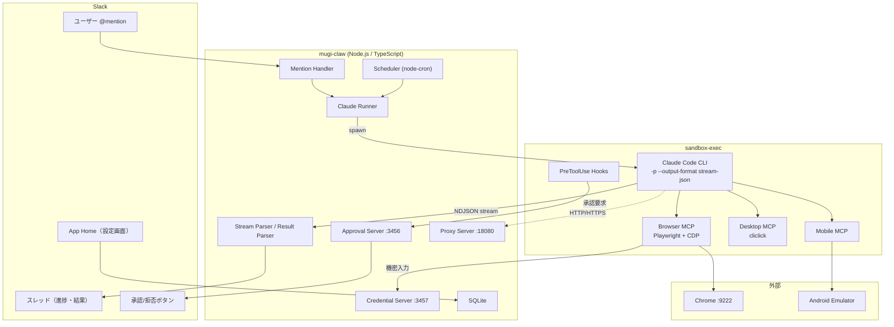
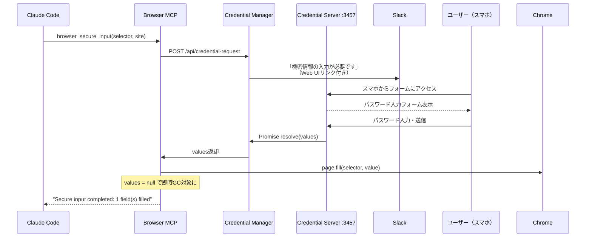

先日、共著で書かせていただいた『[AIエージェント開発 / 運用入門](https://www.amazon.co.jp/dp/4815636605)』が[ITエンジニア本大賞2026](https://www.shoeisha.co.jp/campaign/award/result/)の技術書部門ベスト10に選ばれまして、翔泳社主催の[「技術書の話をしよう。～特集！ITエンジニア本大賞2026～」](https://sebook.connpass.com/event/386559/)で登壇してきました。

そのなかで「自分専用のAIエージェントを作って業務効率化しよう」という話をしたのですが、話した側の自分自身が**ある壁**にぶつかっていたんですよね...。

## Table of Contents

```toc
```

## はじめに

AIエージェント、便利ですよね。[Claude Code](https://docs.anthropic.com/en/docs/claude-code)をはじめとするコーディングエージェントの恩恵を日々受けていますし、このブログの執筆にも[音声入力とClaude Codeを組み合わせたワークフロー](/2026/02/03/whisper-realtime-claude-code-blog-writing/)を活用しています。

**しかし、ブログを書いたりコードを書いたりする以外の雑務、たとえば経費精算やメール確認、カレンダー管理といった事務作業をAIエージェントに任せようとすると、どうしてもコストの壁にぶつかります**。APIキーの従量課金でエージェントをブンブン回すと、冗談抜きで月の請求が恐ろしいことになるわけです。

で、この問題に対して1つの解を見つけました。Claude Codeの**サブスクリプション**をバックエンドにしたパーソナルAIエージェント「[むぎ苦労（mugi-claw）](https://github.com/tubone24/mugi-claw)」です。名前は飼い犬の[むぎ](https://www.instagram.com/mugimugi.cutedog/)から取りつつ、[OpenClaw](https://openclaw.ai/)へのオマージュと、文字通り苦労して作ったという意味を込めています。

この記事では、むぎ苦労の技術的な実装詳細を中心に紹介していきます。

## LLMの利用コストとサブスクリプション

### API従量課金というつらみ

まず、なぜサブスクリプションにこだわったかという話です。

LLMのAPIは**従量課金**、つまり消費したトークン数に応じて課金されます。Claude Opus 4.6の場合、入力が $5/100万トークン、出力が $25/100万トークンです（[Anthropic公式価格表](https://platform.claude.com/docs/en/about-claude/pricing)より）。

一見すると安く感じるかもしれませんが、Claude Codeのようなコーディングエージェントは単純なチャットとは桁違いにトークンを消費します。

エージェントループのたびにファイルを読み込み、コンテキストを組み立て、ツールを実行し、その結果をまた読み込む。1回のやりとりで5万〜15万トークンの入力が飛ぶのは珍しくありません（[DEV Communityの38セッション分析](https://dev.to/slima4/where-do-your-claude-code-tokens-actually-go-we-traced-every-single-one-423e)より）。

Anthropicの公式ドキュメントでは、APIキー利用時の**平均コストは1日あたり約 $6（約900円）** で、90%のユーザーが $12/日以下に収まるとされています（[Manage costs effectively](https://code.claude.com/docs/en/costs)より）。ただしこれはSonnet中心のライトな使い方での平均値です。

Opus 4.6をメインに、日勤帯（8時間）でがっつりコーディングに使った場合の試算はこうなります。

| 項目 | トークン数 | 単価 | コスト |
|------|-----------|------|--------|
| 入力（非キャッシュ 5%） | 約500K | $5/MTok | $2.50 |
| キャッシュ書き込み | 約1M | $6.25/MTok | $6.25 |
| キャッシュ読み取り（95%） | 約19M | $0.50/MTok | $9.50 |
| 出力 | 約1M | $25/MTok | $25.00 |
| **1日合計（ライト〜標準）** | | | **約 $43（約6,500円）** |

キャッシュヒット率が高いおかげで入力側はだいぶ助かりますが、出力トークンの単価が重い。大規模リファクタリングなどヘビーに使うと**1日 $80〜120（約12,000〜18,000円）** に達することもあります。

これを月22営業日で計算すると、**月額 $950〜2,640（約14万〜40万円）** です。さすがにつらいですね、これは。貧乏人にはきつすぎます。

### Claude Codeのサブスクリプション

一方で、Claude Codeにはサブスクリプションプランがあります。

| プラン | 月額 | Proとの使用量比 |
|--------|------|---------------|
| Pro | $20 | 1x（基準） |
| Max 5x | $100 | 5倍 |
| Max 20x | $200 | 20倍 |

Max 20xのAPI換算価値は**月 $2,600〜5,600相当**とする分析もあります（[ksred.comの8ヶ月追跡データ](https://www.ksred.com/claude-code-pricing-guide-which-plan-actually-saves-you-money/)より）。$200で$2,600相当の価値が得られるなら、13倍のコスト効率です。

ちなみに執筆時点（2026年3月27日）では、[Claude March 2026 Usage Promotion](https://support.claude.com/en/articles/14063676-claude-march-2026-usage-promotion)という期間限定キャンペーン（3/13〜3/28）が実施されており、オフピーク時間帯の使用量が2倍になっていました。日本時間だと午前3時〜午後9時がオフピーク扱いなので、日中の業務時間がまるごと2倍。Max 20xならさらに余裕があり、Opus 4.6を1日中使ってもなかなか上限に達しない状況でした。

**ここまで来ると、コーディング以外のこともClaude Codeにお願いしようかなという気になってくるわけです**。

## OpenClawという先行事例と教訓

サブスクリプションを活用してチャットサービス上でAIエージェントを動かすというアイデア自体は、[OpenClaw](https://openclaw.ai/)が先行していました。OpenClawはWhatsApp、Discord、Slackなど多数のチャットプラットフォームに対応したオープンソースのAIエージェントで、GitHub上で25万スター以上を獲得しています（[GitHubリポジトリ](https://github.com/openclaw/openclaw)より）。

しかし、OpenClawにはいくつかの深刻な問題がありました。

まずセキュリティです。2026年初頭から複数のCVEが報告されており、WebSocketハイジャックによるゼロクリック攻撃（CVE-2026-25253、CVSS 8.8）、コマンドインジェクション（CVE-2026-24763）、プロンプトインジェクション経由のコード実行（CVE-2026-30741）など、かなり重大な脆弱性が見つかっています（[Sangforのセキュリティレポート](https://www.sangfor.com/blog/cybersecurity/openclaw-ai-agent-security-risks-2026)より）。

さらにスキルマーケットプレイスであるClawHubでは1,467個の悪意あるスキルが発見され、うち1つは34万インストールを超える規模でクレデンシャルを窃取していたという報告もあります（[Blink Blog](https://blink.new/blog/is-openclaw-safe-clawhub-malware-guide-2026)より）。

そして利用規約の問題です。OpenClawはClaude Pro/MaxのOAuthトークンを流用してAPIアクセスする、いわゆる「サブスクリプションハック」に対応していましたが、Anthropicは2026年1月にサーバー側でOAuthトークンの利用を公式クライアントのみに制限する技術的措置を実施しました（[GitHub Issue #559](https://github.com/openclaw/openclaw/issues/559)より）。アカウントBANの事例も報告されています。

OpenClawのアプローチ自体には共感する部分がありますが、セキュリティと利用規約の両面で諸刃の剣だなというのが正直な感想です。むぎ苦労を作るにあたっては、この教訓を踏まえた設計を心がけました。

## むぎ苦労の概要

### なぜSlackなのか

むぎ苦労は**Slack専用のClaude Code駆動パーソナルAIエージェント**です。コードは[GitHub](https://github.com/tubone24/mugi-claw)で公開していますが、あくまで自分用にチューニングしたものなので、参考程度に見ていただければと思います。

さて、Claude Codeでできることを他のアプリから動かすだけなら、別にSlackである必要はないですよね。ターミナルから直接やればいい話です。

でも、PCを開いていないときに限って事務作業をやりたくなりません?

自分の場合、PCに向かっている時間はコーディングに集中したい。経費精算やメール確認みたいなめんどくさい作業は、通勤中や隙間時間にスマートフォンからちょいちょいで片付けたいんですよね。スマートフォンにはSlackが入っている。そこからAIエージェントに指示を出せれば、PCを開かなくても色々なことが捗るんじゃないかと。

これがSlackにした理由です。

### 利用規約の確認

「それって利用規約的に大丈夫なの？」と思う方もいるでしょう。自分も気になったので調べました。

Claude Codeの[公式ドキュメント](https://code.claude.com/docs/en/overview)では、 `-p` フラグを使った自動化が公式ユースケースとして明記されています。ログ分析、CI/CDでの翻訳自動化、セキュリティレビューなどの例が紹介されており、スクリプトやパイプラインからCLIを呼び出す使い方は想定された利用形態です。

また、[Legal and compliance](https://code.claude.com/docs/en/legal-and-compliance)のページでは、OAuthの認証情報はClaude CodeとClaude.aiでの利用のみ許可されること、およびClaude Code CLI経由の自動化は許可の範囲内であることが明記されています。**つまり、自分自身のサブスクリプションで、自分のマシン上で動くClaude Code CLIを他のアプリケーションから呼び出す分には問題ない**ということです。

一方で、**アカウントの共有は明確に禁止**されています（[Consumer Terms of Service](https://www.anthropic.com/legal/consumer-terms) Section 3.7より）。むぎ苦労はSlack上で動くため、ワークスペースに入っている他のメンバーが1人のサブスクリプションを使ってAIにアクセスできてしまう構造になっています。

これは利用規約に抵触する可能性があるので、くれぐれも**個人の責任の範囲内で**利用してください。大規模なワークスペースに導入して不特定多数で使うような運用は避けるべきです。

## 全体アーキテクチャ

むぎ苦労の全体像を図にすると以下のようになります。



TypeScriptで書かれたNode.jsアプリケーションが、[Slack Bolt](https://api.slack.com/tools/bolt)の[Socket Mode](https://api.slack.com/apis/socket-mode)でSlackに常駐します。ユーザーからメンションを受けると、Claude Code CLIを `child_process.spawn()` で起動し、[NDJSON](https://ndjson.org)ストリームをリアルタイムにパースしてSlackスレッドに進捗を投稿するという流れです。

ブラウザ操作、デスクトップ操作、モバイル操作はそれぞれ[MCP](https://modelcontextprotocol.io)（Model Context Protocol）サーバーとして実装されており、Claude Code CLIから呼び出されます。セキュリティはmacOSの `sandbox-exec` とプロキシの2層で担保しています。

また、LLMOpsの観点では[Langfuse](https://langfuse.com)によるトレーシングも設定しています。Claude CodeのPreToolUse/PostToolUseフックからLangfuse Ingestion APIにデータを送信する仕組みで、詳しい実装は[以前の記事](/2026/03/13/claude-code-langfuse-hooks-tracing/)で紹介しました。むぎ苦労でも同じ仕組みを使って、エージェントのツール実行やトークン消費を可視化しています。

## Claude Code CLIのヘッドレス実行

ここからは実装の詳細に入ります。むぎ苦労の心臓部は、Claude Code CLIをヘッドレス（非インタラクティブ）モードで `spawn` する部分です。

### spawnと主要フラグ

Claude Code CLIには `-p`（`--print`）フラグがあり、標準入力を介さずプロンプトを直接渡して1回のリクエストを処理できます。これにストリーム出力の `--output-format stream-json` を組み合わせると、リアルタイムにNDJSON形式でイベントが流れてきます。

```typescript{file: "src/claude/claude-runner.ts"}
const args = [
  '-p', prompt,
  '--output-format', 'stream-json',
  '--max-turns', String(this.config.claude.maxTurns),
  '--verbose',
];

// 使用を許可するツールを明示的に指定
args.push('--allowedTools', ...tools);

// MCP サーバー設定
args.push('--mcp-config', '.mcp.json');

// スレッド内の再メンション時はセッションを継続
if (resumeSessionId) {
  args.push('--resume', resumeSessionId);
}

// モデル指定（Slack Home画面から切り替え可能）
if (model) {
  args.push('--model', modelId);
}
```

`--allowedTools` には、Claude Code内蔵ツール（`Read` 、 `Write` 、 `Bash` 、 `WebSearch` 等）に加えて、自作MCPのツール群（`mcp__browser__browser_navigate` 等）やスキル（`Skill(gmail)` 、 `Skill(google-calendar)` 等）を指定しています。

サンドボックスが有効な場合は、macOSの `sandbox-exec` でCLIプロセスをラップします。

```typescript{file: "src/claude/claude-runner.ts"}
const command = this.config.sandbox.enabled
  ? 'sandbox-exec'
  : this.config.claude.cliPath;

const spawnArgs = this.config.sandbox.enabled
  ? ['-f', this.config.sandbox.profile, this.config.claude.cliPath, ...args]
  : args;

// プロキシ環境変数を注入
const proxyEnv = this.config.sandbox.enabled
  ? {
      HTTP_PROXY: `http://localhost:${proxyPort}`,
      HTTPS_PROXY: `http://localhost:${proxyPort}`,
    }
  : {};

const child = spawn(command, spawnArgs, {
  env: {
    ...process.env,
    ...proxyEnv,
    MUGI_CLAW_APPROVAL: '1',
    APPROVAL_PORT: String(this.config.approval.port),
    APPROVAL_CHANNEL: approvalContext.channel,
    APPROVAL_THREAD_TS: approvalContext.threadTs,
  },
  stdio: ['ignore', 'pipe', 'pipe'],
});
```

`sandbox-exec -f mugi-claw.sb claude -p ...` という形でCLIが起動され、環境変数でプロキシのアドレスと承認サーバーの接続情報を渡しています。

### NDJSONストリームのパース

`--output-format stream-json` を指定すると、Claude Code CLIは処理の進行に応じてNDJSON（1行1JSON）でイベントを出力します。 `system_init` 、 `assistant` 、 `tool_use` 、 `tool_result` 、 `result` などのイベントタイプがあり、これをリアルタイムにパースしてSlackスレッドの進捗表示に反映させています。

```typescript{file: "src/claude/stream-parser.ts"}
for await (const line of readLines(child.stdout)) {
  if (!line.trim()) continue;
  const event = JSON.parse(line);

  switch (event.type) {
    case 'system_init':
      // セッションIDを保存（--resume用）
      sessionManager.save(threadTs, event.session_id);
      break;
    case 'assistant':
      // テキスト応答 → Slackスレッドに進捗表示
      threadManager.updateStatus(event.content);
      break;
    case 'tool_use':
      // ツール実行中の表示（ツール名に応じた絵文字付き）
      threadManager.showToolExecution(event.tool, event.input);
      break;
    // （中略）
  }
}
```

### セッション継続と同時実行制御

Slackのスレッド形式を活かして、同一スレッド内で再メンションすると前回のセッションを引き継げるようにしています。 `system_init` イベントから取得した `session_id` を `Map<threadTs, ClaudeSession>` で保持し、再メンション時に `--resume` フラグで渡す仕組みです。24時間以上経過した古いセッションは自動でクリーンアップされます。

同時実行制御としては、デフォルト最大3並列で動作し、超過分はキューに入って指数バックオフリトライ（2秒、4秒、8秒、最大3回）で処理されます。

## Slack連携の実装

### スレッド形式のリアルタイム進捗

Slackとの接続は[Socket Mode](https://api.slack.com/apis/socket-mode)を使っています。HTTPエンドポイントの公開が不要で、自宅のMacBookからでもWebSocketで直接つながるのが都合がいいです。

`app_mention` イベントを受信すると、まず「考え中わん...」というステータスメッセージをスレッドに投稿し、そこをリアルタイムに更新していきます。ツール実行中はツール名に応じた絵文字を表示し（`browser_navigate` なら地球儀、 `Bash` ならラップトップ）、いま何をやっているか一目でわかるようにしています。

ステータスメッセージの更新は[Slack APIのレート制限](https://api.slack.com/docs/rate-limits)を考慮して2秒間隔のデバウンスをかけています。完了時の結果メッセージは4,000文字を超える場合に自動分割して投稿します。

### 承認/拒否ボタン

Slack上で動かす以上、すべてのツール実行を自動承認にすると怖いですよね。一方で、承認を求めすぎるとSlack上でボタンを連打する羽目になり、体験が最悪になります。

むぎ苦労では、Claude CodeのPreToolUseフックでツールの種類ごとに3段階の判定を行ないます。

```bash{file: ".claude/hooks/tool-approval.sh"}
# 読み取り系 → 自動承認（exit 0）
Read|Glob|Grep|WebSearch|WebFetch|browser_screenshot|browser_get_text)
  exit 0 ;;

# 書き込み系 → Slackで承認を求める（exit 1）
Write|Edit)
  # Approval ServerにHTTPリクエストを送り、Slackにボタンを投稿
  curl -s "http://localhost:${APPROVAL_PORT}/api/request-approval" \
    -d "{\"tool\":\"${TOOL_NAME}\",\"channel\":\"${APPROVAL_CHANNEL}\"}"
  # （中略：レスポンスのapproved/deniedを判定）
  ;;

# 危険なBashコマンド → 承認必要
*rm*|*sudo*|*git push*|*launchctl*)
  # 同上の承認フロー
  ;;
```

承認ボタンは[Block Kit](https://api.slack.com/block-kit)の `actions` ブロックで実装しており、 `OWNER_SLACK_USER_ID` に設定されたユーザーのみが操作できます。10分間応答がなければ自動で拒否されます。

### 構造化出力パターン

むぎ苦労にはSlackのCanvas作成、予約メッセージ投稿、ブックマーク管理など、Slack APIを直接叩く必要がある機能があります。しかし、これらをClaude Codeにブラウザ経由で操作させるのはトークンの無駄遣いですし、遅いです。

そこで**構造化出力パターン**を採用しました。Claude Codeの応答テキストに `[CANVAS_ACTION]...[/CANVAS_ACTION]` のようなブロックを埋め込ませ、Node.js側で正規表現パースしてSlack APIを直接実行します。

```typescript{file: "src/claude/result-parser.ts"}
const BLOCK_PATTERNS = [
  'MEMORY_SAVE', 'PROFILE_UPDATE', 'SCHEDULE_ACTION',
  'CANVAS_ACTION', 'SCHEDULED_MESSAGE', 'BOOKMARK_ACTION',
  'LIST_ACTION', 'MODEL_ACTION', 'REACTION_ACTION',
  'SCHEDULED_MESSAGE_ACTION',
] as const;

for (const blockType of BLOCK_PATTERNS) {
  const regex = new RegExp(
    `\\[${blockType}\\]([\\s\\S]*?)\\[/${blockType}\\]`, 'g'
  );
  // （中略：マッチしたブロックをJSON.parseしてSlack APIを実行）
}
```

10種類の構造化ブロックをサポートしており、Claude CodeのCLAUDE.mdにフォーマットを定義しておくことで、LLMが適切なタイミングで構造化出力を生成してくれます。パースされたブロックは応答テキストから除去されるため、ユーザーには見えません。

## ブラウザ操作とコンピュータユース

### Chrome DevTools Protocolによる接続

むぎ苦労の大きな特徴の1つが、[Chrome DevTools Protocol](https://chromedevtools.github.io/devtools-protocol/)（CDP）を使ったブラウザ操作です。

あらかじめChromeを `--remote-debugging-port=9222` オプション付きで起動しておき、[Playwright](https://playwright.dev)の `chromium.connectOverCDP()` で接続します。

```typescript{file: "src/browser/mcp-server.ts"}
const browser = await chromium.connectOverCDP(wsUrl);
const context = browser.contexts()[0];
// MCPプロセスごとに専用のタブを作成（複数スレッドの同時操作に対応）
const page = await context.newPage();
```

なぜCDPにこだわるかというと、**ログイン済みのセッションをそのまま使いたい**からです。

GmailやGoogleカレンダー、X（旧Twitter）など、普段ブラウザでログインして使っているサービスを、AIエージェントにも同じセッションで操作させたい。

もちろんGoogle Workspace向けのMCPサーバーを使えばAPIキーでアクセスする方法もありますが、Google CloudでOAuth設定を作ってAPIキーを発行して...というのが意外とハードルが高い。CDPなら、Chromeでログインさえしていれば、人間がやることと同じ操作をAIに任せられます。

トークン効率は正直悪いです。毎回スクリーンショットを撮ったりDOMを解析したりと手間がかかるので、API直接叩くより何倍も遅い。でも、APIキーを発行できないサービスや、そもそもAPIが公開されていないサービスでも操作できるという汎用性には代えられません。

### モバイル操作

ブラウザだけでなく、ネイティブアプリしかないサービスにも対応するために、Androidエミュレータの操作もサポートしています。ベースは [@mobilenext/mobile-mcp](https://www.npmjs.com/package/@mobilenext/mobile-mcp) を使い、これに不足している機能を自作の `mobile_extra` MCPで補っています。

```json{file: ".mcp.json"}
{
  "mcpServers": {
    "browser": { "command": "node", "args": ["dist/browser/mcp-server.js"] },
    "desktop": { "command": "node", "args": ["dist/desktop/mcp-server.js"] },
    "mobile":  { "command": "npx", "args": ["-y", "@mobilenext/mobile-mcp@latest"] },
    "mobile_extra": { "command": "node", "args": ["dist/mobile/mcp-server.js"] }
  }
}
```

自作部分は3つの機能を提供しています。 `mobile_screenshot_slack` はスクリーンショットをSlackスレッドに自動投稿する機能で、サードパーティの `mobile_take_screenshot` にはSlack連携がないため、PreToolUseフックで拒否してこちらに誘導しています。 `mobile_secure_input` はブラウザ版と同じコンセプトの機密情報入力機能で、入力値を `adb shell input text` でエミュレータに送信します。残りはエミュレータのライフサイクル管理（起動・停止・一覧）です。

### スクリーンショットのSlack連携

ブラウザ操作中のスクリーンショットは、自動でSlackスレッドにアップロードされます。Approval Serverの `/api/upload-screenshot` エンドポイントにPOSTし、Slackの `filesUploadV2` でスレッドに投稿する仕組みです。スマートフォンからSlackを見ているだけで、AIが今どの画面を操作しているのか視覚的に確認できるのはなかなか便利です。

## 機密情報をLLMに渡さない仕組み

ブラウザ操作をさせるとなると、どうしてもログイン画面に遭遇します。セッションが切れていたり、新しいサービスにはじめてアクセスしたり。そのときにパスワードやOTPをLLMのコンテキストに載せるわけにはいきません。

むぎ苦労では、 `browser_secure_input` というMCPツールで**機密情報をLLMに一切渡さずに**ブラウザのフォームに入力する仕組みを実装しています。



3つのコンポーネントが連携して動きます。

Browser MCPが `browser_secure_input` ツールの呼び出しを受けると、Approval Serverの `/api/credential-request` にブロッキングHTTP POSTを送ります。Credential Managerはローカルネットワーク上のIPアドレスを自動取得して `http://{local-ip}:3457/credential/{requestId}` というURLを生成し、SlackにBlock Kitメッセージとしてリンクを投稿します。

ユーザーはスマートフォン等からそのURLにアクセスし、HTMLフォームにパスワードを入力して送信します。フォームのパスワードフィールドは `type="password"` かつ `autocomplete="off"` で、5分のカウントダウンタイマー付きです。送信された値はCredential ManagerのPromiseをresolveし、Browser MCPに返されます。

**ここが重要なポイント**ですが、Browser MCPは受け取った値で `page.fill(selector, value)` を実行した後、**即座に `values = null` として参照を切断**しています。LLMには "Secure input completed: 1 field(s) filled on example.com" というメッセージだけが返り、クレデンシャルの中身はコンテキストに一切載りません。

ログにも出力しません。

ただし正直に言うと、この仕組みには穴があります。悪意のあるスキルやプロンプトインジェクションで「パスワード欄の値をDevToolsから読み取って外部に送信しろ」と指示されれば、原理的には突破できてしまいます。このあたりのハードニングは今後の課題です。

## セキュリティ対策

### macOS sandbox-execによる制限

Claude Code CLIにはサンドボックス機能が組み込まれていますが、むぎ苦労では**独自のサンドボックス**を重ねています。macOSのカーネルレベルのサンドボックス機構である `sandbox-exec` を使い、プロセスのリソースアクセスを制限します。

```scheme{file: "sandbox/mugi-claw.sb"}
(version 1)
(allow default)

;; ネットワーク: 外部接続をブロック、localhostのみ許可
(deny network-outbound (remote ip "*:*"))
(allow network-outbound (remote ip "localhost:*"))
(allow network-outbound (remote tcp "localhost:*"))
(allow network-outbound (remote unix-socket))
(allow network-inbound)
(allow network-outbound (remote udp "*:53"))  ;; DNS

;; ファイルシステム: 機密パスをブロック
(deny file-read* (subpath "/Users/tubone24/.ssh"))
(deny file-read* (subpath "/Users/tubone24/.aws"))
(deny file-read* (subpath "/Users/tubone24/.gnupg"))
;; （中略：書き込みも同様にブロック）
```

設計判断として `(deny default)` ではなく `(allow default)` を採用しています。Claude Code CLIは複雑なバイナリで、 `deny default` だと必要な低レベルシステム操作をすべて列挙する必要があり非現実的でした。代わりに、**ネットワークと機密ファイルのみをピンポイントでdeny**する方針です。

なお、 `sandbox-exec` はAppleにより公式にはdeprecated扱いとされています。ただし現時点では動作しており、将来のmacOSバージョンで代替手段に移行する必要が出てくるかもしれません。

### プロキシによるホワイトリスト制御

`sandbox-exec` でlocalhostのみネットワーク接続を許可しているため、外部へのHTTP/HTTPSアクセスはすべて内部プロキシ（ポート18080）を経由します。ここにホワイトリストを持たせて、許可されたドメインのみ通信を許可する仕組みです。

ホワイトリストは3層構造になっています。デフォルト（環境変数 `DEFAULT_WHITELIST` から読み込み、 `*.googleapis.com` のようなワイルドカード対応）、一時許可（インメモリ、再起動でクリア）、永続許可（SQLiteに保存）の3つです。

ホワイトリストにないドメインへのアクセスが発生すると、Slackスレッドに3つのボタン付きメッセージが投稿されます。「Allow Once」で一時許可、「Allow Permanently」でSQLiteに永続保存、「Deny」または10分タイムアウトで拒否。**Slackのスマートフォンアプリからホワイトリストを管理できる**ので、PCを開く必要がありません。

### 2層防御の設計思想

`sandbox-exec`（カーネルレベル）とプロキシ（アプリケーションレベル）の2層で防御しています。

仮にClaude Codeが `curl --noproxy` や `nc` でプロキシをバイパスしようとしても、 `sandbox-exec` がカーネルレベルで外部ネットワーク接続をブロックします。逆に、 `sandbox-exec` の制御をすり抜ける方法が見つかったとしても、プロキシ側のホワイトリストで未許可のドメインへのアクセスが止まります。

**どちらか一方が突破されても、もう一方が防いでくれる**。これが2層にしている理由です。

さらにツールレベルでは、PreToolUseフックとガードスクリプトが `.env` ファイルへのアクセスやプロジェクト外のファイル削除をブロックしています。完璧とは言えませんが、「壊滅的な事故」を防ぐラインとしては機能しているかなと思います。

## 運用と管理機能

### Slackホーム画面

SlackのApp Homeタブに管理画面を用意しています。

| 機能 | 内容 |
|------|------|
| プロフィール設定 | 呼び名、場所、タイムゾーン、趣味、興味分野 |
| スケジュール一覧 | cron形式で定期タスクの登録・編集・削除・一時停止・即時実行 |
| モデル切り替え | Opus / Sonnet / Haiku をセレクトボックスで変更 |
| ホワイトリスト管理 | ドメインの追加・編集・削除（ページネーション付き） |
| 通知設定 | 完了時・エラー時の通知ON/OFF |

（ここにApp Home画面のスクリーンショットを挿入）

PCを開かなくても運用に必要な操作はひと通りSlackから行なえます。プロフィール情報は天気予報の取得やニュースのフィルタリングに使われ、スケジュール実行は [node-cron](https://www.npmjs.com/package/node-cron) で動いています。

### 自己デプロイ

ちょっと変わった機能ですが、むぎ苦労は `/mugiclaw deploy` というSlashコマンドで**自分自身をデプロイ**できます。

```typescript{file: "src/slack/handlers/commands/deploy-commands.ts"}
// 1. git pull
await exec('git pull');
notify(dm, 'git pull 完了');

// 2. ビルド
await exec('npm run build');
notify(dm, 'ビルド完了');

// 3. 自分自身を再起動
await exec(`launchctl kickstart -k gui/$(id -u)/com.mugi-claw`);
```

別のPCでコードを書いてGitHubにpushしておけば、Slackから `deploy` するだけでpull → build → 再起動が走ります。各ステップの進捗はDMでリアルタイム通知されるため、ビルド失敗時もすぐ気づけます。

### launchdによる常時稼働

macOSの [launchd](https://developer.apple.com/library/archive/documentation/MacOSX/Conceptual/BPSystemStartup/Chapters/CreatingLaunchdJobs.html) でデーモン化しています。

```xml{file: "launchd/com.mugi-claw.plist"}
<key>RunAtLoad</key>
<true/>

<key>KeepAlive</key>
<dict>
    <key>SuccessfulExit</key>
    <false/>
</dict>

<key>ThrottleInterval</key>
<integer>10</integer>
```

`RunAtLoad` でログイン時に自動起動、 `KeepAlive` の `SuccessfulExit: false` で異常終了時に自動再起動。 `ThrottleInterval` で最低10秒のインターバルを設けて、クラッシュループを防いでいます。

自宅で使っていないMacBookをクラムシェルモードで常時稼働させて、このplistで動かしています。Claude Codeが流行ったときにMac miniを買って常時稼働させる人が多かったみたいですが、自分はMac miniを持っていなかったので余ったMacBookで代用しています。

## 現状の課題

正直に言って、まだまだ課題だらけです。

まずブラウザ操作やモバイル操作の**速度**。毎回スクリーンショットを撮ったりDOMを解析したりするので、1つの操作に数十秒かかることもあります。APIを直接叩くのと比べると圧倒的に遅い。ただ、APIが存在しないサービスにも対応できるという汎用性とのトレードオフなので、ここは割り切っています。

**セキュリティの穴**も残っています。Credential Serverの入力値を悪意あるプロンプトで読み取られるリスク、プロンプトインジェクションへの耐性、スキルの信頼性検証など、OpenClawの事例を見ても分かるように、このジャンルのアプリケーションはセキュリティが永遠の課題です。

そして**安定性**。Claude Code CLIのアップデートで挙動が変わったり、Slack APIのレート制限に引っかかったり、CDPの接続が不安定になったり。常時稼働させていると色々起きます。 `launchd` のおかげで落ちても自動復帰しますが、根本的な安定性の向上は引き続き取り組んでいく必要があります。

## 最後に

サブスクリプション駆動のSlack常駐AIエージェント「むぎ苦労」を紹介しました。

従量課金の呪いから逃れるためにサブスクリプションを活用し、Chrome DevTools Protocolでログイン済みセッションを再利用し、機密情報はLLMのコンテキストに載せず、sandbox-execとプロキシの2層でセキュリティを確保する。書き出してみると結構な苦労でした。名前の通りですね。

完成度としてはまだまだで、万人におすすめできるものではありません。ただ、スマートフォンのSlackから「明日の予定教えて」とか「あのメール返しといて」と雑に投げるだけで動いてくれるのは、思った以上に体験として良いです。PCを開かなくていい、というだけでこんなに楽なのかと。

コードは[GitHub](https://github.com/tubone24/mugi-claw)に置いてあります。使う場合はくれぐれも利用規約とセキュリティリスクを理解したうえで、自己責任で。

Claude Codeのサブスクリプションで遊ぶネタが尽きない予感がするこの頃です。
