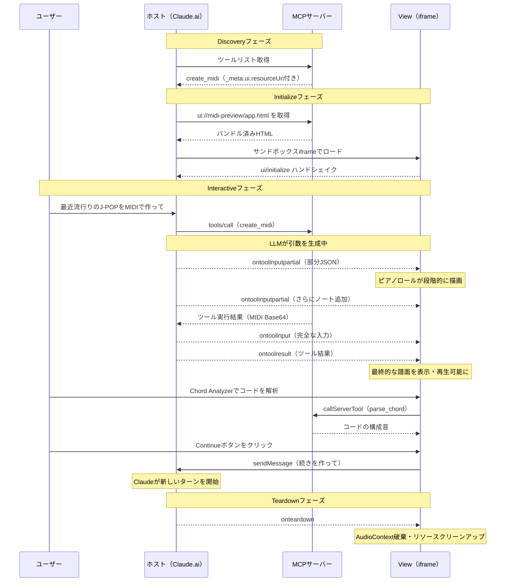

桜も散ってしまい、センチメンタルな曲が聞きたくなりました。ふと思い立って、AIに「最近流行りのJ-POPをMIDIで作って」と頼んでみたら、目の前でピアノロールの譜面がリアルタイムに描かれていきました。

## Table of Contents

```toc
```

## はじめに

以前、[MCPについてLTで登壇した](https://slide-tubone24.pages.dev/slides/cline/1)ことがありました（といっても浅い内容でお恥ずかしい限りですが）。そのときはStdIOベースのMCPサーバーを作って[Cline](https://cline.bot/)と連携させる話だったのですが、MCPの世界はそこからさらに広がっていきました。

その1つが、2026年1月にリリースされた[MCP Apps](https://modelcontextprotocol.io/extensions/apps/overview)という拡張仕様です。これは従来のテキスト応答に加えて、**チャットUI上にインタラクティブなHTML画面を直接埋め込める**というもので、はじめて知ったときは、Googleが主導する[A2UI](https://a2ui.org/)（Agent-to-User Interface、[A2A](https://a2a-protocol.org/)とは独立したプロトコルですが相互補完する関係にあります）と何が違うのか？と思って、自分の理解力では追いつけず、正直あまり向き合っていませんでした。ですが、実際に触ってみるとこれがかなり面白いんですよね。

もともとギターを弾いていた（下手の横好きですが）こともあり、MIDIには馴染みがありました。MIDIファイルを生成するだけなら既存のツールでもできますが、**AIが作曲した楽曲をその場でピアノロール譜面として可視化し、さらにUI上のボタンからサーバーのツールを呼び出したり、Claudeに「続きを作って」とリクエストしたりできる**としたら、MCP Appsの仕様を広くデモできるのでは...と考えたのがきっかけです。

そこで作ったのが[midi-mcp-server](https://github.com/tubone24/midi-mcp-server)です。自分の手作りで粗削りなところも多いですが、よければお付き合いください。

::github{repo="tubone24/midi-mcp-server"}

（ここにClaude.aiでmidi-mcp-serverを使っているデモのGIF/スクリーンショットを挿入）

以下では、midi-mcp-serverの実装を題材にしつつ、MCP Appsの仕様を実際の画面とコードで追っていきます。

## MCP Appsとは

### 従来のMCPツールとの違い

[@modelcontextprotocol/sdk](https://github.com/modelcontextprotocol/typescript-sdk)の `server.tool()` でMCPサーバーを作ったことがある方なら、テキストや画像をレスポンスとして返すパターンには慣れているはずです。

しかし、この方式には限界があります。データの可視化をしたい場合、テキストで数値を並べても直感的ではありませんし、チャートやグラフ、今回のようなピアノロール譜面を表示したい場合、テキストレスポンスでは表現力が足りないわけです。

[MCP Apps](https://modelcontextprotocol.io/extensions/apps/overview)はこの課題を解決します。**MCPサーバーがサンドボックス化されたiframe内にインタラクティブなHTML UIを直接配信できる仕組み**です。通常のMCPツールとMCP Appsの違いを簡単にまとめると次のようになります。

| 項目 | 通常のMCPツール | MCP Apps |
|---|---|---|
| 応答形式 | テキスト・画像・構造化データ | インタラクティブなHTML UI |
| ユーザー操作 | チャットでの返答のみ | ボタン、フォーム、ダッシュボード等 |
| 双方向通信 | なし | postMessageによるJSON-RPC |
| セキュリティ | ― | サンドボックスiframeで強制隔離 |

### なぜWebアプリではなくMCP Appsなのか

「別にWebアプリを作ってリンクを送ればいいのでは？」という疑問もあるかもしれません。

MCP Appsを使う利点は、**会話のコンテキスト内にUIが存在する**点にあります。ユーザーはタブを切り替える必要がなく、UIの状態はチャットの流れと一体化しています。さらにMCP Appsのiframeからサーバーのツールを呼び出したり、ホスト（Claude.ai）にメッセージを送信してモデルに再度推論を依頼できます。

セキュリティ面では、サンドボックスiframeによりホスト側のDOM、Cookie、LocalStorageへのアクセスが制限されているため、サードパーティのMCPサーバーが提供するUIでも安全にレンダリングできるのもポイントです。

現時点でMCP Appsに対応しているクライアントとしては、[Claude](https://claude.ai)、[Claude Desktop](https://claude.com/download)、[VS Code GitHub Copilot](https://code.visualstudio.com/)、[Goose](https://block.github.io/goose/)、[Postman](https://www.postman.com/)、[MCPJam](https://www.mcpjam.com/)などがあります。今回の記事ではClaude.aiでの動作を前提に進めていきます。

## MCP Appsのアーキテクチャとライフサイクル

ここからがこの記事の本題です。MCP Appsのアーキテクチャを、midi-mcp-serverの動作を追いながら見ていきます。

### 全体の流れ

MCP Appsの動作は、大きく4つのフェーズに分けて理解できます（[MCP Apps Overview](https://modelcontextprotocol.io/extensions/apps/overview)より）。

まず**Discoveryフェーズ**では、ホスト（Claude.ai）がMCPサーバーに接続してツールリストを取得します。このとき、ツールの `_meta.ui.resourceUri` フィールドがあれば**このツールはMCP Appsに対応している**と判断されます。

次の**Initializeフェーズ**では、ホストがサンドボックスiframeを作成し、 `ui://` URIスキームで指定されたHTMLリソースをロードします。ここでホストとView間のハンドシェイクが行なわれます。ポイントは、**ツールが実際に呼び出される前にUIリソースを事前に読み込める**ことです。これが後述するプログレッシブレンダリングを可能にしています。

**Interactiveフェーズ**が本番です。LLMがツールを呼び出すと、ツール入力やツール結果がViewにプッシュされます。そしてLLMがまだツール引数を生成している途中でも、部分的なJSONがViewに逐次プッシュされます。

最後の**Teardownフェーズ**では、ホストがViewを破棄する前にクリーンアップの通知が送られます。

この一連の流れをシーケンス図で表すと次のようになります。



### UIリソースの事前読み込み

ツールに `_meta.ui.resourceUri` を設定すると、ホストはツールの呼び出しを待たずにUIリソースを事前読み込みできます。midi-mcp-serverでは [`@modelcontextprotocol/ext-apps`](https://github.com/modelcontextprotocol/ext-apps) パッケージが提供する `registerAppTool` と `registerAppResource` でこの設定を行なっています（[MCP Apps Build Guide](https://modelcontextprotocol.io/extensions/apps/build)より）。

```typescript{file: "src/server.ts"}
const RESOURCE_URI = 'ui://midi-preview/app.html';

// UIリソース（バンドル済みHTML）を登録
registerAppResource(server, 'MIDI Preview', RESOURCE_URI, {}, async () => ({
  contents: [{
    uri: RESOURCE_URI,
    mimeType: RESOURCE_MIME_TYPE,
    text: builtHtml,  // Viteでバンドルした単一HTMLファイル
  }],
}));

// MCP Apps対応ツールを登録
registerAppTool(server, 'create_midi', {
  title: 'Create MIDI',
  description: 'Generate a MIDI file from structured composition data...',
  inputSchema: {
    title: z.string().describe('Title of the composition'),
    composition: z.any().describe('Composition object with bpm, tracks...'),
  },
  outputSchema: {
    midiBase64: z.string(),
    title: z.string(),
    bpm: z.number(),
    trackCount: z.number(),
  },
  _meta: {
    ui: { resourceUri: RESOURCE_URI },
  },
}, async ({ title, composition: rawComposition }) => {
  const composition = preprocessComposition(rawComposition);
  const midiBase64 = generateMidiBase64(composition);
  return {
    content: [
      { type: 'text', text: `MIDI file "${title}" generated successfully.` },
    ],
    structuredContent: {
      midiBase64,
      title,
      bpm: composition.bpm,
      trackCount: composition.tracks.length,
    },
  };
});
```

`registerAppResource` で登録したHTMLリソースは、ホストからのリクエストに応じて配信されます。このHTMLは後述する[Vite](https://vite.dev/)の[vite-plugin-singlefile](https://www.npmjs.com/package/vite-plugin-singlefile)で単一ファイルにバンドルされたもので、CSS・JavaScriptがすべてインラインに含まれています。

ちなみに、MCP Apps対応でないツールは従来どおり `server.tool()` で登録すればOKです。UIを持つツールだけ `registerAppTool` を使い分けます。

midi-mcp-serverではUIリソースに加えて、7つの音楽理論リソース（和声法、コード進行、対位法、モード・スケール、オーケストレーション、リズムパターン、ボイスリーディング）も `server.registerResource()` で登録しています。これらはMCP Apps特有の機能ではなく通常のMCPリソースですが、後述する `readServerResource` でView側から読み出す形で活用しています。

## プログレッシブレンダリング：ontoolinputpartialの仕組み

**MCP Appsで一番「おお...」となる仕様がこれです。** 自分の拙い説明で伝わるか不安ですが、がんばって書いてみます。

LLMがツール引数のJSONを生成しているとき、まだJSONは途中までしかできていません。普通に考えれば構文エラーのJSONなのでパースできないはずです。ところがMCP Appsのホストは、この不完全なJSONを**常にvalidな形にヒール**（欠けているフィールドをnullやデフォルト値で補完）して、Viewに逐次プッシュしてくれます。

これが `ontoolinputpartial` フックで受け取れるデータです。

```typescript{file: "src/mcp-app.ts"}
app.ontoolinputpartial = (params) => {
  try {
    const args = params.arguments as unknown as ToolInput;
    if (args?.composition?.tracks) {
      loadComposition(args);  // 部分データでも描画を試みる
    }
  } catch (_e) {
    // まだデータが不完全な場合は無視
  }
};
```

midi-mcp-serverでは、AIが1つ目のトラックの音符を生成し始めた瞬間からピアノロールが描画され始め、音符が追加されるたびにリアルタイムで譜面が更新されていきます。**テキストが1文字ずつ表示されるストリーミングのピアノロール版です。**

（ここにAIが作曲中のピアノロールが段階的に描画されている様子のスクリーンショット/GIFを挿入）

実装上の工夫として、 `args?.composition?.tracks` の存在チェックをしています。ヒール済みとはいえ、まだ `tracks` プロパティが存在しないタイミングもあるため、描画可能な状態になるまではスキップしています。この**まだ無理ならスルーする**パターンは、 `ontoolinputpartial` を使うときの定番です。

そして引数の生成が完了すると `ontoolinput` フックが発火し、完全なデータで最終描画とMIDI生成を行ないます。

```typescript{file: "src/mcp-app.ts"}
app.ontoolinput = (params) => {
  loadComposition(params.arguments as unknown as ToolInput, { generateMidi: true });
};
```

`ontoolinputpartial` との違いは `{ generateMidi: true }` オプションです。部分データの段階ではMIDI生成を行なわず（どうせまだ不完全なので）、 `ontoolinput` で完全なデータが揃ってから生成する、という使い分けです。プログレッシブレンダリングを実装するときの定型パターンとして覚えておくと便利です。

## Appクラスのフックでライフサイクルを管理する

[`@modelcontextprotocol/ext-apps`](https://github.com/modelcontextprotocol/ext-apps) の `App` クラスには6つのフックがあり、 **`connect()` を呼ぶ前にすべて登録する**必要があります。先ほどの `ontoolinputpartial` と `ontoolinput` に加えて、残り4つのフックも見ていきましょう。

### ontoolresult

サーバーでツールの実行が完了すると `ontoolresult` が発火します。midi-mcp-serverでは、サーバーが生成したMIDI base64データをここで取得しています。

```typescript{file: "src/mcp-app.ts"}
app.ontoolresult = (params) => {
  if (params.isError || currentMidiBase64) return;
  // structuredContent から取得（LLMにトークンを消費させない）
  const sc = params.structuredContent;
  if (sc?.midiBase64 && typeof sc.midiBase64 === 'string') {
    currentMidiBase64 = sc.midiBase64;
    btnDownload.disabled = false;
    return;
  }
  // フォールバック：structuredContent 非対応の旧ホスト向け
  const rb = params.content?.find((c) => c.type === 'resource');
  if (rb?.type === 'resource') {
    const text = rb.resource.text;
    if (text) { currentMidiBase64 = text; btnDownload.disabled = false; }
  }
};
```

ここでのポイントは、サーバーが返したMIDI base64データを **`structuredContent` 経由** で取得している点です。 `content` ではなく `structuredContent` を使うことで、**LLMにbase64の大量トークンを消費させずにView側だけにデータを渡せる**のがうれしいところです。 `structuredContent` の詳細は後述しますが、MIDIのbase64は数KB〜数十KBに及ぶため、 `content` で返してしまうとLLMが毎ターンこの塊を読み続けることになってしまい、もったいないわけです。

なお、 `structuredContent` 非対応の旧ホストでも動くように、 `content` の `type: 'resource'` 経由のフォールバックも入れています。自分のような手探り実装だと互換性のケアを忘れがちなので、こういう細かい配慮は忘れずに...と毎回反省しています。

MCP AppsのViewはサンドボックスiframe内で動作するため、 `<a download>` のような通常のダウンロード手法が使えません。代わりに、ここで取得したBase64データを後述の `app.downloadFile()` に渡してホスト経由でダウンロードさせる仕組みになっています。

（ここに完成したピアノロールと再生UIのスクリーンショットを挿入）

### ontoolcancelledとonteardown

ユーザーがツール呼び出しをキャンセルしたり、チャットを閉じたりした場合のクリーンアップも重要です。

```typescript{file: "src/mcp-app.ts"}
app.ontoolcancelled = (_params) => {
  player.stop();
  btnPlay.disabled = true; btnStop.disabled = true;
  btnDownload.disabled = true;
  statusText.textContent = 'Cancelled';
};

app.onteardown = (_params, _e) => {
  player.destroy();  // AudioContext破棄、キャッシュクリア
  return {};
};
```

`ontoolcancelled` はユーザーがツール呼び出しを中断した場合に発火し、 `onteardown` はホストがView自体を破棄する際に発火します。midi-mcp-serverでは音声再生の停止や[AudioContext](https://developer.mozilla.org/ja/docs/Web/API/AudioContext)の破棄を行なっています。**リソースリークを防ぐためにも、この2つのフックは忘れずに実装しておきたいところです。**

### onhostcontextchanged：テーマ追従

ホスト環境が変化したとき（ダークモード/ライトモードの切り替え等）に発火するフックです。

```typescript{file: "src/mcp-app.ts"}
app.onhostcontextchanged = (params) => {
  if (params.context) {
    applyHostStyleVariables(params.context);
    applyDocumentTheme(params.context);
    applyHostFonts(params.context);
    if (params.context.displayMode) updateFsBtn(params.context.displayMode);
    if (currentComposition) renderNotation(currentComposition, notationDiv);
  }
};
```

`@modelcontextprotocol/ext-apps` が提供する `applyHostStyleVariables` ・ `applyDocumentTheme` ・ `applyHostFonts` を呼ぶだけでホストのスタイル変数・テーマ・フォントを反映できます。テーマが変わったらピアノロールも再描画して、グリッド線やテキストの色を合わせるようにしています。

（ここにダークモードとライトモードでのピアノロール表示比較のスクリーンショットを挿入）

さらに `params.context.displayMode` で現在の表示モード（後述する `fullscreen` 等）も取得できるため、表示モード変更時のUI更新もここで行なえます。

### フック登録とconnect()

これらのフックはすべて `app.connect()` の前に登録する必要があります。 `connect()` が成功すると `getHostContext()` でホストの初期状態を取得できます。

```typescript{file: "src/mcp-app.ts"}
const app = new App({ name: 'midi-preview', version: '0.3.0' }, {});

// ↑ この後にフックを登録（前述の6つ）

app.connect()
  .then(() => {
    const ctx = app.getHostContext();
    if (ctx) {
      applyHostStyleVariables(ctx);
      applyDocumentTheme(ctx);
      applyHostFonts(ctx);
    }
  })
  .catch(() => {
    statusText.textContent = 'Standalone mode — waiting for data…';
  });
```

`connect()` が失敗した場合（スタンドアロンでHTMLを開いた場合など）のフォールバックも入れておくと開発時に便利です。

## Viewからの双方向通信

MCP Appsが**単なる表示するだけのUI**ではなく**アプリケーション**と呼ばれる所以が、この双方向通信の仕組みです。 `App` クラスはフック以外にも、**View側からホストやサーバーと対話するためのメソッド**を提供しています。

midi-mcp-serverではこれらのメソッドをフル活用しているので、1つずつ実際の動作と合わせて見ていきましょう。

### callServerTool

View側（iframe内のUI）からMCPサーバーのツールを直接呼び出せます。midi-mcp-serverでは、**Chord Analyzerパネル**でこの仕組みを使っています。

```typescript{file: "src/mcp-app.ts"}
async function analyzeChord() {
  const chord = chordInput.value.trim();
  const octave = parseInt(chordOctave.value, 10);
  try {
    const result = await app.callServerTool({
      name: 'parse_chord',
      arguments: { chord, octave },
    });
    const data = JSON.parse(result.content[0].text);
    chordResult.innerHTML = `
      <div class="chord-name">${data.chord}</div>
      <div class="chord-notes">Notes: <strong>${data.noteNames.join(' – ')}</strong></div>
      <div class="chord-midi">MIDI: ${data.midiNumbers.join(', ')}</div>
    `;
  } catch (e) {
    // エラー表示
  }
}
```

ユーザーがChord Analyzerにコード名（例: `Cmaj7`）を入力してAnalyzeボタンを押すと、View側から `parse_chord` ツールが呼び出されます。**このやり取りはLLMを介さず、View→サーバー間で直接行なわれる**のがポイントです。LLMのターンを消費せず、レスポンスも高速です。

（ここにChord Analyzerパネルで `Cmaj7` を解析した結果のスクリーンショットを挿入）

サーバー側の `parse_chord` ツールは通常の `server.tool()` で登録したMCP Apps非対応のツールですが、View側から `callServerTool` で呼び出せます。つまり、**UIを持たない既存のツールでもView側から利用できる**わけです。

### readServerResource

MCPサーバーが公開しているリソースをView側から直接読み取ることもできます。midi-mcp-serverでは、サーバーに登録した7つの音楽理論リソースを**Music Theory Referenceパネル**から参照できるようにしています。

```typescript{file: "src/mcp-app.ts"}
theorySelect.addEventListener('change', async () => {
  const uri = theorySelect.value;  // e.g. 'music-theory://harmony'
  if (!uri) return;
  try {
    const result = await app.readServerResource({ uri });
    theoryContent.innerHTML = renderMarkdown(result.contents[0]?.text ?? '');
  } catch (e) {
    theoryContent.innerHTML = `<p class="error">Failed: ${e.message}</p>`;
  }
});
```

サーバー側では `server.registerResource()` で通常のMCPリソースとして登録しているだけです。

```typescript{file: "src/server.ts"}
for (const res of MUSIC_THEORY_RESOURCES) {
  const content = loadResource(res.file);
  server.registerResource(
    res.name,
    res.uri,  // e.g. 'music-theory://harmony'
    { description: res.description, mimeType: 'text/markdown' },
    async () => ({
      contents: [{ uri: res.uri, mimeType: 'text/markdown', text: content }],
    })
  );
}
```

これは `registerAppResource`（UIリソース用）とは別で、通常のMCPリソース登録です。MCP Appsのツールでないリソースでも、View側から `readServerResource` で読めるということを意味しています。チャット画面を離れることなく、AI作曲のバックグラウンド知識を参照できるわけです。

（ここにMusic Theory Referenceパネルで `Chord Progressions` を表示しているスクリーンショットを挿入）

### sendMessage

`sendMessage` はチャットにメッセージを送信し、**モデルに即座に新しいターンを開始させる**メソッドです。midi-mcp-serverでは**Continueボタン**で使っています。

```typescript{file: "src/mcp-app.ts"}
btnAskClaude.addEventListener('click', async () => {
  if (!currentComposition) return;
  const title = titleEl.textContent || 'this piece';
  const bpm = currentComposition.bpm;
  const tracks = currentComposition.tracks.map((t) => t.name || 'unnamed').join(', ');
  await app.sendMessage({
    role: 'user',
    content: [{
      type: 'text',
      text: `Please continue "${title}" by adding 8 more bars. ` +
            `Keep the same key, tempo (${bpm} BPM), and style. Tracks: ${tracks}.`,
    }],
  });
});
```

ボタンを押すと、現在の楽曲情報を含んだメッセージがClaudeに送られ、Claudeが新しいターンとして**続きの8小節**を作曲し始めます。**UIの操作がそのままAIへの指示になる**という、MCP Appsならではの体験です。

（ここにContinueボタンを押してClaudeが続きを生成している様子のスクリーンショットを挿入）

### downloadFileとrequestDisplayMode

先述の `ontoolresult` で触れたとおり、MCP AppsのViewはサンドボックスiframe内で動作するため、通常の `<a download>` によるファイルダウンロードが使えません。 `downloadFile` はこの制約を回避するメソッドで、ホストそばにBase64データを渡して代わりにダウンロードしてもらう仕組みです。midi-mcp-serverではMIDIファイルのダウンロードに使っています。

```typescript{file: "src/mcp-app.ts"}
await app.downloadFile({
  contents: [{
    type: 'resource',
    resource: {
      uri: `file:///${filename}`,
      mimeType: 'audio/midi',
      blob: currentMidiBase64,
    },
  }],
});
```

`requestDisplayMode` はViewの表示モードを切り替えるメソッドです。midi-mcp-serverでは全画面表示の切り替えに使っています。 `getHostContext()` で現在の表示モードと利用可能なモードを取得し、 `inline` と `fullscreen` を切り替えます。ピアノロールのような視覚的なUIは全画面で見たくなるので、地味にこの機能はありがたいです。

```typescript{file: "src/mcp-app.ts"}
btnFullscreen.addEventListener('click', async () => {
  const ctx = app.getHostContext();
  const current = ctx?.displayMode ?? 'inline';
  const next = current === 'fullscreen' ? 'inline' : 'fullscreen';
  await app.requestDisplayMode({ mode: next });
});
```

（ここにフルスクリーンモードでのピアノロール表示のスクリーンショットを挿入）

ここまで見てきたように、 `App` クラスのメソッドにより、MCP Appsは**ホスト・サーバー・Viewの三者間で双方向にデータをやり取りできるアプリケーション基盤**として機能します。

## ツール結果のデータ経路とVisibility

### content, structuredContent, _metaの使い分け

MCP Appsのツール結果には3つのデータ経路があり、用途によって使い分けます（[MCP Apps Build Guide](https://modelcontextprotocol.io/extensions/apps/build)より）。

`content` はLLMに公開されるデータです。テキストレスポンスや生成結果のサマリーなど、モデルが次のターンで参照するべき情報を入れます。midi-mcp-serverでは `MIDI file generated successfully. 2 track(s), 120 BPM.` のようなテキストを返しています。

`structuredContent` はLLMには見えず、Viewだけが受け取るデータです。大量のデータをUIに渡したいけどトークンを消費したくない場合に便利です。midi-mcp-serverでも、**まさにこの仕組みを使ってMIDI base64データをViewに渡しています**。MIDIのbase64は数KB〜数十KBに及ぶため、これを `content` で返してしまうとLLMが大量のトークンを消費してしまいますが、 `structuredContent` 経由ならLLMには見えず、ダウンロード用にView側でのみ利用できます。波形データや詳細な分析結果など、人間向けの表示データを大量に渡すケースでも同様に活用できます。

`structuredContent` を返すには、ツール定義時に `outputSchema` を宣言しておく必要があります。先ほどの `registerAppTool` の例でも、 `midiBase64` ・ `title` ・ `bpm` ・ `trackCount` のスキーマを定義しておくことで、型付きの `structuredContent` を返せるようにしています。ここは最初自分も見落としていて、 `outputSchema` を書かずに `structuredContent` を返そうとして動かず、小一時間ハマったところです...。

`_meta` はタイムスタンプやバージョンなどのメタデータ用で、LLMには非公開です。

この使い分けは、MCP Appsを設計するうえでかなり重要です。**UIの表示にしか使わないデータは `structuredContent` に逃がす**のがベストプラクティスで、 `content` に大量のデータを詰めるとトークンを消費してしまいます。

### Visibilityによるツールの公開範囲制御

`registerAppTool` では `_meta.ui.visibility` を設定することで、ツールの呼び出し元を制御できます。

| 設定値 | 意味 | ユースケース |
|---|---|---|
| `["model", "app"]` | LLMからもViewからも呼び出し可能（デフォルト） | 通常のデータ取得ツール |
| `["app"]` | Viewからのみ呼び出し可能。LLMには見えない | ページネーション、フォーム送信、ポーリング |
| `["model"]` | LLMからのみ呼び出し可能。Viewからは呼べない | 削除や課金など誤操作を防ぎたいアクション |

midi-mcp-serverの `create_midi` ツールはデフォルト（LLMとView両方）のままにしていますが、たとえば**再生履歴を保存する**ようなツールを追加するなら `["app"]` にして、UIのボタンからだけ呼べるようにするのが安全でしょう。

## Cloudflare Workersへのデプロイ

midi-mcp-serverは[Cloudflare Workers](https://developers.cloudflare.com/workers/)にデプロイして、リモートMCPサーバーとして `https://midi-mcp-server.tubone24.workers.dev` で公開しています。URLを指定するだけで誰でもClaude.aiから使えるようになるので、せっかくならリモートで公開したいところです。

Workers環境ではNode.jsの `http` / `https` モジュールが使えないため（この制約に自分は毎回ハマります...）、MCPのHTTPトランスポートにはFetch APIベースの `WebStandardStreamableHTTPServerTransport` を使います（[Cloudflare Agents ドキュメント](https://developers.cloudflare.com/agents/guides/remote-mcp-server/)より）。

```typescript{file: "src/worker.ts"}
import { WebStandardStreamableHTTPServerTransport }
  from '@modelcontextprotocol/sdk/server/webStandardStreamableHttp.js';

export default {
  async fetch(request: Request): Promise<Response> {
    const server = createWorkerServer();
    const transport = new WebStandardStreamableHTTPServerTransport({
      sessionIdGenerator: undefined,  // ステートレスモード
      enableJsonResponse: true,
    });
    await server.connect(transport);
    try {
      const response = await transport.handleRequest(request);
      // CORSヘッダーを追加して返却
      // ...中略...
      return new Response(response.body, { status: response.status, headers });
    } finally {
      await transport.close();
      await server.close();
    }
  },
};
```

Node.js版（`server.ts`）が `McpServer` クラスと `registerAppTool` ヘルパーを使うのに対し、Workers版（`worker.ts`）では低レベルの `Server` クラスに `setRequestHandler` で直接ハンドラーを登録しています。これはWorkers環境でリクエストごとにサーバーインスタンスを生成するステートレスな設計を取るためです。

`wrangler.toml` で押さえておくべきポイントは、MCP SDKが依存する `nodejs_compat` フラグと、HTMLおよびMarkdownファイルをテキストモジュールとしてインポートするための `[[rules]]` 設定の2つです。

```toml{file: "wrangler.toml"}
name = "midi-mcp-server"
main = "src/worker.ts"
compatibility_date = "2024-12-05"
compatibility_flags = ["nodejs_compat"]

[[rules]]
type = "Text"
globs = ["**/*.html", "**/*.md"]
```

デプロイは `npx wrangler deploy` の一発で完了します。楽ちんです。

## Claude.aiで使ってみる

midi-mcp-serverをClaude.aiから使うには、設定画面でリモートMCPサーバーのURLを追加するだけです。

（ここにClaude.aiのMCPサーバー設定画面のスクリーンショットを挿入）

接続ができたら、あとはシンプルに頼むだけです。

> 最近流行りのJ-POPをMIDIで作って

これだけで、AIが `create_midi` ツールを呼び出し、BPM、トラック、ノート情報を構造化データとして生成し始めます。

**そしてここからが感動ポイントです。** AIがツール引数のJSONを生成している最中、 `ontoolinputpartial` フックによって部分的なデータがViewに逐次送られます。

最初のトラックの最初の数音が生成された時点で、ピアノロール上にノートが現れ始めます。AIが音符を追加するたびに譜面がリアルタイムに更新されていく様子は、**まるで作曲家が目の前で楽譜を書いているのを眺めているような感覚**です。

（ここにプログレッシブレンダリングでピアノロールが段階的に描画されている様子のスクリーンショット/GIFを挿入）

生成が完了すると、再生ボタンが有効になります。Soundfontの読み込みが完了していればHDオーディオで、まだならオシレーターサウンドで再生されます。

トラック情報パネルにはトラック名、GM instrument番号、ノート数が表示されるので、AIがどんな構成で楽曲を作ったのかも一目でわかります。

（ここに完成したピアノロールと再生UIのスクリーンショットを挿入）

Chord Analyzerでコードの構成音を調べたり、Music Theory Referenceで和声法やコード進行の基本を参照しながら、Continueボタンで「あと8小節追加して」とClaudeにリクエストする...という一連の流れが、すべてチャット画面を離れることなく完結します。

## 最後に

MCP Appsを使って、AIが作曲したMIDI楽曲をピアノロール譜面としてリアルタイムに可視化するMCPサーバーを作ってみました。

正直、 `ontoolinputpartial` による段階的な譜面描画は、想像していた以上に「おお...」となる体験でした。テキストのストリーミング表示とはまた違った没入感があります。そして `callServerTool` や `sendMessage` を組み合わせることで、単なるビジュアライザーではなく、**サーバーのツールを呼び出したりモデルに再指示を出したりできるインタラクティブなアプリケーション**になるのは、MCP Appsの本領発揮だと感じます。

`@modelcontextprotocol/ext-apps` の[examplesディレクトリ](https://github.com/modelcontextprotocol/ext-apps/tree/main/examples)を眺めると、3DモデルビューアやPDFリーダー、QRコード生成器など、すでに面白い事例がたくさん出てきています。MCP Appsはまだ登場して間もない仕様ですが、自分のような実装力に自信のない人間でもそれなりに形にできたので、データ可視化やフォーム入力、メディアプレビューなど、テキストだけでは表現しきれないユースケースに可能性を感じます。

自分の理解がまだまだ浅いのはさておき、MCPもまた触ると楽しいですね、というこの頃です。
