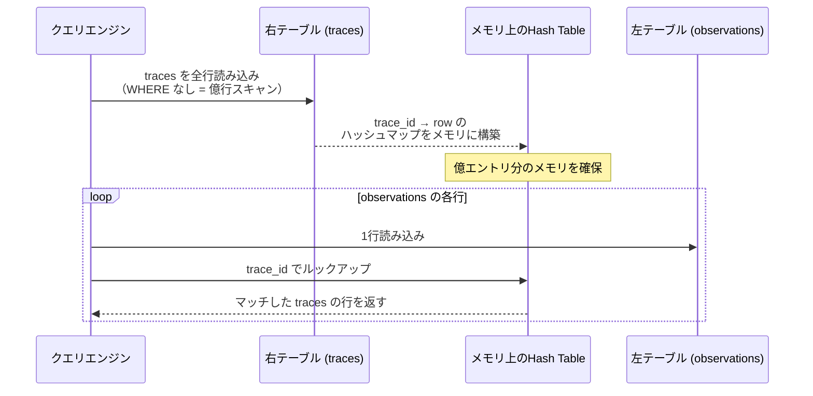
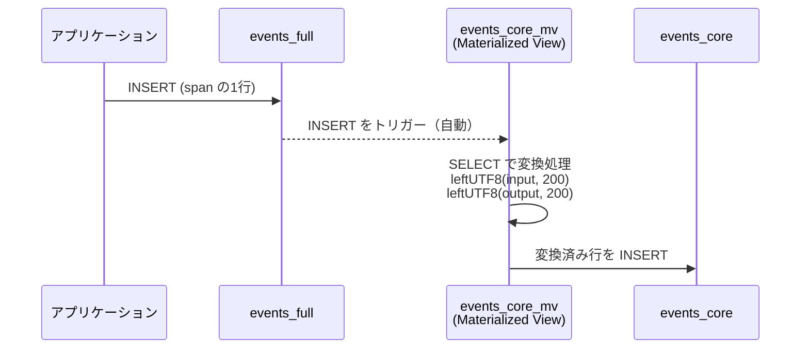

GW真っただ中ですね。皆さん、いかがお過ごしでしょうか。

GWにこんな重たい記事なんか読みたくないっすよね。出かけましょう。

## Table of Contents

```toc

```

## はじめに

<div class="alert alert-warning" role="alert">
<strong>注意</strong><br>この記事で参照しているテーブル構造・スキーマは、Langfuse v4の<a href="https://github.com/langfuse/langfuse/blob/main/packages/shared/clickhouse/scripts/dev-tables.sh" target="_blank" rel="noopener noreferrer">開発用マイグレーションスクリプト（dev-tables.sh）</a>をもとに解説しています。OSS正式版がリリースされた際には、テーブル名・カラム名等が変更される可能性がありますので、あらかじめご了承ください。
</div>

[Langfuse](https://langfuse.com/) v4、ついに出ました!!!


毎度のことながらLLMOps大好きすぎマンの私としては、新バージョンが出るたびにChangelogを眺めるのが楽しみで仕方ないんですけど、今回のv4は単なる機能追加ではなく**ClickHouseのベスプラテーブル設計**に置き換えていく大改修となっています。

具体的には、これまで `traces` と `observations` の2つのテーブルを軸にしていたClickHouseスキーマが、 `events_full` という単一のテーブルにすべて非正規化される形に変わりました。

Langfuseのブログの表現を借りればobservation-centric、つまり**Observation（Span）をデータモデルの主役に据える転換**です。これまでTraceの子ども的扱いだったObservationを、テーブル設計の中心そのものに引き上げた、というイメージです。

今になってこんな大変なことを...。と感じると思います。だって結構なマイグレーションじゃないですかこれ。

こんな大胆な変更が必要だったのかを理解するためには、ClickHouseというデータベースが**どんなクエリパターンに最適化されているか**、そして**どんな書き方をすると本来のパフォーマンスが出ないか**を踏み込んで知る必要があります。

ということで今回は、[Langfuse公式の発表ブログ](https://langfuse.com/blog/2026-03-10-simplify-langfuse-for-scale)と[実際の開発用マイグレーションスクリプト（dev-tables.sh）](https://github.com/langfuse/langfuse/blob/main/packages/shared/clickhouse/scripts/dev-tables.sh)、それから[ClickHouse公式ドキュメント](https://clickhouse.com/docs)を横に置きながら、**v4で行なわれた設計変更の意図を1個ずつ噛み締めながら**深掘りしていこうと思います。

なお、Langfuseのv2→v3のアーキテクチャ転換については、過去の[Langfuse v3はv2からどのように変わったのかを噛み締めながらAWSマネージドサービスでLangfuse v3を作りきる](/2024/12/30/building-langfuse-v3-with-aws-managed-services/)で詳しく書いてますので、PostgreSQLからClickHouseへの移行経緯はそちらも併せてご覧ください。

## Langfuse Cloudで先行体験できるFastMode

実はv4、**Langfuse Cloudをお使いの方はもうプレビューで触れます**。(知らなかった...。)

ダッシュボード上の **Fast** と書かれたトグルをONにすると、内部的にはv4の新しい `events_full` テーブル（および後述する `events_core` マテリアライズドビュー）を参照するモードに切り替わります。（ここはおそらくです。というのもまだOSS版のLangfuseにv4はないので、テーブル名などが実際と異なる可能性は十分あります。）


これだけでもUIの応答が体感で別物になっていて、データが多いプロジェクトだと「これが本来のLangfuseか」というレベルで早くなります。まさしく、Fastモード...。

UIも変わっていて、これまでは **Traces一覧 → 開く → Observation一覧** という階層構造だったのが、**大量のObservationが並列に並んでいる**画面に変わっています。


このあたりのUI変更は個人的には賛否両論あるところで、これは記事の最後の方でぼやかせてください...。

## v4のテーブル構造の概要 observation-centricへの転換

セルフホストの正式リリースはまだなので、ここで参照するスキーマは [packages/shared/clickhouse/scripts/dev-tables.sh](https://github.com/langfuse/langfuse/blob/main/packages/shared/clickhouse/scripts/dev-tables.sh) の開発用マイグレーションスクリプトです。**正式版で項目名が変わる可能性は十分あります**ので、その点はご承知おきください。

v3では次のように **`traces` と `observations` の2テーブル**で構成されています。(カラムの多くは省略してます。)


これがv4ではこうなります。


**`traces` テーブルの `trace_name` / `user_id` / `session_id` / `tags` といった列が、すべて `observations` 相当の `events_full` のカラムとして「非正規化」されて流し込まれた**ということです。

細かい話ですがtrace単位の情報を持つだけのSpan（合成Span）も `span_id = 't-' + trace_id` の形で同じテーブルに入っているので、**1つのテーブルで trace と observation の両方を表現する単一Spanモデル**になっています。

ちゃんと大学でRDBの正規化とか習った人からすると、「正規化されてないやんけ...」と引いてしまうやつなんですが、ClickHouseの世界では**正解**だったりします。

なぜそうなのかを順に見ていきます。

## v3を振り返る

v3で新しく入ったClickHouseは、当初は**ほぼPostgreSQLライクなテーブル設計**として始まりました。

そしてv4の発表ブログ [Simplifying Langfuse for Scale](https://langfuse.com/blog/2026-03-10-simplify-langfuse-for-scale) では、当時の設計が抱えていた問題が率直に振り返られています。

<blockquote>
<p>Joining two tables with billions of records...became a persistent ceiling on what large projects could query</p>
<p>(数十億件のレコードを含む2つのテーブルを結合すること……これが、大規模プロジェクトにおけるクエリ処理能力の恒久的な限界となってしまった)</p>
<p><cite><a href="https://langfuse.com/blog/2026-03-10-simplify-langfuse-for-scale">Simplifying Langfuse for Scale</a> by Steffen, Valeriy, and Max</cite></p>
</blockquote>

数十億レコードの `traces` と `observations` の結合がボトルネックになり、大規模プロジェクトでクエリできる範囲が頭打ちになっていた、という話です。

同じブログでは、データ処理量がClickHouse移行あとで**19倍**に増え、ClickHouseノードのサイズが**15倍**に膨らんだとも書かれています。

<blockquote>
<p>Growing 19x in terms of data processed...our ClickHouse node-sizes grew 15 times</p>
<p><cite><a href="https://langfuse.com/blog/2026-03-10-simplify-langfuse-for-scale">Simplifying Langfuse for Scale</a></cite></p>
</blockquote>

長年の運用の結果、公開APIでエラー率が増加したり、ダッシュボードで数日分しか表示できない、トレース一覧表示に秒単位の遅延などの問題が出てきたということです。

これを解消するためにv4では、**ClickHouseの本来の強みが発揮できるテーブル設計に作り直そう**という方向に舵を切ったとのことです。

なるほど...。大変だ...。

多くの人は [Simplifying Langfuse for Scale](https://langfuse.com/blog/2026-03-10-simplify-langfuse-for-scale)を読むことで理解できることも多いと思いますが、私はなぜなぜと深堀りしたくなるタイプなので、この際ClickHouseの仕組みについてもう一度基礎から勉強し、どのアンチパターンを踏んでいたのかを改めてさらってみようと思います。

## ClickHouseはカラムナーDB

まずおさらいから入りましょう。[ClickHouse](https://clickhouse.com/) はオープンソースの**カラムナー（列指向）OLAP（Online Analytical Processing・オンライン分析処理）データベース**です。

PostgreSQLに代表されるOLTP（Online Transaction Processing・オンライントランザクション処理）は、データを**行（row）単位**で持ちます。

1行を構成する全カラムが基本的に8KB区切りの1つのページに連続して書かれ、行を1つ取り出すとそこに乗っている全カラムが副次的に取れる、という構造です。

（実際はページはヒープファイルと呼ばれる構造として格納され、1ページ内でLine Pointer（行ポインタ）はヘッダー側から下方向に、Tupleと呼ばれる実データはページ末尾から上方向に向かって伸びるスロットページ方式で配置されていますが、細かすぎるので詳細の表現はここでは割愛します。）


ClickHouseを含むカラムナーDBは反対に、**カラム（列）単位で別々のファイルに格納**します。ClickHouseの場合、Partというディレクトリの中に `project_id.bin` 、`span_id.bin` 、`input.bin` ...といった具合に**カラムごとのバイナリファイル**が並びます。


この構造のメリットは、**特定カラムだけを集計したいときに効率的な**点です。

たとえば**全observationsの** **`total_cost`** **を合計したい**場合、カラムナーDBは該当のカラムのバイナリファイル、**つまり `total_cost.bin` だけを読めば**OKです。

一方PostgreSQLのような行指向ヒープだと、対象行のすべての列をいったん読み込んでから不要な列を捨てる、という無駄が出てしまうわけです。

ちなみに、これと表裏一体で**カラムナーDBが極端に苦手なクエリ**もあります。

**それが `SELECT *` のクエリです**。

全カラムを読み込むということは、せっかく分散して置かれているカラムごとのファイルを**全部開きに行く**ことになるので、列指向であることのメリットがまるごと消えてしまうわけです。

なので **必要なカラムだけ書いたSELECT文を投げる** のが、カラムナーDBにおける最もオーソドックスで効果のあるパフォーマンスチューニングだったりします。

### ベクトル化実行（Vectorized Execution）

もう1つ、ClickHouseの速さを支える仕組みとして**ベクトル化実行**があります。ClickHouse公式の [Why is ClickHouse so fast?](https://clickhouse.com/docs/concepts/why-clickhouse-is-so-fast) には次のような説明があります。

<blockquote>
<p>"Vectorization" means that query plan operators pass intermediate result rows in batches instead of single rows. This leads to better utilization of CPU caches and allows operators to apply SIMD instructions to process multiple values at once.</p>
<p>(「ベクトル化」とは、クエリプランの演算子が、中間結果の行を1行ずつではなく、バッチ単位で渡すことを指します。これにより、CPUキャッシュの利用効率が向上し、演算子がSIMD命令を適用して複数の値を一度に処理できるようになります。)</p>
<p><cite><a href="https://clickhouse.com/docs/concepts/why-clickhouse-is-so-fast">Why is ClickHouse so fast?</a> - ClickHouse公式ドキュメント</cite></p>
</blockquote>

行を1つずつ処理するのではなく、**バッチ単位**で渡してSIMD命令で一気に処理する、ということです。

たとえば `total_cost` の合計を計算するとき、メモリ上に並んだ`total_cost`の値（100, 200, 150, ...）に対して通常のスカラー加算ではなく**SIMDで複数値を1命令で加算**できるので、CPUのクロックサイクルを大きく節約できます。


つまり **カラムに並んだ大量の数値を集計する** 種類のワークロードに対して効果が発揮しやすいのがClickHouseの素性で、Langfuseのような大量のトレース集計、例えばコストやレイテンシーの集計に向いている、と言えるわけです。

## TracesのJOINはなぜ高コストか

ClickHouseが集計に強いのは分かりました。ではその際、**2つの巨大なテーブルをJOINする**のはどうかと言うと、**残念ながら苦手なことが多い**です。

ClickHouseのJOINでは、Hash Joinを中心としたハッシュ系アルゴリズムが基本で動作します（v24.12以降の[デフォルト設定](https://clickhouse.com/docs/operations/settings/settings#join_algorithm)では、大多数のケースで `parallel_hash` が選ばれ、適用できない場合に `direct`、さらに `hash` へとフォールバックします）。このうち `hash` と `parallel_hash` は共通して**右テーブルをRAM上にハッシュテーブルとして展開する**という仕組みを持っています（`direct` はDictionaryやJoin table engineへの直接ルックアップを使うため、ハッシュテーブルの構築は不要です）。

たとえば、Langfuse v3のClickHouseで次のようなクエリを投げたとします。

```sql
-- v3: トレース一覧にコスト合計を付けて返すクエリ（イメージ）
SELECT
    t.id          AS trace_id,
    t.name        AS trace_name,
    t.user_id,
    sum(o.total_cost) AS total_cost,
    count(o.id)       AS span_count
FROM observations AS o          -- 左テーブル（数十億行）
JOIN traces AS t                -- 右テーブル（数億行）
  ON o.trace_id = t.id
  AND o.project_id = t.project_id
WHERE o.project_id = 'xxx'
  AND o.start_time >= now() - INTERVAL 7 DAY
GROUP BY t.id, t.name, t.user_id
ORDER BY t.created_at DESC
LIMIT 100;
```

このとき、Hash Joinの動きは概ねこうです。


シーケンス図にするとこのようになります。



**右テーブル（`traces`）を全行メモリに読み込んでハッシュテーブルを作り、そこに左テーブル（`observations`）をストリームで突っ込んで照合する**感じです。

<blockquote>
<p>ClickHouse takes the right_table and creates a hash table for it in RAM.</p>
<p>(ClickHouseはright_tableを受け取り、それに対応するハッシュテーブルをRAM上に作成します。)</p>
<p><cite><a href="https://clickhouse.com/docs/sql-reference/statements/select/join">JOIN Clause</a></cite></p>
</blockquote>

これが何を意味するかというと、`observations JOIN traces` のように**右側にある `traces` の行数が多いと、ハッシュテーブル構築のコストが跳ねあがる**ということです。

仮にtracesが1億行あれば1億エントリのハッシュテーブルをメモリに展開しないといけないし、そのうえ `join_algorithm = 'auto'` を明示設定している場合は、メモリが足りなくなると**より遅いマージ結合へフォールバック**されてしまいます。

マージ結合とは、両テーブルをJOINキーで事前ソートしたうえで、2つのポインタを順にずらしながら一致行を探していくアルゴリズムです。ハッシュテーブルをRAMに丸ごと乗せる必要がない分メモリは節約できますが、ソート処理がディスクI/Oを伴う場合があり、Hash Joinと比べてスループットが落ちます。


<blockquote>
<p>If join_algorithm = 'auto' is enabled, then after some threshold of memory consumption, ClickHouse falls back to merge join algorithm.</p>
<p>(join_algorithm = autoが有効になっている場合、メモリ使用量が一定の閾値を超えると、ClickHouse はマージ結合アルゴリズムに切り替わります。)</p>
<p><cite><a href="https://clickhouse.com/docs/sql-reference/statements/select/join">JOIN Clause</a></cite></p>
</blockquote>

しかも、これにも上限があり、 `max_rows_in_join` と `max_bytes_in_join` という設定で指定した閾値を超えることはできません。

最悪**JOINで失敗する**というケースがあるということです。

公式の[JOINs in ClickHouse](https://clickhouse.com/docs/guides/joining-tables)ガイドでは、ちゃんと**1クエリのJOIN数の上限を3〜4個に推奨**しています。

<blockquote>
<p>Aim for a maximum of 3 to 4 joins in a query.</p>
<p>(1つのクエリにおける結合は、最大で3～4つを目安にしてください。)</p>
<p><cite><a href="https://clickhouse.com/docs/guides/joining-tables">JOINs in ClickHouse</a> - ClickHouse公式ドキュメント</cite></p>
</blockquote>

そしてJOINを最小化する手段としても、非正規化が有効と書かれています。

つまり **非正規化** を使ってJOIN自体を消しに行け、ということです。これは記事冒頭で見たLangfuse v4の方向性と完全に一致してます。**v4の `events_full` への非正規化は、まさにこの公式ベスプラに従った設計**と言えます。

## Granuleとスパースインデックス

ClickHouseのもう1つの基本概念が**Granule（グラニュール）** と、それを索引する**Sparse Primary Index（スパースプライマリインデックス）** です。

ClickHouseの[Sparse Primary Indexのベストプラクティス](https://clickhouse.com/docs/guides/best-practices/sparse-primary-indexes)では次のように説明されています。

<blockquote>
<p>the primary index for a part has one index entry (known as a 'mark') per group of rows (called 'granule')</p>
<p>(あるパーツのプライマリインデックスには、行のグループ（「グラニュール」と呼ばれる）ごとに1つのインデックスエントリ（「マーク」と呼ばれる）が存在します)</p>
<p><cite><a href="https://clickhouse.com/docs/guides/best-practices/sparse-primary-indexes">A Practical Introduction to Primary Indexes in ClickHouse</a> - ClickHouse公式ドキュメント</cite></p>
</blockquote>

もう少しわかりやすく説明すると、**`ORDER BY` でソートされた状態のテーブルを、デフォルトでは8192行ずつのGranuleという単位に上の行から区切っていき、その先頭のキー値を1エントリとしてプライマリインデックスに持つ**という仕組みです。

LangfuseのClickHouseのマイグレーションスクリプトを見たことある人なら、**DDL文に謎のORDER BY句が入っているのを見たことがあると思います**。

あれは**このORDER BYの順序で並べ替えたテーブルの上から8192行区切りでGranuleが切られる**というまさにこの仕組みを表しています。


また、**Sparse**と呼ばれるのは、全行に対してインデックスを持つB-treeとは違って、**Granule単位の粗い解像度**でしか持たないからです。

これがどうクエリ高速化に効くかと言うと、**ORDER BYに含まれるカラムでフィルターしたとき、不要なGranuleを丸ごと読み飛ばせる**という形で効いてきます。


v3のobservationsテーブルのDDLを見ながら確認していきましょう。

```sql
CREATE TABLE observations
(
    id                      String,
    trace_id                String,
    project_id              String,
    type                    LowCardinality(String),
    start_time              DateTime64(3),
    -- ...省略...
)
ENGINE = ReplacingMergeTree(event_ts, is_deleted)
PARTITION BY toYYYYMM(start_time)
PRIMARY KEY (project_id, type, toDate(start_time))
ORDER BY (project_id, type, toDate(start_time), id);
```

`ORDER BY` が `(project_id, type, toDate(start_time), id)` になっているので、Granuleはこの順序で並びます。

Langfuse Cloudを使ったことがある方なら分かると思うんですけど、UIから何かを見るときは**必ずプロジェクト単位**で絞り込まれているところからがスタートです。プロジェクトをまたいだ操作は基本的にはできないはずです。

なのでORDER BYの先頭が `project_id` というのは、**スパースインデックスがとても効きやすい**設計です。

日付フィルターも `toDate(start_time)` で効くので、**直近N日分のあるプロジェクトのobservations**みたいなクエリは高速に処理されていました。

ここで気にしてほしいのが、`ORDER BY` の **2番目のキーが `type`** だったことです。これがv4で消えるんですが、まずは設計意図から読み解いていきましょう。

## v3とv4のORDER BYを読み解く

v4の `events_full` のDDLはこんな感じです。

```sql
CREATE TABLE IF NOT EXISTS events_full
(
    project_id              String,
    trace_id                String,
    span_id                 String,
    -- ...省略...
)
ENGINE = ReplacingMergeTree(event_ts, is_deleted)
PARTITION BY toYYYYMM(start_time)
PRIMARY KEY (project_id, toStartOfMinute(start_time), xxHash32(trace_id))
ORDER BY (project_id, toStartOfMinute(start_time), xxHash32(trace_id), span_id, start_time)
SAMPLE BY xxHash32(trace_id)
SETTINGS
    index_granularity_bytes  = '64Mi',
    merge_max_block_size_bytes = '64Mi',
    enable_block_number_column = 1,
    enable_block_offset_column = 1,
    prewarm_mark_cache         = 1,
    prewarm_primary_key_cache  = 1;
```

v3との `ORDER BY` を並べると、**設計思想の根本的な転換**が見えてきます。

```sql
-- V3: observations
ORDER BY (project_id, type, toDate(start_time), id)

-- V4: events_full / events_core
ORDER BY (project_id, toStartOfMinute(start_time), xxHash32(trace_id), span_id, start_time)
```

変化点を1つずつ見ていきます。

### 変化① `type` が2番目のキーから消えた

v3では `type` が `(project_id, type, ...)` のように2番目のソートキーでした。これは、**`type='GENERATION'` のObservationだけを並べる**みたいなクエリパターンが多かったからです。今はUIからなくなってしまいましたが、Generationのみを集めた画面やLLM-as-a-Judgeなど、特定のtypeのObservationを見たいことが多いためです。

一方v4では、LLM呼び出しは `type='GENERATION'`、ツールは `type='TOOL'`...といった**異なる型のデータがすべて1つのテーブルに混在**します。この状態で `type` を `ORDER BY` の2番目に置いてしまうと、何が起きるかというと...。

**特定の `trace_id` に属するSpan群が、`type` ごとに別々のGranuleにバラけてしまうわけです**。

これだと**ある1本のトレースに属するすべてのSpanを取りたい**というクエリで、**複数のGranuleを全部開きに行かないといけない**ことになります。


v4のUI(fast preview)を見てみると、フィルターをかけていないとき、単位時間に発生したobservationがtype関係なく表示されています。typeを入れないことで、このUIを表示するときの速度をあげるために物理分散を防ぐ必要がありました。

**`type` をソートキーから外した**、というわけです。代わりに、近接している時刻のobservationが同じGranuleに固まりやすいように、`toStartOfMinute(start_time)` が2個目のソートキーになっています。

### 変化② `toDate()` から `toStartOfMinute()` へ

v3は `toDate(start_time)` で**日次粒度**にしていました。これだと1日分のSpanがすべて同じキー値を持ってしまい、その中の順序は次のキー `id`（UUID）で決まります。**UUIDはランダムなので、ソートしたところで実質的に意味のある順序にはなっていなかった**んですね。

v4では `toStartOfMinute(start_time)` にすることで、**分単位**で切り直しています。同じ1分内のSpanが同一キー値を持ち、その中はさらに `xxHash32(trace_id)` でtrace単位にまとまるので、 **同じtraceに属するSpanが物理的に隣接して並ぶ** ようになります。


ダッシュボードのクエリは性質上**直近15分** **直近1時間**みたいな**リアルタイムに近い分単位の時間範囲**がワークロードとして多いので、`toStartOfMinute()` は不要なGranuleを刈り取りやすくする方向にも効きます。

### 変化③ ` xxHash32(trace_id)` の追加

v4では `xxHash32(trace_id)` が追加されています。 

[xxHash32](https://clickhouse.com/docs/sql-reference/functions/hash-functions#xxhash32)とは、**任意の文字列を32bitの整数にマップするハッシュ関数**です。

これをソートキーに入れることで、**同じtrace_idのSpanが物理的に隣接して並ぶ**ようになります。

#### なぜ `xxHash32(trace_id)` なのか

**同じtrace_idのSpanが物理的に隣接して並ぶ**ことが目的なら、trace_idをそのままソートキーとして使っても良さそうです。

しかしtrace_idはUUIDなので、それだけでユニークになってしまいます。ようはカーディナリティが高すぎるのです。

一方 `xxHash32` は、**任意の文字列を `0 〜 4,294,967,295`（2³² − 1）の `UInt32` 整数にマップ**するハッシュ関数です。ということは同じtrace_idの同一Granuleへのグルーピングという特性を保ちつつ、**全体としては均等に分散された整数値グルーピング**になるわけです。

### Granuleパラメータも併せてチューニング

ORDER BYの再設計と同時に、v4ではGranule関連のパラメータも調整されています。`SETTINGS` の中の `index_granularity_bytes = '64Mi'` がそれです。

公式ブログ [Simplifying Langfuse for Scale](https://langfuse.com/blog/2026-03-10-simplify-langfuse-for-scale) では次のように書かれています。

<blockquote>
<p>Moving from 10MiB per granule to 64MiB per granule as the maximum size</p>
<p>(最大サイズを、1グラニュールあたり10MiBから64MiBに変更する)</p>
<p><cite><a href="https://langfuse.com/blog/2026-03-10-simplify-langfuse-for-scale">Simplifying Langfuse for Scale</a></cite></p>
</blockquote>

なんでこんなことする必要があるかというと、 `input` / `output` カラムに最大数MB級のJSONが乗ってくるからです。

デフォルトの10MiBだと1Granuleに数行しか入らず、結果として**Granule数が爆発してプライマリインデックスのエントリ数が膨大**になります。64MiBに引き上げると、1Granuleに入る行が増え、スパースインデックスの粒度が適正化されます。

つまりこの設定変更は、**行が大きい列指向テーブル**というLangfuse特有の事情に合わせた、**ClickHouseの低レベルチューニング**ということになります。

## ReplacingMergeTreeとイミュータブル設計

ここまでがClickHouseの「クエリ側」の話でした。(長すぎ...。)

ここからは**書き込み側**のアーキテクチャ転換を見ていきます。これがv4のもう1つの大きな柱です。

ClickHouseのテーブルエンジンでLangfuseが使っているのは [ReplacingMergeTree](https://clickhouse.com/docs/engines/table-engines/mergetree-family/replacingmergetree) です。

<blockquote>
<p>removes duplicate entries with the same sorting key value</p>
<p>(同じソートキー値を持つ重複エントリを削除します)</p>
<p><cite><a href="https://clickhouse.com/docs/engines/table-engines/mergetree-family/replacingmergetree">ReplacingMergeTree</a> - ClickHouse公式ドキュメント</cite></p>
</blockquote>

これは何かというと、**ORDER BYキーの組み合わせが一致する行を、バックグラウンドマージ時に重複排除してくれるエンジン**です。**同じORDER BYキーを持つ行は同じレコードとみなす**という規約です。

ClickHouseのようなOLAPでは、 `SELECT` や `INSERT` に比べ、**`UPDATE` のようなミューテーションが極めて高コスト**になります。

**列指向ストレージの特性として各カラムが個別ファイルに分かれているため、1行の変更でも影響するカラムファイルをすべて再圧縮・書き直す必要があり、書き込み増幅（Write Amplification）が大きくなります**。

そこで、行の更新によるもたつきを最小限にするため、ReplacingMergeTreeでは**行を更新したい**場合、**新しい状態の行をINSERTで重ねて入れて、バックグラウンドのマージで古い方を捨てる**ことになります。

v3のobservationsだと `ORDER BY (project_id, type, toDate(start_time), id)` なので、**`id` つまり、Observation IDが同じ新しい行を入れれば、それは更新と見做されてバックグラウンドで古い方が消える**、というわけです。

ReplacingMergeTreeの詳しい解説は、[過去記事](https://tubone-project24.xyz/2024/12/30/building-langfuse-v3-with-aws-managed-services/#replacingmergetree)をご参照ください。

### 困りものの FINAL コスト

問題は、バックグラウンドマージは**いつ走るか保証されない**ことです。公式にも次のように書かれています。

<blockquote>
<p>Data deduplication occurs only during a merge. Merging happens in the background at an unknown time</p>
<p>(データの重複排除は、マージ処理中にのみ行われます。マージ処理はバックグラウンドで、いつ行われるかは不明です。)</p>
<p><cite><a href="https://clickhouse.com/docs/engines/table-engines/mergetree-family/replacingmergetree">ReplacingMergeTree</a></cite></p>
</blockquote>

バックグラウンドマージが終わるまでの間、**更新があった行では古い行と新しい行が共存してしまう**形になってしまうんですね。


これを解決するために、SELECT文に、**`FINAL` 修飾子**をつけることができます。

```sql
SELECT 
    project_id,
    -- 省略
    FROM observations FINAL
WHERE project_id = 'xxx'
```

FINALを付けると、クエリ時にORDER BYのキーで重複排除した結果、つまり**最新の行のみ**が返ります。

ただし、主キーで絞れない場合、高コストなことが多いです。

<blockquote>
<p>The FINAL operator does have a small performance overhead on queries. This will be most noticeable when queries aren't filtering on primary key columns, causing more data to be read and increasing the deduplication overhead. </p>
<p>(FINAL演算子は、クエリの実行においてわずかなパフォーマンス上のオーバーヘッドをもたらします。これは、クエリが主キー列でフィルタリングを行っていない場合に最も顕著になり、読み込まれるデータ量が増加し、重複排除のオーバーヘッドが高まる原因となります。)</p>
<p><cite><a href="https://clickhouse.com/docs/guides/replacing-merge-tree#final-performance">ReplacingMergeTree</a></cite></p>
</blockquote>

ざっくり言うと、同一ORDER BYキーを持つ行が複数のPartに散らばっているため、**関連するPartを横断しながらメモリ上で重複排除マージ**を行ないながら結果を返す動きをします。

PARTITION BYのプルーニングやPRIMARY KEYのスパースインデックスは引き続き効きますが、このPart横断の重複排除コストが余分に乗るため、 `FINAL` なしの通常クエリと比べて読み書きが大きく増えます。(Partについてはこのあと後述します。)

Langfuse v3 Cloud版の規模感だと数十億行のPart横断重複排除が毎クエリで走ることになりかねず、CPU・メモリが張り付いてしまうわけです。

実際にLangfuse公式ブログでもこの構造的問題が次のように振り返られています。

<blockquote>
<p>ReplacingMergeTree pushed deduplication to background merges, so to guarantee correctness at read-time we had to deduplicate</p>
<p>(ReplacingMergeTreeの導入により、重複排除処理がバックグラウンドのマージ処理に移行したため、読み取り時の正確性を保証するために、重複排除を行う必要がありました)</p>
<p><cite><a href="https://langfuse.com/blog/2026-03-10-simplify-langfuse-for-scale">Simplifying Langfuse for Scale</a></cite></p>
</blockquote>

### 解決策としてのイミュータブル設計

ここでv4が採った解決策が、**そもそも行を更新しなければ重複は発生しないし、FINALも要らないよね**というイミュータブル設計です。

LangfuseのSDKは従来、Spanが始まった瞬間にレコードを書き、終了時刻が来たらコストや出力を**部分更新**していくモデルでした。

これをv4では、**Spanの開始から終了までをいったんSDK側のメモリに保持し、確定したタイミングで1回だけINSERT**する形に変更しています。これは [OpenTelemetry](https://opentelemetry.io/) のSpan仕様と整合する設計でもあります。

OpenTelemetryのSpan仕様では、`end()` 後の状態変更は無視されるべきとされています。

<blockquote>
<p>These MUST NOT be changed after the Span's end time has been set.</p>
<p>(spanの終了時刻を設定した後は、これらを変更してはなりません。)</p>
<p><cite><a href="https://opentelemetry.io/docs/specs/otel/trace/api/">Trace API</a> - OpenTelemetry公式仕様</cite></p>
</blockquote>

このイミュータブル化の効果が、Langfuse公式ブログでもポジティブに語られています。

<blockquote>
<p>With no duplicates, the ordering key becomes authoritative - data can be streamed in disk order</p>
<p>(重複がない場合、ソートキーが基準となり、データはディスク上の順序通りにストリーム処理される。)</p>
<p><cite><a href="https://langfuse.com/blog/2026-03-10-simplify-langfuse-for-scale">Simplifying Langfuse for Scale</a></cite></p>
</blockquote>

重複がない＝ORDER BYキーが正しい順序を保証している＝**ディスク順にストリーム読み出しできる**、という先ほどまで語ってきたことが真に実現できるわけです。

FINALが要らなくなり、結果として**v3で苦しんでいた重複排除コストがまるごと消える**形になっています。

副次効果としてS3コストもガッツリ下がっていて、セルフホスト環境ではS3コストが**約85%削減**された、と書かれています。

<blockquote>
<p>Optimization alone cut S3 costs by ~85% for some self-hosters</p>
<p>最適化だけで、一部のセルフホスティング利用者のS3コストを約85%削減できた</p>
<p><cite><a href="https://langfuse.com/blog/2026-03-10-simplify-langfuse-for-scale">Simplifying Langfuse for Scale</a></cite></p>
</blockquote>

LangfuseのワーカーはS3に置かれたイベントを参照してClickHouseに書く構成なので、当然1spanあたりのイベント数が減れば書き込み回数が減り、S3 APIコールも減るという理屈です。

## ClickHouseのPartとPartition

イミュータブル化は、もう1つClickHouse特有のところに効いてきます。それが**Part**と**Partition**の話です。ここちょっと混乱しがちなので整理しましょう。

ClickHouseでは**INSERTごとに新しいPart（ディレクトリ）が作られる**のが基本動作です。Partは物理的にはこんな感じのファイル群を持っています。

```text
/var/lib/clickhouse/data/{database}/{table}/
│
├── 202501_1_1_0/              ← Part #1（INSERTで生成）
│   ├── project_id.bin         ← project_id カラムのデータ
│   ├── project_id.mrk3        ← マークファイル
│   ├── span_id.bin
│   ├── input.bin              ← カラムごとに独立したファイル
│   ├── primary.idx            ← スパースインデックス
│   ├── partition.dat          ← パーティションキー値
│   └── ...
├── 202501_2_2_0/              ← Part #2
└── 202501_1_2_1/              ← マージ済みPart（#1+#2を統合、level=1）
```

Part名は `{partition}_{min_block}_{max_block}_{level}` の形式で、最後の `level` がマージ回数です。

`INSERT`ごとに新しいPart（ディレクトリ）が作られ続けていると、Partが大量になってしまうため、ClickHouseは**複数のPartをマージして1つのPartにまとめる**という動きを**バックグラウンド**で行なっています。

マージをすると、マージしたPartの`min_block`と`max_block`の範囲をカバーする新しいPartができて、`level`が繰り上がり、マージ前のPartは削除される、という流れになります。

また、**Partition** はその上位概念で、`PARTITION BY` で指定した式の値が同じPartの集合が同じPartitionに属します。つまり階層としては次のようになります。

```text
テーブル
└── Partition（PARTITION BY の単位）
    └── Part（INSERTまたはマージの単位）
        └── Granule（デフォルト8192行 or index_granularity_bytes）
            └── Row（実データ）
```

クエリ実行時は**外側から順にプルーニング**（不要なデータを削減）されていきます。

1. **PARTITION BY** で対象パーティション以外をスキップ
2. **PRIMARY KEY**（スパースインデックス）で対象Granule以外をスキップ
3. **Skip Index**（Bloom Filter等）でさらにGranuleを刈り取り（ここの説明は割愛してます。長くなるので公式ドキュメント見て...。）
4. 必要なカラムだけ `.bin` を読む

ClickHouse公式の[MergeTreeドキュメント](https://clickhouse.com/docs/engines/table-engines/mergetree-family/mergetree)でもパーティションプルーニングは明示的に触れられています。

<blockquote>
<p>Partition pruning ensures partitions are omitted from reading when the query allows it.</p>
<p>(パーティションの剪定により、クエリで許可されている場合、パーティションの読み取りが省略されます。)</p>
<p><cite><a href="https://clickhouse.com/docs/engines/table-engines/mergetree-family/mergetree">MergeTree</a></cite></p>
</blockquote>

### Part数が増えると何が起きるか

問題は、**マージは非同期・バックグラウンドで動く**ということです。

つまりClickHouseへの `INSERT` が多すぎてPartのマージが追いつかないと、Part数がどんどん溜まっていきます。

また、Part数が一定以上になるとスロークエリになったり、例外を吐いて `INSERT` できなくなるパラメーターが存在しデフォルトの値は以下のとおりです。

| 設定名 | デフォルト | 意味 |
|-------|-----------|------|
| `parts_to_delay_insert` | 1000 | 1パーティションのPart数がこれを超えるとINSERTに人工的な遅延を付加 |
| `parts_to_throw_insert` | 3000 | 1パーティションのPart数がこれを超えるとINSERTを例外で拒否 |
| `max_parts_in_total` | 100000 | テーブル全体のPart数上限 |

例えば1パーティションのPart数が3000を超えると `Too many parts` という例外でINSERT自体が止まってしまいます。

ちなみに、 `INSERT` と書きましたが、ReplacingMergeTreeの更新モデルでは、**`UPDATE`も`INSERT`として実行される**ので、やはり**Spanの更新頻度が高いとPart数が増える**ことになります。

### v4のイミュータブル化がPart数を減らす

ここでv3を振り返ると、

Spanが到着→更新差分INSERT→さらに更新差分INSERT...

という具合に**1つのSpanに対して複数のPartが生成**されていました。Langfuse公式ブログによると、

<blockquote>
<p>Partitions had ~1,000 parts where 150–200 is typical</p>
<p>(「Partitions」には約1,000のパートがあり、通常は150～200程度である。)</p>
<p><cite><a href="https://langfuse.com/blog/2026-03-10-simplify-langfuse-for-scale">Simplifying Langfuse for Scale</a></cite></p>
</blockquote>

最適値が150〜200のところを**約1,000Part**まで膨らんでいたとのことです。マージが100GB付近で止まっていたのも、このPart数とデータ量で重なって苦しんでいたからと推測できます。

v4ではSpanがイミュータブル化されたので、**1つのSpanに対するINSERTは1回だけ**となりました。結果としてPart生成頻度が落ち着き、バックグラウンドマージが健全に進む、という改善が連鎖的に効いてきます。

## Materialized Viewによる軽量化（events_core）

最後に紹介したいのが、v4で導入された**Materialized View**を使った軽量テーブル `events_core` の存在です。

ClickHouseのMaterialized Viewは、**RDBMSのビューとは根本的に違うもの**なので最初に整理しておきます。[ClickHouse公式のIncremental Materialized Viewドキュメント](https://clickhouse.com/docs/materialized-view/incremental-materialized-view)では次のように説明されています。

<blockquote>
<p>unlike in transactional databases like Postgres, a ClickHouse materialized view is just a trigger that runs a query on blocks of data as they're inserted into a table</p>
<p>(Postgresのようなトランザクション型データベースとは異なり、ClickHouseのマテリアライズドビューは、データがテーブルに挿入される際にデータブロックに対してクエリを実行するトリガーに過ぎません。)</p>
<p><cite><a href="https://clickhouse.com/docs/materialized-view/incremental-materialized-view">Incremental Materialized View</a> - ClickHouse公式ドキュメント</cite></p>
</blockquote>

ClickHouseのマテリアライズドビューは、**`INSERT`時に発火するトリガー**として動作します。`INSERT`で入ってきたデータブロックを、定義したSELECT文で変換して**別の宛先テーブルにそのまま書き込んでくれる**、いわばETL的な動きをするわけです。

v4の `events_core_mv` は、`events_full` へのINSERTを`input` / `output` を**200文字に切り詰めた状態**で `events_core` テーブルに横流しします。

```sql
CREATE MATERIALIZED VIEW IF NOT EXISTS events_core_mv TO events_core AS
SELECT
    ...,
    leftUTF8(input, 200)                              AS input,
    leftUTF8(output, 200)                             AS output,
    arrayMap(v -> leftUTF8(v, 200), metadata_values)  AS metadata_values
FROM events_full;
```



これがなぜ必要かというと、Observation一覧UIでは**リスト上にinput/outputのプレビューが表示される**ためです。


LLMの入出力はものによっては数MBになるので、UI上のリスト表示のたびに `events_full` から大きな列を引っ張ると動作が激重になります。

そこで**リスト表示用の軽量版 `events_core` を別テーブルとして物理的に持っておき、詳細画面に遷移したときにはじめて `events_full` を見る**という設計に切り替わっています。

**読み取りパターンに合わせて事前に整形したテーブルを複数持つ** というOLAPらしい解だと思います。

### `parallel_view_processing` の話

ちなみに、Materialized Viewの並列性に関する設定として `parallel_view_processing` というのがあって、これもLangfuse v4では有効化されています。デフォルトは0（無効）です。

<blockquote>
<p>parallel_view_processing=1 worked like magic here</p>
<p>(parallel_view_processing=1 を設定したら、まるで魔法のようにうまくいきました)</p>
<p><cite><a href="https://langfuse.com/blog/2026-03-10-simplify-langfuse-for-scale">Simplifying Langfuse for Scale</a></cite></p>
</blockquote>

公式ブログいわく、25〜45秒のジョブ時間に回復した、と書かれています。デフォルトでは1つのINSERTが複数のMVをトリガーするときMVへの書き込みは順次実行されますが、 `=1` で並列化されるという挙動になり高速化に寄与したとのことです。

## 個人的に思う余談（UIへの賛否両論）

ここまでがLangfuse v4がClickHouseどこをチューニングしたのか、という細かい話でした。（お疲れ様でした...。）

ClickHouseの仕様に則ったパフォーマンス改善という意味では、私個人としては全面的に賛成です。やっぱ早いは正義ですからね。

**使うDBの特性に合わせて設計せよ** という原則は本当に大事だなと改めて感じました。

ただ、UIに関しては**ちょっと思うところがある**んです...。すみません...。

AIエージェントを日々開発・運用していると、一番見たいのは **ユーザーのプロンプトからエージェントの最終アウトプットまで** のセットです。

そこでなにか引っかかるものがあったら、その下のObservation（LLM呼び出し、ツール呼び出し、サブエージェント...）を**深掘りしていく**動き方が基本だと思っています。

ところが今回のFastで動くObservation中心のUIだと、**全Observationが並列にずらっと並ぶ**形なんですね。


エラー監視とか、特定のGENERATIONを抽出したいといった**監視系のユースケース**にはこれで全然問題ないんです。フィルターで条件指定もできますし。

でも、 **ある1セッションのエージェントが何を考えて何を呼んで最終的にどんな返事をしたのか** という鳥瞰的な追跡には、トレース単位でツリー表示されるUIの方がやっぱり見やすいと思います。

Langfuse公式ブログでは保存済みビュー的なものを作って絞り込んでね、と案内されていますが、正直それは私の運用には合わないかな...。

この辺りは実際にもう少し運用してみて、気になるところがあれば公式にフィードバックを上げていこうと思います。

ともあれ、データベース側の改善はぐうの音も出ないくらいによいので、v4のUIとうまく折り合いがつくような運用方法を模索していきたいと思います。

## 最後に

**v4で何が変わったか**だけなら[公式ブログ](https://langfuse.com/blog/2026-03-10-simplify-langfuse-for-scale)を読めば1分で分かる内容をこんな長々付き合ってくださりありがとうございます。貴重な時間を奪ってしまいました...。

ですが、**なぜそうしないとダメだったのか**を腰を据えて考えると、ClickHouseという1つのデータベースの設計思想と、LLMOpsという特定ドメインのワークロード特性が**かなり高い解像度で噛み合った結果**なんだなと改めて感じます。

製品を作る側も使う側も、土台に置いている技術の**得意なこと・苦手なこと**をきちんと理解して、それに合わせて設計することの重要性を改めて噛み締めた連休でした。

私もそういうところを意識して自分のプロダクトを作っていこうかなと改めて思いました。

思うだけで行動に移さないんですけどね...。
