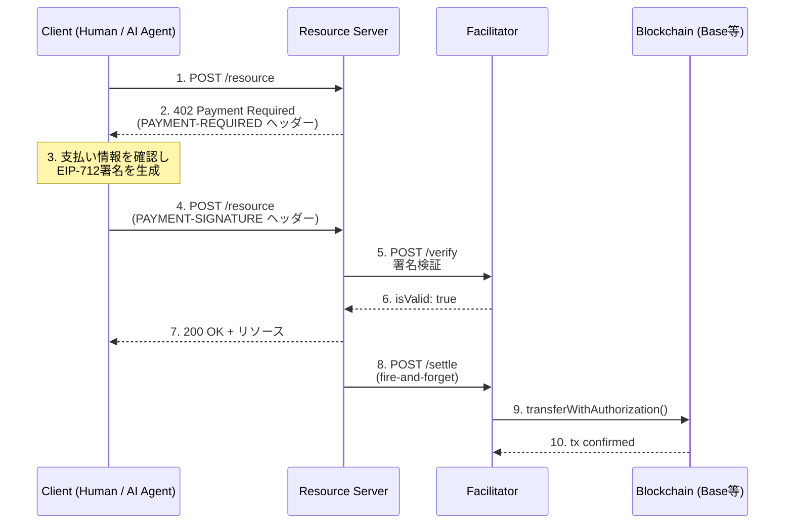
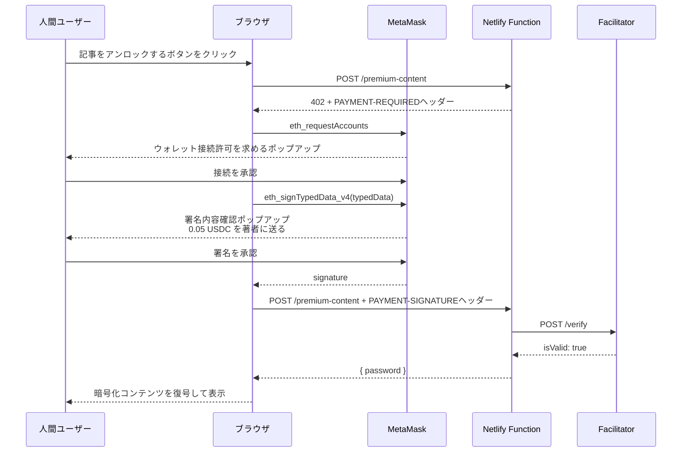
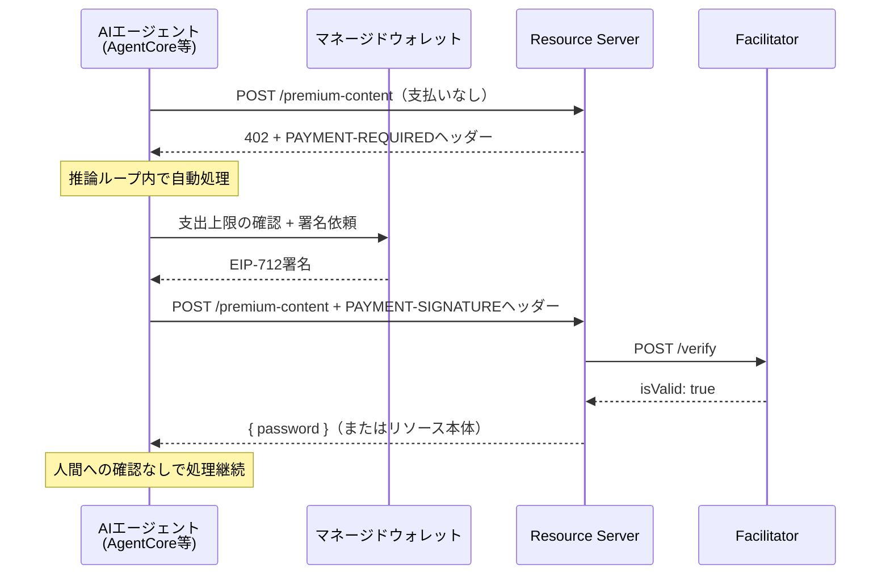

GW明け、なんとも気の抜けた朝。

ああ良き天気心安らかなり。

日本の夏蝉の声いま静かにして。

木の下に宿れるなり我が心。

その宿れるなりと同じき安き心にある。

## Table of Contents

```toc
```

## 忙しい人向け

このブログにペイウォール（ここからは有料記事ですよ〜のやつ）を実装しました。


仕組みは [x402](https://www.x402.org/) プロトコル + [Base Sepolia](https://docs.base.org/network-information/#base-testnet-sepolia) テストネット上のUSDC決済です。

動作デモとして [x402ペイウォール デモ記事](/2011/01/01/x402-paywall-demo/) を用意しています。[MetaMask](https://metamask.io/) とBase SepoliaテストのUSDC（無料）があれば実際に課金フローを体験できます。

きっかけは [Amazon Bedrock AgentCore Payments](https://aws.amazon.com/blogs/machine-learning/agents-that-transact-introducing-amazon-bedrock-agentcore-payments-built-with-coinbase-and-stripe/) の発表です。AWSがx402対応のフルマネージド決済基盤を出してきたのを見て、**そもそもx402ってどういうプロトコルなんだろう**と気になって、実際に自分のブログで動かしてみました。

## はじめに

2026年5月7日、AWSが [Amazon Bedrock AgentCore Payments](https://aws.amazon.com/about-aws/whats-new/2026/04/amazon-bedrock-agentcore-payments-preview/) をプレビュー公開しました。

AIエージェントが自律的に支払いを完了させる基盤として、**x402というHTTPベースの決済プロトコル**を採用したサービスです。

x402を調べてみると [Coinbase](https://www.coinbase.com/) が2025年5月にオープンソース化し、 [2026年4月にはLinux Foundation配下のx402 Foundationに移管](https://www.linuxfoundation.org/press/linux-foundation-is-launching-the-x402-foundation-and-welcoming-the-contribution-of-the-x402-protocol) されているプロトコルで、Cloudflareをはじめ複数の事業者が参画するエコシステムに成長していました。

しかし、仕様を読んでいるだけではイマイチ実感が持てないタイプなので...。せっかくなら自分のブログに実際に組み込んでみようと思い、x402ベースのペイウォールを作ってみました。

## x402プロトコルとは

### HTTP 402 Payment Required

x402を理解する上で、まずは [HTTP 402 Payment Required](https://developer.mozilla.org/ja/docs/Web/HTTP/Status/402) というステータスコードの存在を思い出す必要があります。

[HTTPステータスコード百人一首](https://booth.pm/ja/items/2866153)とかでも、なにこれ!?ってなるようなステータスコードです。

このステータスコード、HTTPの仕様には [**1990年代から予約されていた**](https://datatracker.ietf.org/doc/html/rfc2068#section-10.4.3) のですが、長らく標準的な使い方が決まらず、ずっと将来の利用のために `Reserved` のまま放置されていました。

考え方はあるものの、クライアント・サーバー間で**ここから先は支払いが必要**と表現する手段が標準化されないまま、現代まで来てしまったわけです。

x402はこの402ステータスコードに **マシンリーダブルな決済プロトコル** を載せようというアイディアで、HTTPの上に薄く乗っかる、チェーン非依存（というお題目の）の決済プロトコルとして設計されています。

### プロトコルの基本フロー

x402のフローは、HTTPさえ知っていればだいたい想像できる素直な作りです。



クライアントは最初支払いヘッダーなしでリクエストを投げます。

サーバーは**この資源は有料だよ。支払い条件はこちら**と**402 Payment Required**を返します。


また、レスポンスヘッダーの `PAYMENT-REQUIRED` ヘッダーには、サーバーからの決済要件がBase64エンコードされたJSON文字列として格納されています。 受け入れ可能な決済スキーム・価格・ネットワーク・送金先アドレスなどの詳細が含まれます。


デコードしてみると、こんな感じです。

```json
{
  "x402Version": 2,
  "accepts": [
    {
      "scheme": "exact",
      "network": "eip155:84532",
      "amount": "50000",
      "asset": "0x0000000000",
      "payTo": "0x0000000000",
      "maxTimeoutSeconds": 300,
      "extra": {
        "name": "USDC",
        "version": "2"
      },
      "resource": "https://tubone-project24.xyz/.netlify/functions/premium-content",
      "description": "Premium article decryption password",
      "mimeType": "application/json"
    }
  ],
  "error": null
}
```

`amount` はUSDCのSmallest Unit（小数点6桁）なので、0.05 USDCは `50000` です。 `asset` は決済に使うトークンのコントラクトアドレス（このケースではBase Sepolia上のUSDCコントラクト）で、後ほどEIP-712署名の `verifyingContract` にもこの値が入ります。 `scheme: "exact"` は **ちょうどこの金額を払え** という意味で、x402の基本スキームです。

クライアントが署名を作ってリクエストヘッダーの `PAYMENT-SIGNATURE` にbase64で設定し再度リクエストを送ると、サーバーが [Coinbase facilitator](https://docs.cdp.coinbase.com/x402/welcome) などの代行サービスで署名の検証をします。


こちらもデコードするとこんな感じです。

```json
{
  "x402Version": 2,
  "resource": {
    "url": "https://tubone-project24.xyz/.netlify/functions/premium-content",
    "description": "Premium article decryption password",
    "mimeType": "application/json"
  },
  "accepted": {
    "scheme": "exact",
    "network": "eip155:84532",
    "asset": "0x0000000000",
    "amount": "50000",
    "payTo": "0x0000000000",
    "maxTimeoutSeconds": 300,
    "extra": {
      "name": "USDC",
      "version": "2"
    }
  },
  "payload": {
    "signature": "0x5749e5ad000000000000000000",
    "authorization": {
      "from": "0x00000000000",
      "to": "0x00000000000",
      "value": "50000",
      "validAfter": "0",
      "validBefore": "1778250046",
      "nonce": "0x32900000000000"
    }
  }
}
```

検証がOKなら実際のリソースを返す、という流れです。

オンチェーン送金（settle）は、検証が通った時点で**非同期で実行する**のが実装が多いです。つまり検証が通った時点で決済結果を待たずにコンテンツの取得ができます。

クライアントは送金の確定を待たずにリソースを受け取れるので、体感的にはほぼリアルタイムです。 [Base](https://base.org/) のような低レイテンシの下位テストネット上であれば送金費用も安価で、AIエージェントが大量に呼び出すユースケースにも耐えられる設計になっています。

## なぜ今x402なのか

x402の面白さは、 **AIエージェントの自律的な決済を可能にする** という点にあります。

ちょっと長くなりますが、まず**人間向け決済UXがエージェントに合わない理由**から整理させてください。

### 人間向け決済UXがエージェントに合わない

これまでのWebの課金は、結局のところ**人間がブラウザの前にいる**ことを前提に作られてきました。

クレジットカード入力フォーム、 [Apple Pay](https://www.apple.com/jp/apple-pay/) のFace ID認証などどれも、人間の判断と操作を必要とします。

ところが、AIエージェントが自律的にWebを巡回し、APIを呼び、必要に応じて有料リソースを使うようになると、この前提が崩れます。

エージェントが有料の参考記事1本を読みたいだけなのに、人間に**わざわざ「クレカ番号入れてください」と確認**を取らないといけないのは面倒です。

一方で、エージェントに無制限のクレカ番号を渡すのも、それはそれで怖いものです。

実はこのあたりも解としてMandateという人間の意思表示の委任状みたいなものを基軸に解決する[Agent Payments Protocol (AP2)](https://github.com/google-agentic-commerce/AP2)というものもあるのですが、これは別の記事[AP2に入門する](/2025/10/29/introduction-to-ap2/)で解説しています。

### MetaMaskポップアップは人間専用のインターフェース

私の今回の実装では、人間ユーザー向けに **[MetaMask](https://metamask.io/) で署名する** UXを採用しています。なので、AIエージェントライクではないです。

MetaMaskは [Web3 Wallet](https://ethereum.org/ja/wallets/) として動作するブラウザ拡張で、 `window.ethereum.request({ method: "eth_signTypedData_v4", ... })` を呼ぶと、ユーザーに対してこんなポップアップが出ます。


人間がこれを見て、目視で内容を確認し、**OK**と署名ボタンを押すことで決済が進む形です。

しかし、これが**エージェントには通用しません**。エージェントは**MetaMaskポップアップをクリックできない**からです。

### x402が解くAIエージェントフレンドリーな決済

x402は、この問題を **決済をHTTPのなかで完結させる** ことで解決します。

x402対応クライアントは、HTTPリクエストを送って402を受け取った時点で、自分のキー（あるいは委任されたキー）で署名を作り、自分で**PAYMENT-SIGNATURE**ヘッダーをセットして再送します。

つまりx402では、 **お金を払うというアクションが、HTTPリクエストの一部として記述可能** になります。

これがマシンネイティブ、もといAIエージェントフレンドリーな決済プロトコルと呼ばれる所以です。

実際、Coinbaseの [x402 Bazaar](https://docs.cdp.coinbase.com/x402/bazaar) という [MCP](https://modelcontextprotocol.io/) サーバー経由で、x402対応エンドポイントを動的に検索できるようになっています。エージェントはタスクの完遂のために必要なAPIを探し、利用料を支払って呼び出す、ということがプロトコルレベルで完結します。

課金対象のリソースへのアクセス時に人間の承認を取るという従来のフローがなくなるわけです。

## きっかけはAmazon Bedrock AgentCore Payments

そもそもの話に戻ると、この記事を書こうと思ったきっかけは **2026年5月7日に発表された [Amazon Bedrock AgentCore Payments](https://aws.amazon.com/blogs/machine-learning/agents-that-transact-introducing-amazon-bedrock-agentcore-payments-built-with-coinbase-and-stripe/)** です。

発表を読んで「x402ってそもそもどういうプロトコルなんだろう」と気になって手を動かし始めたので、ここで発表内容を少し詳しく整理しておきます。

### 何が発表されたのか

[Amazon Bedrock](https://aws.amazon.com/jp/bedrock/) の [AgentCore](https://aws.amazon.com/jp/bedrock/agentcore/) に **Payments** という新コンポーネントが追加され、現在プレビュー公開中です。

Coinbaseおよび、 Stripe傘下の [Privy](https://www.privy.io/) との共同開発という体裁で、AIエージェントが自律的にx402決済できる基盤が提供されます。

### セッション単位の支出上限という発想

個人的になるほどと思ったのが **セッション単位の支出上限** という仕組みです（[AWSブログ](https://aws.amazon.com/jp/about-aws/whats-new/2026/04/amazon-bedrock-agentcore-payments-preview/)では "session-level spending limits" と表現されています）。

エージェントに無制限の財布を持たせるのは怖いので、AgentCore Paymentsではセッション単位で予算上限を設定できるらしいです。

たとえば「このエージェントの今回の実行では、最大1ドルまで使ってよい」と渡しておけば、それを超える決済はそもそも実行されません。

これは人間向け決済ではあまりない形です。というのも普通のクレカは **総額の上限** しか持たず、セッション概念がありません。AIエージェントが自律的に動くからこそ、 **このタスクに対する予算** みたいな単位で予算を持つ必要が出てくるわけです。

もちろんAgentCoreはx402プロトコルの知識がなくてもx402決済できる基盤ですが、まず **プロトコルを理解する** という目的で自前実装してみたくなったのがこの記事を書くきっかけです。

## このブログでの自前実装

フロントエンドの [Paywallコンポーネント](https://github.com/tubone24/blog/blob/main/src/components/Paywall/index.tsx)（React）がMetaMaskで署名し、バックエンドのNetlify Functionがfacilitatorに検証を依頼、検証OKで記事ごとのパスワードを返す仕組みです。

[pagecrypt](https://www.npmjs.com/package/pagecrypt) というライブラリを使って、有料記事は暗号化されているのですが、 Netlify Functionから受け取ったパスワードで暗号化済みのHTMLを復号して、プレミアムコンテンツが表示される仕組みです。

## Netlify Functionでのサーバーサイド実装

### facilitator の /verify と /settle

今回はテストネット用途なので、認証不要の公開facilitatorである [x402.org/facilitator](https://x402.org/facilitator) を使います。

本番環境では [Coinbase CDP](https://docs.cdp.coinbase.com/x402/welcome) の `https://api.cdp.coinbase.com/platform/v2/x402`（CDP APIキー必須）を使うのが推奨ですが、Base SepoliaやSolana Devnetなどテストネット上のデモであれば認証なしの公開facilitatorで十分動きます。

署名付きのリクエストを受け取ったNetlify Functionは、まずこのfacilitatorの `/verify` エンドポイントに検証を依頼します。

```javascript{file: "functions/src/premium-content.js"}
const verifyBody = {
  paymentPayload,       // クライアントから来たBase64デコード済みオブジェクト
  paymentRequirements: facilitatorRequirements(requirements),
};

const verifyRes = await fetch(`${FACILITATOR_URL}/verify`, {
  method: "POST",
  headers: { "Content-Type": "application/json" },
  body: JSON.stringify(verifyBody),
});

const verifyData = await verifyRes.json();

if (!verifyRes.ok || !verifyData.isValid) {
  return json(402, { error: verifyData.invalidReason });
}
```

facilitatorは `isValid: true/false` で返してきます。 `isValid: false` の場合は `invalidReason` に理由が入ります（残高不足、署名期限切れなど）。

検証が通ったら、`/settle` を **fire-and-forget**（投げっぱなし）、つまり非同期で発火させます。

```javascript{file: "functions/src/premium-content.js"}
// settle は検証OKと同時に発火するが、応答を待たない
fetch(`${FACILITATOR_URL}/settle`, {
  method: "POST",
  headers: { "Content-Type": "application/json" },
  body: JSON.stringify({ paymentPayload, paymentRequirements }),
}).catch((e) => Sentry.captureException(e));

// settle完了を待たずにパスワードを返す
return json(200, { password });
```

settleはオンチェーン送金（`transferWithAuthorization()` 呼び出し）なので、完了まで数百msかかります。

でもユーザーをそこまで待たせる必要はないので、**非同期で流して先にパスワードを返してしまうのがx402の設計思想**です。

## Paywallコンポーネントによるクライアントサイド実装

### EIP-712 typedData の中身を解剖する

x402でのUSDC決済には [EIP-712](https://eips.ethereum.org/EIPS/eip-712) の構造化署名と、[EIP-3009](https://eips.ethereum.org/EIPS/eip-3009) の `TransferWithAuthorization` が使われます。

EIP-712は **Ethereumの構造化データを型情報付きでハッシュ化・署名する** ための仕様で、署名対象を型と値のペアで表現することにより、MetaMaskのようなウォレット側で **何に署名しようとしているか** を人間可読に表示しやすくしています（人間可読のUI自体はウォレット実装側の責務です）。

EIP-3009はその上に乗って、**送金者がオフチェーンで署名するだけで、第三者（facilitator）がガス代を払って代わりにオンチェーン送金できる**仕組みを提供します。

実装では以下の `typedData` を組み立てています。

```typescript{file: "src/components/Paywall/index.tsx"}
const typedData = JSON.stringify({
  types: {
    EIP712Domain: [
      { name: "name",              type: "string"  },
      { name: "version",           type: "string"  },
      { name: "chainId",           type: "uint256" },
      { name: "verifyingContract", type: "address" },
    ],
    TransferWithAuthorization: [
      { name: "from",        type: "address" },
      { name: "to",          type: "address" },
      { name: "value",       type: "uint256" },
      { name: "validAfter",  type: "uint256" },
      { name: "validBefore", type: "uint256" },
      { name: "nonce",       type: "bytes32" },
    ],
  },
  domain: {
    name:              "USDC",           // ERC-20トークン名
    version:           "2",              // USDCコントラクトのバージョン
    chainId:           84532,            // Base Sepolia
    verifyingContract: accept.asset,     // USDCコントラクトアドレス
  },
  primaryType: "TransferWithAuthorization",
  message: {
    from:        userAddress,            // 署名者（送金元）
    to:          accept.payTo,           // 受取人（著者ウォレット）
    value:       "50000",               // 0.05 USDC (6桁小数)
    validAfter:  "0",                    // 即時有効
    validBefore: String(now + 300),      // 5分後に失効（now はUnix秒）
    nonce:       "0x...32バイトランダム", // 同一authorizationの再使用を防ぐ
  },
});
```

各フィールドの意味を整理します。

**domain**は「どのコントラクトへの指示か」を示すコンテキストで、 `name / version` はUSDCコントラクトのEIP-712ドメインパラメーターです。

`verifyingContract` がUSDCのコントラクトアドレスになっていることで、**このチェーンのこのUSDCコントラクト以外では使えない署名**になります。

異なるチェーンで同じ署名が再利用されるリプレイ攻撃を防ぐための仕組みです。

**TransferWithAuthorization**はEIP-3009の送金指示本体です。 `validAfter / validBefore` で有効期間を設定でき、今回は署名後5分で失効するようにしています。

`nonce` が **bytes32のランダム値** になっている点が重要で、USDCコントラクトが `usedAuthorizations[authorizer][nonce]` のマップで使用済みnonceを管理しているため、**まったく同じauthorizationを2回送信して二重に送金させる**ことができないようになっています。

### eth_signTypedData_v4でMetaMaskから署名を取る

typedDataが組み立てられたら、 `eth_signTypedData_v4` でMetaMaskに署名依頼を出します。

```typescript{file: "src/components/Paywall/index.tsx"}
// ウォレット接続
const accounts = await window.ethereum.request({
  method: "eth_requestAccounts",
});
const from = accounts[0];

// EIP-712署名
const signature = await window.ethereum.request({
  method: "eth_signTypedData_v4",
  params: [from, typedData],
});
```

MetaMaskが `eth_signTypedData_v4` を受け取ると、typedDataの中身を人間が読める形で表示し、ユーザーが内容を確認したうえで署名できます。

署名が取れたら、EIP-3009の `authorization` オブジェクトと一緒に `paymentPayload` を組み立てて、Base64エンコードして `PAYMENT-SIGNATURE` ヘッダーにセットし、再度Netlify Functionに投げます。

## MetaMaskフロー vs AIエージェントフロー

ここが個人的に一番おもしろいと思っている部分です。

同じx402プロトコルでも、**人間がMetaMaskで払う場合**と**AIエージェントが自動で払う場合**では、フローが大きく違います。

### 人間（MetaMask）のフロー



人間のフローでは、**MetaMaskのポップアップが2回**（接続承認 + 署名承認）ユーザーに提示されます。

ユーザーが **何に署名しているか** を目視確認して承認する、という人間的なUXです。

### AIエージェントのフロー



エージェントのフローには、ポップアップも確認ステップも存在しません。402レスポンスを受け取った瞬間に「支払いが必要だ」と理解し、設定された支出上限の範囲内であれば自動的に署名して再送します。人間に「課金してもいいですか」と聞く必要がなく、 **推論ループが中断されないまま** 有料リソースにアクセスできます。

## pagecryptによるビルド時暗号化

x402と直接関係ないですが、実装の話の締めくくりとして、暗号化周りをあっさり説明しておきます。

ブログはAstroで静的生成しているので、プレミアムコンテンツも最終的にはHTMLファイルになります。このHTMLをビルド時に `scripts/encrypt-premium.mjs` が [pagecrypt](https://www.npmjs.com/package/pagecrypt) で暗号化し、 `dist/<slug>/encrypted.html` として出力します。

pagecryptはAES-GCM + PBKDF2 (SHA-256) でHTMLを暗号化するnpmライブラリで、HTMLにJavaScriptが仕込まれているため、正しいパスワードを与えると**クライアントサイドで復号して表示**されます。サーバーは暗号化済みHTMLを配信するだけです。

```javascript{file: "scripts/encrypt-premium.mjs"}
const password = createHmac("sha256", SITE_SECRET).update(slug).digest("hex");
const encrypted = await encryptHTML(html, password, 200_000);
writeFileSync(path.join(outDir, "encrypted.html"), encrypted, "utf8");
```

Netlify Functionが返すパスワードと、ビルド時の暗号化パスワードが `HMAC-SHA256(SITE_SECRET, slug)` で一致するように設計されています。

## 実装時の注意点

### x402 v2のヘッダー仕様の変更

x402にはv1とv2があり、HTTPヘッダーの構造が変わっています。

v1では支払い要件はサーバーがHTTP 402のレスポンスボディにJSONで返し、クライアントは `X-PAYMENT` ヘッダーで支払いペイロードを送り、サーバーは `X-PAYMENT-RESPONSE` ヘッダーで決済結果を返していました。一方v2では支払い要件もヘッダーに移り、 `PAYMENT-REQUIRED`（要件）/ `PAYMENT-SIGNATURE`（支払い）/ `PAYMENT-RESPONSE`（結果）の3ヘッダー構成になっています。 `X-` プレフィックスがなくなった点も差分の1つです。

古い記事を参考にしているとv1のスタイルで実装してしまいがちです。これで時間を溶かしました。

### facilitatorリクエストの構造

`/verify` に送るボディは、以下の2つのキーが必要です。

```json
{
  "paymentPayload": { ... },       // クライアントから来た署名済みペイロード
  "paymentRequirements": { ... }   // サーバー側の支払い条件（resource/description/mimeTypeは含めない）
}
```

`paymentRequirements` にクライアント向けの情報（`resource` / `description` / `mimeType`）を含めてしまうと、facilitatorが期待するスキーマと合わずにエラーになります。サーバーがクライアントに返す `accepts` の全フィールドをそのままfacilitatorに流してはいけない、というのが最初のハマりポイントでした。

## 最後に

x402というプロトコルを触ってみて、設計がシンプルで好きだなと思いました。

HTTPの上に薄く乗っかるだけで、人間もエージェントも同じフローで決済でき、特別なSDKや認証サーバーを立てなくても、fetch一本とEIP-712の署名さえあれば動く点がシンプルでよいです。

また、AIエージェントが勝手に課金しながらWebを巡回する未来は、少し怖い気もしますが、セッション単位の支出上限のような仕組みで制御できる設計になっているのは安心感があります。

自分でゼロから実装してみたことで、AgentCore Paymentsのドキュメントを読んだときに「ああ、あの `/verify` と `/settle` を内部でやってくれてるのか」とすんなり理解できました。フルマネージドを使う前に一度素で触れてみるのは、やっぱり悪くないですね。

ちなみにデモのペイウォールの内容は、我が家の暴れん坊犬の暴走GIF画像です。