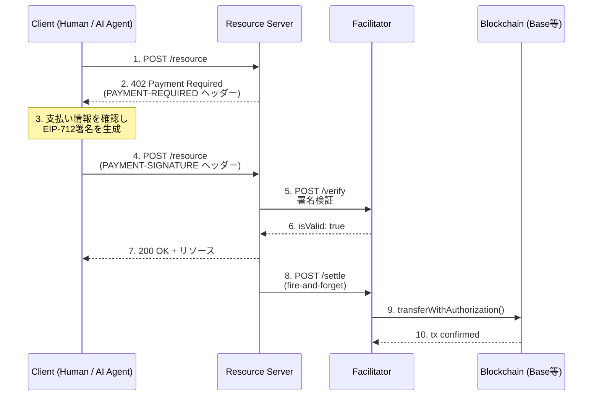
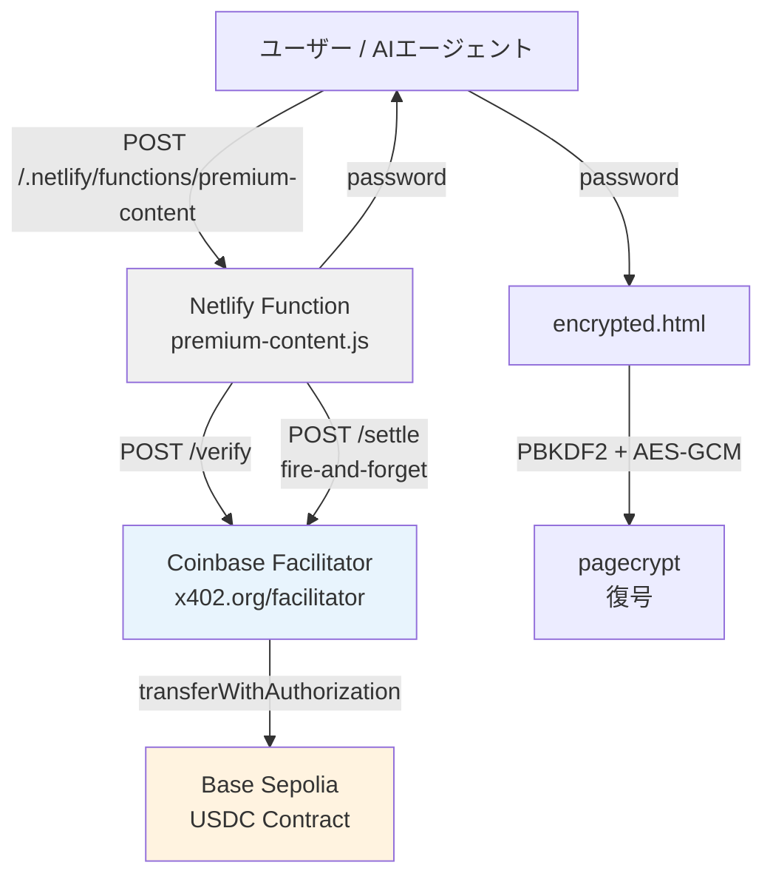
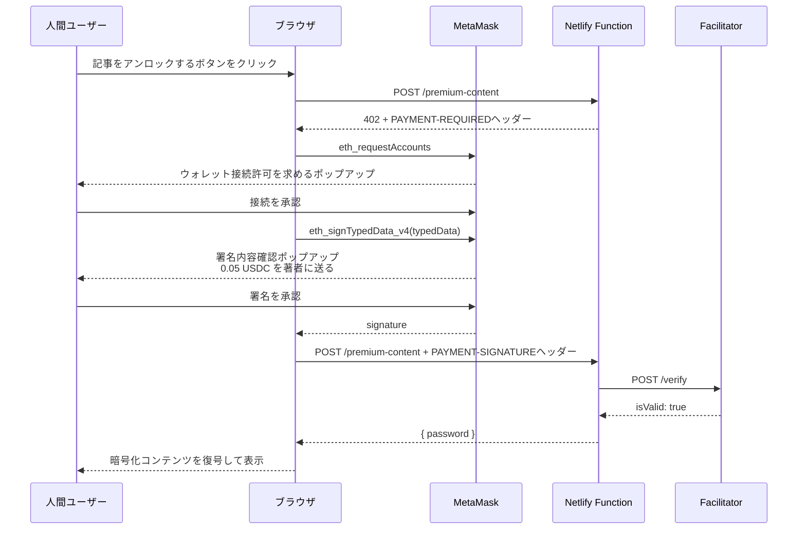
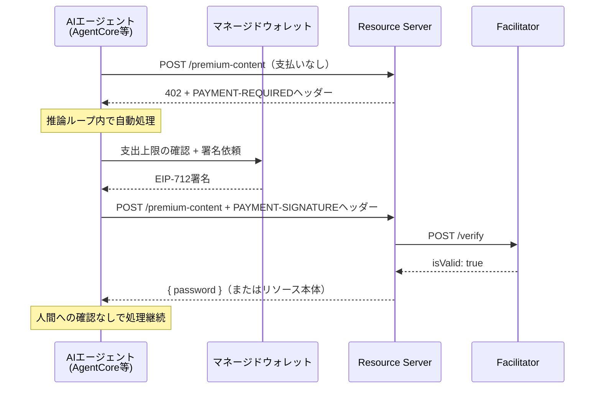

GW明け、なんとも気の抜けた朝に、何か新しいことに手を出したくなるのは私だけでしょうか。

## Table of Contents

```toc
```

## 忙しい人向け

このブログにペイウォールを実装しました。

仕組みは [x402](https://www.x402.org/) プロトコル + [Base Sepolia](https://docs.base.org/network-information/#base-testnet-sepolia) テストネット上のUSDC決済です。

動作デモとして [x402ペイウォール デモ記事](/2011/01/01/x402-paywall-demo/) を用意しています。[MetaMask](https://metamask.io/) とBase SepoliaテストのUSDC（無料）があれば実際に課金フローを体験できます。

きっかけは [Amazon Bedrock AgentCore Payments](https://aws.amazon.com/blogs/machine-learning/agents-that-transact-introducing-amazon-bedrock-agentcore-payments-built-with-coinbase-and-stripe/) の発表です。AWSがx402対応のフルマネージド決済基盤を出してきたのを見て、「そもそもx402ってどういうプロトコルなんだろう」と気になって、実際に自分のブログで動かしてみました。

## はじめに

2026年5月7日、AWSが [Amazon Bedrock AgentCore Payments](https://aws.amazon.com/about-aws/whats-new/2026/04/amazon-bedrock-agentcore-payments-preview/) をプレビュー公開しました。

AIエージェントが自律的に支払いを完了させる基盤として、**x402というHTTPベースの決済プロトコル**を採用したサービスです。

x402を調べてみると [Coinbase](https://www.coinbase.com/) が2025年5月にオープンソース化し、 [2026年4月にはLinux Foundation配下のx402 Foundationに移管](https://blog.cloudflare.com/x402/) されているプロトコルで、Cloudflareをはじめ複数の事業者が参画するエコシステムに成長していました。

しかし、仕様を読んでいるだけではイマイチ実感が持てないタイプなので...。せっかくなら自分のブログに実際に組み込んでみようと思い、x402ベースのペイウォールを作ってみました。

## x402プロトコルとは

### HTTP 402の復権

x402を理解する上で、まずは [HTTP 402 Payment Required](https://developer.mozilla.org/ja/docs/Web/HTTP/Status/402) というステータスコードの存在を思い出す必要があります。

このステータスコード、HTTPの仕様には**1990年代から予約されていた**のですが、長らく標準的な使い方が決まらず、ずっと将来の利用のために `Reserved` のまま放置されていました。

クライアント・サーバー間で**ここから先は支払いが必要**と表現する手段が標準化されないまま、現代まで来てしまったわけです。

x402はこの402ステータスコードに **マシンリーダブルな決済プロトコル** を載せようというアイディアで、HTTPの上に薄く乗っかる、チェーン非依存の決済プロトコルとして設計されています。

### Coinbaseオリジナルから x402 Foundation へ

x402は当初Coinbaseが2025年5月に発表したものでしたが、その後の経緯がそれなりに面白いです。

2026年4月2日、Coinbaseはx402を [Linux Foundation](https://www.linuxfoundation.org/) 配下に新設された **x402 Foundation** に寄贈し、Cloudflareを含む創設メンバー企業による中立的なオープンガバナンスに移行しました。なお、Cloudflare自身は [これに先立ち2025年9月23日に Workers / Agents SDK / MCPサーバーでのx402対応を発表](https://blog.cloudflare.com/x402/) しており、Linux Foundation配下への移管はその参画関係を制度化したものという位置づけです。

つまり**今のx402はCoinbase固有の規格ではなく、業界横断のオープンスタンダード**になっています。CoinbaseはBaseチェーン上のfacilitatorをホスティング提供する立ち位置ですが、プロトコル自体は誰でも実装できます。実際、 [QuickNode](https://blog.quicknode.com/x402-protocol-explained-inside-the-https-native-payment-layer/) や [Hyperbolic Labs](https://github.com/HyperbolicLabs/hyperbolic-x402) など、独自のfacilitatorやx402対応APIを提供する事業者が増えています。

### プロトコルの基本フロー

x402のフローは、HTTPさえ知っていればだいたい想像できる素直な作りです。



クライアントは最初支払いヘッダーなしでリクエストを投げます。

サーバーは「この資源は有料だよ。支払い条件はこちら」と402を返し、クライアントが署名を作って再送、サーバーが [Coinbase facilitator](https://docs.cdp.coinbase.com/x402/welcome) などの代行サービスで検証してOKならリソースを返す、という流れです。

オンチェーン送金（settle）は、検証が通った時点で**サーバーから fire-and-forget で発火させる**のが基本です。クライアントは送金の確定を待たずにリソースを受け取れるので、体感的にはほぼリアルタイムです。 [Base](https://base.org/) のような低レイテンシの下位テストネット上であれば送金費用も安価で、AIエージェントが大量に呼び出すユースケースにも耐えられる設計になっています。

## なぜ今x402なのか

x402の面白さは、 **AIエージェントの自律的な決済を可能にする** という点にあります。

ここはちょっと厚めに書きたいので、まず「人間向け決済UXがエージェントに合わない理由」から整理させてください。

### 人間向け決済UXがエージェントに合わない

これまでのWebの課金は、結局のところ**人間がブラウザの前にいる**ことを前提に作られてきました。クレジットカード入力フォーム、 [Stripe](https://stripe.com/jp) のCheckout画面、 [Apple Pay](https://www.apple.com/jp/apple-pay/) のFace ID認証...どれも、人間の判断と操作を必要とします。

ところが、AIエージェントが自律的にWebを巡回し、APIを呼び、必要に応じて有料リソースを使うようになると、この前提が崩れます。

エージェントが論文1本を読みたいだけなのに、人間に**わざわざ「クレカ番号入れてください」と確認**を取らないといけないのはおかしいですよね。一方で、エージェントに無制限のクレカ番号を渡すのも、それはそれで怖い。1日何万件のAPIコールをするエージェントに、人間と同じ決済UXを提供するのは無理があります。

### MetaMaskポップアップは人間専用のインターフェース

私の今回の実装では、人間ユーザー向けに **[MetaMask](https://metamask.io/) で署名する** UXを採用しています。が、これも厳密には人間専用UXです。

MetaMaskは [Web3 Wallet](https://ethereum.org/ja/wallets/) として動作するブラウザ拡張で、 `window.ethereum.request({ method: "eth_signTypedData_v4", ... })` を呼ぶと、ユーザーに対してこんなポップアップが出ます。

```text
MetaMask: TransferWithAuthorization

  from: 0x...あなたのアドレス
  to: 0x...著者のアドレス
  value: 50000 (= 0.05 USDC)
  validBefore: 2026-05-08 09:30:00

  [Reject]  [Sign]
```

人間がこれを見て、目視で内容を確認し、「うんOK」と署名ボタンを押す。これが現状のWeb3 UXの基本形です。

しかし、これが**エージェントには通用しません**。エージェントはMetaMaskポップアップをクリックできないからです。

### x402が解くマシンネイティブな決済

x402は、この問題を **決済をHTTPのなかで完結させる** ことで解決します。

x402対応クライアントは、HTTPリクエストを送って402を受け取った時点で、自分のキー（あるいは委任されたキー）で署名を作り、自分でPAYMENT-SIGNATUREヘッダーをセットして再送します。MetaMaskのような人間向けUIは介在しません。

つまりx402では、 **お金を払うというアクションが、HTTPリクエストの一部として記述可能** になります。これがマシンネイティブの決済プロトコルと呼ばれる所以です。

実際、Coinbaseの [x402 Bazaar](https://docs.cdp.coinbase.com/x402/bazaar) という [MCP](https://modelcontextprotocol.io/) サーバー経由で、x402対応エンドポイントを動的に検索できるようになっています。エージェントは `search_resources` で目的に合うAPIを探し、 `proxy_tool_call` で支払って呼び出す、ということがプロトコルレベルで完結します。

「次のAPIは課金が必要なので、人間に許可を取ってきます」という従来のフローが、もはや存在しないわけです。

## きっかけはAmazon Bedrock AgentCore Payments

そもそもの話に戻ると、この記事を書こうと思ったきっかけは **2026年5月7日に発表された [Amazon Bedrock AgentCore Payments](https://aws.amazon.com/blogs/machine-learning/agents-that-transact-introducing-amazon-bedrock-agentcore-payments-built-with-coinbase-and-stripe/)** です。

発表を読んで「x402ってそもそもどういうプロトコルなんだろう」と気になって手を動かし始めたので、ここで発表内容を少し詳しく整理しておきます。

### 何が発表されたのか

[Amazon Bedrock](https://aws.amazon.com/jp/bedrock/) の [AgentCore](https://aws.amazon.com/jp/bedrock/agentcore/) ファミリに **Payments** という新コンポーネントが追加され、現在プレビュー公開中です。 Coinbaseおよび、 Stripe傘下の [Privy](https://www.privy.io/) との共同開発という体裁で、AIエージェントが自律的にx402決済できる基盤が提供されます。

特徴をざっくりまとめるとこんな感じです。

| 機能 | 内容 |
|------|------|
| ウォレット管理 | Coinbase ウォレット（USDCステーブルコイン）と Stripe Privy ウォレット（フィアット）の2系統 |
| 決済プロトコル | x402（HTTP 402ベース） |
| ガバナンス | セッション単位の支出上限・用途制限 |
| 監査 | 全決済のオンチェーン履歴 + AgentCoreの実行ログに統合 |
| ディスカバリ | [Coinbase x402 Bazaar](https://docs.cdp.coinbase.com/x402/bazaar) MCPサーバー連携でx402リソースを動的検索 |

### セッション単位の支出上限という発想

個人的に「これはうまいな」と思ったのが **セッション単位の支出上限** という仕組みです（AWSブログでは "session-level spending limits" と表現されています）。

エージェントに無制限の財布を持たせるのは怖いので、AgentCore Paymentsではセッション単位で予算上限を設定できます。たとえば「このエージェントの今回の実行では、最大1ドルまで使ってよい」と渡しておけば、それを超える決済はそもそも実行されません。

これは人間向け決済では成立しにくい考え方ですよね。普通のクレカは **総額の上限** しか持たず、セッション概念がありません。AIエージェントが自律的に動くからこそ、 **今日のこのタスクに対する予算** みたいな単位で予算をくくる必要が出てくるわけです。

### Bazaar MCPサーバーによる動的ディスカバリ

そして、決済以上に重要だなと思ったのが **動的ディスカバリ** の方です。

エージェントが「このタスクには有料の天気APIが必要だな」と判断したとき、x402 Bazaar MCPサーバーに `search_resources` を投げると、 価格・スキーマ・関連性つきで候補APIのリストが返ってきます。エージェントはその中から最適なものを選び、 `proxy_tool_call` で支払い込みで呼び出す。

つまり、 **どのAPIを使うかもいくら払うかも、開発者がハードコードしなくていい** 世界です。

AgentCoreはプロトコルの知識がなくてもx402決済できる基盤ですが、まず **プロトコルを理解する** という目的で自前実装してよかったなとしみじみ思います。

## このブログでの自前実装

### アーキテクチャ全体像

実装は大きく3層に分かれています。



フロントエンドの [Paywallコンポーネント](https://github.com/tubone24/blog/blob/main/src/components/Paywall/index.tsx)（React）がMetaMaskで署名し、バックエンドのNetlify Functionがfacilitatorに検証を依頼、検証OKで記事ごとのパスワードを返す。受け取ったパスワードで暗号化済みのHTMLを復号して、プレミアムコンテンツが表示される仕組みです。

### @x402/express を使わなかった理由

x402の公式TypeScript SDKには `@x402/express` というミドルウェアパッケージがあります。これを使うと、Expressサーバー上でほぼ1行でx402対応できます。

ただ今回はブログが [Netlify Functions](https://docs.netlify.com/functions/overview/) というサーバーレス環境なので、Expressが使えません。そこで、facilitatorの `/verify` と `/settle` を直接叩く薄いラッパーを自前で書くことにしました。

### Front MatterとペイウォールCDNの繋ぎ

記事のMarkdownファイルには以下のようなFront Matterを追加しています。

```yaml{file: "src/content/blog/2026-05-08-x402-protocol-ai-agent-micropayment.md"}
premium: true
priceUsd: 0.05
```

記事ページ（`[...slug].astro`）はペイウォールマーカーコメントを境界として本文を前後に分割し、後半をPaywallコンポーネントで隠す構造にしています。ビルド時には `premium-full` ディレクトリにフルコンテンツのHTMLを吐き出し、 [pagecrypt](https://www.npmjs.com/package/pagecrypt) でAES-GCM暗号化したものを `encrypted.html` として配置します。

## Netlify Functionでのサーバーサイド実装

### x402 v2のヘッダー仕様

x402 v2では、リクエスト・レスポンスに3つのHTTPヘッダーが登場します。

| ヘッダー | 方向 | 用途 |
|---------|------|------|
| `PAYMENT-REQUIRED` | サーバー→クライアント | 支払い条件（Base64エンコードJSON）|
| `PAYMENT-SIGNATURE` | クライアント→サーバー | 支払いペイロード（Base64エンコードJSON）|
| `PAYMENT-RESPONSE` | サーバー→クライアント | 決済完了通知 |

`PAYMENT-REQUIRED` の中身は以下の構造です。

```json
{
  "x402Version": 2,
  "accepts": [
    {
      "scheme": "exact",
      "network": "eip155:84532",
      "amount": "50000",
      "asset": "0x036CbD53842c5426634e7929541eC2318f3dCF7e",
      "payTo": "0x...著者ウォレット",
      "maxTimeoutSeconds": 300,
      "extra": { "name": "USDC", "version": "2" }
    }
  ],
  "error": null
}
```

`amount` はUSDCのSmallest Unit（小数点6桁）なので、0.05 USDCは `50000` です。 `scheme: "exact"` は **ちょうどこの金額を払え** という意味で、x402の基本スキームです。

### facilitator の /verify と /settle

今回はテストネット用途なので、認証不要の公開facilitatorである [x402.org/facilitator](https://x402.org/facilitator) を使います。本番環境では [Coinbase CDP](https://docs.cdp.coinbase.com/x402/welcome) の `https://api.cdp.coinbase.com/platform/v2/x402`（CDP APIキー必須）を使うのが推奨ですが、Base SepoliaやSolana Devnetなどテストネット上のデモであれば認証なしの公開facilitatorで十分動きます。

署名付きのリクエストを受け取ったNetlify Functionは、まずこのfacilitatorの `/verify` エンドポイントに検証を依頼します。

```javascript{file: "functions/src/premium-content.js"}
const verifyBody = {
  paymentPayload,       // クライアントから来たBase64デコード済みオブジェクト
  paymentRequirements: facilitatorRequirements(requirements),
};

const verifyRes = await fetch(`${FACILITATOR_URL}/verify`, {
  method: "POST",
  headers: { "Content-Type": "application/json" },
  body: JSON.stringify(verifyBody),
});

const verifyData = await verifyRes.json();

if (!verifyRes.ok || !verifyData.isValid) {
  return json(402, { error: verifyData.invalidReason });
}
```

facilitatorは `isValid: true/false` で返してきます。 `isValid: false` の場合は `invalidReason` に理由が入ります（残高不足、署名期限切れなど）。

検証が通ったら、`/settle` を**火忘れ（fire-and-forget）**で発火させます。

```javascript{file: "functions/src/premium-content.js"}
// settle は検証OKと同時に発火するが、応答を待たない
fetch(`${FACILITATOR_URL}/settle`, {
  method: "POST",
  headers: { "Content-Type": "application/json" },
  body: JSON.stringify({ paymentPayload, paymentRequirements }),
}).catch((e) => Sentry.captureException(e));

// settle完了を待たずにパスワードを返す
return json(200, { password });
```

settleはオンチェーン送金（`transferWithAuthorization()` 呼び出し）なので、完了まで数百msかかります。でもユーザーをそこまで待たせる必要はないので、非同期で流して先にパスワードを返してしまうのがx402の設計思想です。

### HMAC-SHA256でslug依存パスワードを生成

パスワードは記事スラッグと環境変数 `SITE_SECRET` から導出しています。

```javascript{file: "functions/src/premium-content.js"}
const password = createHmac("sha256", process.env.SITE_SECRET)
  .update(String(slug))
  .digest("hex");
```

スラッグをキーに混ぜることで、記事ごとに別のパスワードになります。つまり**ある記事のパスワードを知っていても、別の記事は復号できない**仕組みです。

## Paywallコンポーネントによるクライアントサイド実装

### EIP-712 typedData の中身を解剖する

x402でのUSDC決済には [EIP-712](https://eips.ethereum.org/EIPS/eip-712) の構造化署名と、[EIP-3009](https://eips.ethereum.org/EIPS/eip-3009) の `TransferWithAuthorization` が使われます。

EIP-712は **人間が読める形でEthereumの構造化データに署名する** 仕様で、MetaMaskのポップアップで **何に署名しようとしているか** が日本語でわかるようになっています。EIP-3009はその上に乗って、**送金者がオフチェーンで署名するだけで、第三者（facilitator）がガス代を払って代わりにオンチェーン送金できる**仕組みを提供します。

実装では以下の `typedData` を組み立てています。

```typescript{file: "src/components/Paywall/index.tsx"}
const typedData = JSON.stringify({
  types: {
    EIP712Domain: [
      { name: "name",              type: "string"  },
      { name: "version",           type: "string"  },
      { name: "chainId",           type: "uint256" },
      { name: "verifyingContract", type: "address" },
    ],
    TransferWithAuthorization: [
      { name: "from",        type: "address" },
      { name: "to",          type: "address" },
      { name: "value",       type: "uint256" },
      { name: "validAfter",  type: "uint256" },
      { name: "validBefore", type: "uint256" },
      { name: "nonce",       type: "bytes32" },
    ],
  },
  domain: {
    name:              "USDC",           // ERC-20トークン名
    version:           "2",              // USDCコントラクトのバージョン
    chainId:           84532,            // Base Sepolia
    verifyingContract: accept.asset,     // USDCコントラクトアドレス
  },
  primaryType: "TransferWithAuthorization",
  message: {
    from:        userAddress,            // 署名者（送金元）
    to:          accept.payTo,           // 受取人（著者ウォレット）
    value:       "50000",               // 0.05 USDC (6桁小数)
    validAfter:  "0",                    // 即時有効
    validBefore: String(now + 300),      // 5分後に失効
    nonce:       "0x...32バイトランダム", // リプレイ攻撃防止
  },
});
```

各フィールドの意味を整理します。

**domain**は「どのコントラクトへの指示か」を示すコンテキストで、 `name / version` はUSDCコントラクトのEIP-712ドメインパラメーターです。 `verifyingContract` がUSDCのコントラクトアドレスになっていることで、「このチェーンのこのUSDCコントラクト以外では使えない署名」になります。異なるチェーンで同じ署名が再利用されるリプレイ攻撃を防ぐための仕組みです。

**TransferWithAuthorization**はEIP-3009の送金指示本体です。 `validAfter / validBefore` で有効期間を設定でき、今回は署名後5分で失効するようにしています。 `nonce` が **bytes32のランダム値** になっている点が重要で、同一のnonceは一度しか使えないため、**同じ署名を使い回すリプレイ攻撃が不可能**になっています。

### eth_signTypedData_v4でMetaMaskから署名を取る

typedDataが組み立てられたら、 `eth_signTypedData_v4` でMetaMaskに署名依頼を出します。

```typescript{file: "src/components/Paywall/index.tsx"}
// ウォレット接続
const accounts = await window.ethereum.request({
  method: "eth_requestAccounts",
});
const from = accounts[0];

// EIP-712署名
const signature = await window.ethereum.request({
  method: "eth_signTypedData_v4",
  params: [from, typedData],
});
```

MetaMaskが `eth_signTypedData_v4` を受け取ると、typedDataの中身を人間が読める形で表示し、ユーザーが内容を確認したうえで署名できます。

署名が取れたら、EIP-3009の `authorization` オブジェクトと一緒に `paymentPayload` を組み立てて、Base64エンコードして `PAYMENT-SIGNATURE` ヘッダーにセットし、再度Netlify Functionに投げます。

## MetaMaskフロー vs AIエージェントフロー

ここが個人的に一番おもしろいと思っている部分です。

同じx402プロトコルでも、**人間がMetaMaskで払う場合**と**AIエージェントが自動で払う場合**では、フローが大きく違います。

### 人間（MetaMask）のフロー



人間のフローでは、**MetaMaskのポップアップが2回**（接続承認 + 署名承認）ユーザーに提示されます。ユーザーが **何に署名しているか** を目視確認して承認する、という人間的なUXです。

### AIエージェントのフロー



エージェントのフローには、ポップアップも確認ステップも存在しません。402レスポンスを受け取った瞬間に「支払いが必要だ」と理解し、設定された支出上限の範囲内であれば自動的に署名して再送します。人間に「課金してもいいですか」と聞く必要がなく、 **推論ループが中断されないまま** 有料リソースにアクセスできます。

### 2つのフローを比べると

| 観点 | 人間（MetaMask） | AIエージェント（AgentCore等） |
|------|----------------|--------------------------|
| 認可主体 | ユーザー本人 | セッション単位の事前設定 |
| トリガー | ボタンクリック | HTTP 402受信 |
| 署名UI | MetaMaskポップアップ2回 | なし（自動署名）|
| レイテンシ | ユーザー応答待ち（数秒〜数十秒） | 署名＋verify完了までごく短時間 |
| エラー時 | エラー表示 → ユーザーがリトライ | 上限超過時は人間にエスカレーション |
| 予算管理 | ウォレット残高（総額） | セッション単位の支出上限 |
| 監査 | ウォレット履歴 | AgentCore実行ログ＋オンチェーン |

特に「予算管理」の違いが面白いです。人間のクレカやウォレットには**総額の上限**しかありませんが、エージェントの場合は**このタスク・このセッションにいくらまで使っていいか**という粒度で制御できます。

**未来の読者の多くは、人間ではないかもしれない。**

そう思うと、このペイウォールを実装した意味が少しだけ変わってくる気がします。

## pagecryptによるビルド時暗号化

実装の話の締めくくりとして、暗号化周りをあっさり説明しておきます。

ブログはAstroで静的生成しているので、プレミアムコンテンツも最終的にはHTMLファイルになります。このHTMLをビルド時に `scripts/encrypt-premium.mjs` が [pagecrypt](https://www.npmjs.com/package/pagecrypt) で暗号化し、 `dist/<slug>/encrypted.html` として出力します。

pagecryptはAES-GCM + PBKDF2 (SHA-256) でHTMLを暗号化するnpmライブラリで、HTMLにJavaScriptが仕込まれているため、正しいパスワードを与えると**クライアントサイドで復号して表示**されます。サーバーは暗号化済みHTMLを配信するだけです。

```javascript{file: "scripts/encrypt-premium.mjs"}
const password = createHmac("sha256", SITE_SECRET).update(slug).digest("hex");
const encrypted = await encryptHTML(html, password, 2_000_000); // PBKDF2 200万イテレーション（pagecryptデフォルト）
writeFileSync(path.join(outDir, "encrypted.html"), encrypted, "utf8");
```

`encryptHTML` の第3引数はPBKDF2のイテレーション数で、 [pagecryptのデフォルトは `2e6`（200万）](https://github.com/Greenheart/pagecrypt) です。READMEでは `3e6` 以上が推奨されているので、用途やビルド時間とのトレードオフでもう少し増やしても良いかもしれません。

Netlify Functionが返すパスワードと、ビルド時の暗号化パスワードが `HMAC-SHA256(SITE_SECRET, slug)` で一致するように設計されています。

## ハマったポイント

### x402 v2のヘッダー仕様の変更

x402にはv1とv2があり、HTTPヘッダーの構造が変わっています。

v1では支払い要件はサーバーがHTTP 402のレスポンスボディにJSONで返し、クライアントは `X-PAYMENT` ヘッダーで支払いペイロードを送り、サーバーは `X-PAYMENT-RESPONSE` ヘッダーで決済結果を返していました。一方v2では支払い要件もヘッダーに移り、 `PAYMENT-REQUIRED`（要件）/ `PAYMENT-SIGNATURE`（支払い）/ `PAYMENT-RESPONSE`（結果）の3ヘッダー構成になっています。 `X-` プレフィックスがなくなった点も差分の1つです。

古い記事を参考にしているとv1のスタイルで実装してしまいがちです。 Coinbase facilitatorは両バージョンを受け付けていますが、公式ドキュメントや `@x402/express` はv2前提なので、素直にv2で実装した方が無難です（[x402 v2仕様](https://github.com/coinbase/x402/blob/main/specs/transports-v2/http.md) より）。

### facilitatorリクエストの構造

`/verify` に送るボディは、以下の2つのキーが必要です。

```json
{
  "paymentPayload": { ... },       // クライアントから来た署名済みペイロード
  "paymentRequirements": { ... }   // サーバー側の支払い条件（resource/description/mimeTypeは含めない）
}
```

`paymentRequirements` にクライアント向けの情報（`resource` / `description` / `mimeType`）を含めてしまうと、facilitatorが期待するスキーマと合わずにエラーになります。サーバーがクライアントに返す `accepts` の全フィールドをそのままfacilitatorに流してはいけない、というのが最初のハマりポイントでした。

### Base Sepoliaウォレットの準備

実際に動かすには、MetaMaskに **Base Sepoliaテストネット** を追加して、テスト用USDCを入手する必要があります。ただ、ここは**テストネットなので実際のお金は一切かかりません**。

[Base Sepolia](https://docs.base.org/network-information/#base-testnet-sepolia) は [Base](https://base.org/) のテストネットで、ChainIDは `84532`、CAIP-2識別子は `eip155:84532` です。MetaMaskへのネットワーク追加は、 [Chainlist](https://chainlist.org/chain/84532) から "Add to MetaMask" ボタン一発でできます。

テスト用USDCは [Circle Faucet](https://faucet.circle.com/) から無料で入手できます。手順はシンプルで、Circle Faucetにアクセスして **USDC on Base Sepolia** を選び、MetaMaskのウォレットアドレスを貼り付けて送信するだけです。1回につき10 USDC程度もらえるので、0.05 USDCのこの記事を200回読めてしまいます。

テスト用USDCのコントラクトアドレスは `0x036CbD53842c5426634e7929541eC2318f3dCF7e` で、この記事のNetlify Functionに埋め込まれているアドレスと同じです。

## 最後に

x402というプロトコルを触ってみて、設計がシンプルで好きだなと思いました。HTTPの上に薄く乗っかるだけで、人間もエージェントも同じフローで決済できる。特別なSDKや認証サーバーを立てなくても、fetch一本とEIP-712の署名さえあれば動く。

AIエージェントが勝手に課金しながらWebを巡回する未来は、少し怖い気もしますが、Spend Policyのような仕組みで制御できる設計になっているのは安心感があります。

自分でゼロから実装してみたことで、AgentCore Paymentsのドキュメントを読んだときに「ああ、あの `/verify` と `/settle` を内部でやってくれてるのか」とすんなり理解できました。フルマネージドを使う前に一度素で触れてみるのは、やっぱり悪くないですね。

なお、実際に動くデモとして別の記事にペイウォールを設けています。Base SepoliaテストネットのUSDCで試せるので、よければ覗いてみてください。

[x402ペイウォール デモ記事](/2011/01/01/x402-paywall-demo/)

x402が使われるブログ記事を書いている予感がするこの頃です。

