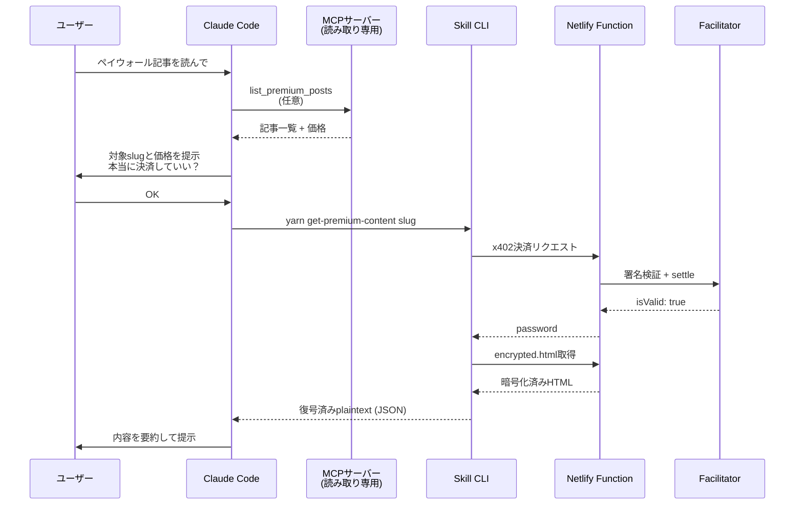

GW明けの余韻もそろそろ抜けてきました。

暑いね〜最近。

## Table of Contents

```toc
```

## 忙しい人向け

[前回の記事](/2026/05/08/x402-protocol-ai-agent-micropayment/)で実装した [x402](https://www.x402.org/) ペイウォール（有料）記事を、 [Claude Code](https://code.claude.com/docs/en/overview) などのAIエージェントから自律的にアンロックして読ませるためのスキル `get-premium-content` を作りました。

スキルの実体はこのブログのリポジトリにそのまま入っています。

::github{repo="tubone24/blog"}

スキルの本体は `.claude/skills/get-premium-content/SKILL.md` で、Claude Codeでこのリポジトリを開いていれば自動で認識されます。


## 前回のおさらい

[前回の記事](/2026/05/08/x402-protocol-ai-agent-micropayment/)で、自分のブログに [x402](https://www.x402.org/) プロトコルでペイウォールを実装しました。

仕組みとしては、 [Base Sepolia](https://docs.base.org/network-information/#base-testnet-sepolia) テストネット上のUSDCで0.05 USDCを支払うと、暗号化されたHTMLの復号パスワードを返してもらえる、という構成です。 [pagecrypt](https://www.npmjs.com/package/pagecrypt) でビルド時に暗号化したHTMLが、ブラウザ側で復号されて表示されます。

人間ユーザー向けのフロントエンドは [MetaMask](https://metamask.io/) で署名するUXを採用しており、ポップアップで内容を確認して承認、という流れになっています。

一方でAIエージェントから有料記事を読ませよう！みたいな気持ちも少なからずあるものです。

そんなわけで、今回は**AIエージェント側からアンロックする経路**も実装してみることにしました。

## なぜ今回はリモートMCPだけで完結しなかったのか

最初に考えたのは、 [リモートMCPサーバー](https://modelcontextprotocol.io/) としてx402決済機能を公開する案です。

このブログにはすでに `mcp-blog-server.js` という [Netlify Functions](https://docs.netlify.com/functions/overview/) で動くMCPサーバーがあって、記事一覧の取得や検索ができます。

ここに `unlock_premium_post` みたいなツールを足せば、Claude.aiのコネクタ経由でも有料記事をアンロックできるんじゃないか、と思いました。

**しかし、これは現実的ではありませんでした**。

理由はシンプルで、 **今回利用している EVM exact スキームではEOAの秘密鍵による署名が必要** だからです。

前回記事で説明したとおり、x402の [EIP-3009](https://eips.ethereum.org/EIPS/eip-3009) `transferWithAuthorization`（[EIP-712](https://eips.ethereum.org/EIPS/eip-712) 形式で署名）をクライアント側で署名して `PAYMENT-SIGNATURE` ヘッダーに乗せます。この署名を作るには秘密鍵が必要で、リモートMCPサーバー上で署名するなら、**そのサーバーに `EVM_PRIVATE_KEY` を置く必要があります**。

つまり、不特定多数のAIエージェントから呼ばれるリモートMCPサーバーが、**サーバー所有者（私）の財布の鍵を握ってfacilitator経由でオンチェーン決済する**という、なかなかに踏み込んだおもしろ構成になります。貧乏人の私の口座が空になります。困りますね。

そもそもEOAの秘密鍵のようなセンシティブな情報を、**不特定多数のAIエージェントから呼ばれるサーバーに置く**のは、たとえ利用者の秘密鍵をおいてもらう構成にしても、セキュリティ的に非常にリスキーです。

そんなわけで、 **決済を伴うツールはリモートMCPに置かず、ローカルで動くスキル側で持つ** という方針に決めました。

## 2系統アーキテクチャに分ける

### 共通実装は1ファイルにまとめる

決済と復号のロジックは `functions/src/utils/x402-paywall.js` にまとめてあります。 [@x402/fetch](https://www.npmjs.com/package/@x402/fetch) の `wrapFetchWithPayment` でfetchをラップして、 [viem](https://viem.sh/) の [`privateKeyToAccount`](https://viem.sh/docs/accounts/local/privateKeyToAccount) で秘密鍵からEOAアカウントを作っています。

```javascript{file: "functions/src/utils/x402-paywall.js"}
import { wrapFetchWithPayment } from "@x402/fetch";
import { x402Client } from "@x402/core/client";
import { registerExactEvmScheme } from "@x402/evm/exact/client";
import { privateKeyToAccount } from "viem/accounts";

function buildFetchWithPayment() {
  const privateKey = process.env.EVM_PRIVATE_KEY;
  if (!privateKey) {
    throw new Error("EVM_PRIVATE_KEY が未設定です（中略）");
  }
  const signer = privateKeyToAccount(privateKey);
  const client = new x402Client();
  registerExactEvmScheme(client, { signer });
  return wrapFetchWithPayment(fetch, client);
}
```

このモジュールは `unlockPremium` / `decryptEncryptedHtml` / `getPremiumContent` の3つの関数をexportしていて、リモートMCPサーバーとSkill CLIの両方からimportされます。

### リモートMCPは読み取り専用に絞る

リモートMCPサーバーには、**決済を伴わない読み取り専用ツールだけ**を生やしました。

| MCPツール | 役割 |
| --- | --- |
| `list_premium_posts` | `premium: true` な記事の一覧と価格 |
| `get_premium_post_paywall_info` | 単一slugの決済メタデータ |
| `decrypt_premium_post` | password既知時の復号のみ |

**いくらで何が買えるのか**を確認するための情報取得と、すでに手に入っているパスワードでの復号計算だけです。

### Skill CLIは決済の主経路とする

決済を伴う処理は、Skill CLIのほうに集約しました。

| コマンド | 入力 | 出力 |
| --- | --- | --- |
| `yarn unlock-premium <slug>` | slug | password (hex) |
| `yarn decrypt-premium <slug> <password>` | slug + password | plaintext HTML |
| `yarn get-premium-content <slug>...` | slug 1..N | plaintext HTML 配列（JSON） |

CLI経由なら、署名はローカルプロセス内で完結し、環境変数の `EVM_PRIVATE_KEY` を使います。**サーバーに鍵を渡さなくて済む**のがミソです。

実装は [tsx](https://github.com/privatenumber/tsx) でTypeScriptのまま叩けるようにしてあるので、 `package.json` の `scripts` に `yarn` コマンドとして登録しているだけです。

## get-premium-contentスキルの中身

スキルの本体は `.claude/skills/get-premium-content/SKILL.md` です。中身は普通のMarkdownで、Claude Codeに **どういうとき・どう振る舞ってほしいか** を書いておくだけです。

[Claude Codeのスキルドキュメント](https://code.claude.com/docs/en/skills) によると、スキルは **YAMLフロントマター** の `description` でClaudeが自動起動を判断し、本体のMarkdownが指示書として使われる仕組みになっています。

`description` にトリガーになりそうな自然な日本語フレーズを並べておくと、ユーザーの依頼から自動で起動してくれます。

今回は、こんなふうに `description` を書いてあります。

```yaml{file: ".claude/skills/get-premium-content/SKILL.md"}
---
name: get-premium-content
description: x402プロトコルでtubone24ブログのペイウォール記事を
  AIエージェントが自律的にアンロック・取得するスキル。
  「ペイウォール記事を読みたい」「x402で記事をアンロックして」
  「premium記事の内容を取得して」「USDCで記事を購入して」など、
  有料記事の閲覧を依頼された場合に使用。
  Base SepoliaのUSDCで決済し、暗号化されたHTMLを復号して
  plaintextを返す。
---
```

スキル本文には標準フローを書いてあって、おおよそこんな順番でClaude Codeが動きます。



ポイントは **ユーザー確認のステップを必須にしている** ところです。


完全にAIエージェントに自律的に決済させてもいいのですが、 決済は実費がかかる不可逆な行為なので、Claude Codeが勝手に走らないように **slug・価格・送金先・ネットワークを提示してから明示承認を待つ** ことをスキル本文で強く指示しています。

そもそもこんなブログの有料記事なんて、~~考えなしに読もうとするほうがどうかしているぜ~~。

## 実際にClaude Codeに読ませてみる

ここからは実際の動作です。

Claude Codeを開いて該当の有料記事の取得を頼むと、こんな感じの会話が始まります。

1. 該当のslugと、 `priceUsd: 0.05` USDC、送金先アドレス、Base Sepoliaであることを提示
2. 「この内容で決済を進めてよいですか？」と確認してくる
3. 承認すると `yarn get-premium-content "<slug>"` を実行
4. 復号されたHTMLが返ってきて、Claude Codeがそれを読み解いて要約してくれる

CLIの出力はこんな感じのJSONで返ってきます。

```json
[
  {
    "slug": "2011/01/01/x402-paywall-demo",
    "password": "...32バイトhex...",
    "encryptedUrl": "https://tubone-project24.xyz/2011/01/01/x402-paywall-demo/encrypted.html",
    "contentHtml": "<!-- 復号されたHTML -->"
  }
]
```

`contentHtml` の中身がplaintextなので、Claude Codeはそのまま要約に使えます。 **MetaMaskポップアップを1度も触ることなく**、推論ループのなかで決済から取得までが完結します。

Claude Codeの応答を見るとたしかに有料記事の内容が読み込まれていることがわかりますね。


ちなみに今のところデモ用ペイウォール記事は前回記事と同じく、**飼い犬の[むぎ](https://www.instagram.com/mugimugi.cutedog/)の暴走GIFプラス一言**だけです。

テストネットワークなので実費はかかっていないものの、AIエージェントに0.05 USDC払わせて取りに行かせるコンテンツとしては、はたしてどうなんだろう、という気持ちはあります。

## 最後に

x402プロトコルの面白さは、 **同じプロトコルを人間とAIエージェントの両方から叩ける** ところにあると改めて思いました。

人間はMetaMaskで署名内容を目で確認しながらアンロックし、AIエージェントはローカルの秘密鍵でスキル経由のCLIから自律アンロックする形でした。

サーバー側から見れば **どちらもただの x402 リクエスト** で、特別な分岐は不要です。

AgentCore Paymentsのようなマネージドウォレット基盤が広がれば、そのうち**ローカルで秘密鍵をself-custody（自分で秘密鍵を管理すること）しなくてもAIエージェントがx402決済できる時代**が来るんだろうな、という気がしています。

そうなった頃には、この仕組みもAgentCore対応版に書き直さないといけませんね。今からちょっと楽しみな予感がするこの頃です。
