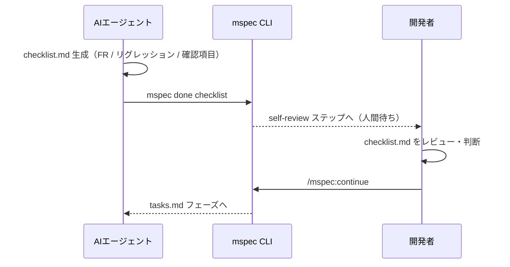

嫌なこといいますが、6月って祝日ないんですよ。

## Table of Contents

```toc
```

## 忙しい人向け

[mspec](https://github.com/tubone24/mspec) という [Claude Code](https://docs.claude.com/en/docs/claude-code/overview) 向けの仕様駆動開発（[Spec-Driven Development](https://github.blog/ai-and-ml/generative-ai/spec-driven-development-with-ai-from-chaos-to-structure/)）フレームワークを作りました。

ドキュメントは [tubone24.github.io/mspec/](https://tubone24.github.io/mspec/) にまとめています。

::github{repo="tubone24/mspec"}

合言葉は **3つのM** です。

- **Manifest**: 各成果物が [Diátaxis](https://diataxis.fr/) のどの象限（Tutorial / How-to / Reference / Explanation）かを宣言し、読み手の意図と一致したMarkdownを書く
- **Mapped**: 仕様の `FR-NNN` と実装コードが `@mspec-delta` という3行アンカーで物理的に紐づく
- **Machine-checkable**: 全部のゲートチェックをCLIの正規表現とパーサーで決定論的に行ない、 **LLMを検証経路に含めない**

ちなみに、もとの名前は飼い犬の[むぎ](https://www.instagram.com/mugimugi.cutedog/)から取った「**むぎぼーspec**」でした。

## はじめに

最近のClaude CodeなどのAIエージェント駆動の開発では、何かしらの仕様駆動開発フレームワークを使う機会が増えました。

私自身も [GitHub Spec Kit](https://github.com/github/spec-kit) や [OpenSpec](https://github.com/Fission-AI/OpenSpec) を業務でも個人開発でもかなり使ってきました。

どちらも素晴らしいフレームワークなのですが、使い込んでいくうちに **自分のワークフローや好みと噛み合わない部分** が積もってきました。

具体的には、**AIにTDDをやらせると形骸化したテストが量産されたり**、**フレームワークが出すドキュメントが重量級すぎてレビューだけで疲れたり**、確率的に動くLLMにどこまで自律性を委ねるかというラインがふわっとしていたり、 **仕様とコードのドリフト（drift）に対する仕組みが弱いのでは...** といった点です。

そんな違和感が、mspecを作るきっかけになりました。

このブログでは、mspecの設計思想と、その背景にある [Kent BeckのTDD](https://www.oreilly.com/library/view/test-driven-development/0321146530/) や [Daniele ProcidaのDiátaxis](https://diataxis.fr/)、 [GitHub Spec Kit](https://github.com/github/spec-kit) と [OpenSpec](https://github.com/Fission-AI/OpenSpec) の系譜まで踏み込んで紹介します。

なお、まだプロダクトはバージョン `0.1.0` であり、私自身がドッグフーディングしながら少しずつ育てている段階です。荒削りな部分も多々ありますが、設計の意図とともに見ていただければ嬉しいです。

## 仕様駆動開発で起きている3つの困りごと

mspecは **仕様駆動開発で繰り返し遭遇する3つの困りごと** を出発点に設計されています。

### Spec Drift（仕様の漂流）

いわゆる仕様とコードがズレている状態です。

コードは進むのにその元になっているはずの仕様は1コミット前のまま、誰も気づかないまま1ヶ月もすれば、**仕様が正しいのか、コードが正しいのか、本番の挙動から逆算しないとわからない** という事態になります。

さらに厄介なのが、 **ある実装がどの変更のために書かれたのか、その根拠になった仕様を後から追えない** 点です。コードから変更の文脈を辿れないので、リファクタや削除のたびに、このコードを本当に消していいのかという確認コストが発生します。

(ただし、git運用を整えて単一のコミット点で仕様とコードをコミットしていればgit logなどで追うことは可能です)

また、仕様と実装が乖離しているときに **どちらが正しいかを判断するための根拠** もありません。あるのはそれっぽく動くだけのプロダクトのみです。

ドリフトを検知して仕様と実装を揃えるのは非常に難しい状態といえます。

mspecではSpec Driftに対して、後述の `@mspec-delta` アンカーで **コードから仕様への物理的なリンク** を埋め込み、CLIで双方向に検証するアプローチを取ってます。

### AIが書くドキュメントの読みにくさ

仕様駆動開発フレームワークを回すと、 **大量のMarkdownファイル** が生成されます。

困るのは、その中に **読み手や目的が混在しているドキュメント** が大量に含まれることです。

もっとわかりやすく言えばAIの生成ブレを抑えるためだけに書かれた詳細な手順書と、人間が設計の意図を確認するための概説が、同じMarkdownファイルに混ざっていたりします。

特に私が辛いと感じたのは、**実装を自然言語でなぞったタスクリスト**です。

ある程度コードが読める人間にとって、次のような自然言語で書かれた記述は、コードを読むよりも圧倒的にイメージしにくいものです。

> ○○クラスに△△メソッドを実装し、引数として〜〜を受け取り、〜〜を返す

そのタスクリストをレビューで人間に読ませる設計になっているフレームワークは、**実装コードを直接見るよりも理解のコストが高い逆転現象**が起きがちです。

mspecではこの問題に対して、後述のDiátaxisの `doc_type` を全成果物に必須化することで、 **読み手がいまどのカテゴリのドキュメントを読んでいるか** を明示し、不要なドキュメントをスキップできる設計にしました。

### LLMがLLMを採点する閉鎖ループ

そして個人的に一番気にしているのがこれです。

仕様を書くのも、レビューするのも、テストを書くのも、実装するのも、 **同じくらいの能力のモデル** だったとしたらどうでしょう。

仕様駆動開発フレームワークの動き自体はいわゆるエージェントスキルで定義された手順でしかありません。

それはそれでいいのですが、フローの決定的なポイントで **LLMがLLMを採点する** ような設計になっていると、**AIの確率的な振る舞いがそのままフレームワークの不確実性に直結する**ことになります。

LLMの確率的な振る舞いを **どこまで許容し、どこから決定論で締めるか**が悩みのポイントでした。

mspecではゲートに **LLMを介在させない** ことをルールにしました。

すべての検証はパーサーか正規表現で実装されており、`mspec validate`、`mspec anchor check`、`mspec spec lint`、`mspec test expect-red/green`、そして `mspec archive` のマージまですべてCLIが決定論的に判断します。

## 生成AIで形骸化するTDD

3つの失敗モードのうち、特にTDDの話を少し深掘りさせてください。

[Kent Beck](https://en.wikipedia.org/wiki/Kent_Beck) が2002年に書籍 [_Test-Driven Development: By Example_](https://www.oreilly.com/library/view/test-driven-development/0321146530/) で体系化したTDDのリズムは、 [Martin FowlerのBliki](https://martinfowler.com/bliki/TestDrivenDevelopment.html) でもおなじみの **Red → Green → Refactor** の3拍子です。

1. **Red**: 動かない小さなテストをまず書く（コンパイルすら通らなくてもよい）
2. **Green**: そのテストが通るように、罪深いコードでもいいから書く
3. **Refactor**: 重複と汚れを取り除く

このサイクルは「**clean code that works**」、つまり **動くきれいなコード** を出口に置く設計手順です。

### 形骸化が起きる仕組み

生成AIにこのリズムを実行させると、表面的にはRed→Greenに見えるのですが、**テストを書く時点でAIの頭の中には実装イメージができてしまっている**ことが多いです。

その結果出てくるのが、次のようなコードたちです。

- カバレッジを上げるためだけの大量のモック差し込みユニットテスト
- 通らない（というかコードがない）はずのエッジケースに対する未到達テスト
- 実装の振る舞いではなく、 **実装そのものをコピーした検証**

しかも、テストが落ちると平気で **テストを実装に合わせて書き換える** ようなコミットを打ってくるので、Red→Greenの順序が崩れていてもエージェントのなかでは**ちゃんとテスト書いて通しました**になっています。

### mspecが取るアプローチ

mspecではこの問題に対して、**テストの実行順序そのものを証跡として記録する**というごく単純で素朴なアプローチを取っています。

具体的には、 [`mspec test expect-red <task-id>`](https://tubone24.github.io/mspec/reference/cli) と [`mspec test expect-green <task-id>`](https://tubone24.github.io/mspec/reference/cli) という2つのコマンドを用意して、エージェントはタスクごとにこの順序を**CLIで物理的に記録させる**ようになっています。

```bash
# テストが落ちることを確認（Red）
mspec test expect-red T-001
# → 失敗証跡を .mspec/cache/red-evidence/ に保存

# 実装を入れる

# テストが通ることを確認（Green）
mspec test expect-green T-001
# → 成功証跡を .mspec/cache/green-evidence/ に保存
```

ポイントは **CLIが期待する終了コードに合致しないと`exit 1`を返す**ことです。終了コードの定義は `.mspec/config.yaml` の `test:` セクションでカスタマイズできます。

```yaml{file: ".mspec/config.yaml"}
test:
  # mspec test expect-red/expect-green が叩くコマンド
  command: "vitest run"
  # この終了コードならテスト失敗（Red）とみなす
  expect_red_on_exit: [1, 2]
  # この終了コードならテスト成功（Green）とみなす
  expect_green_on_exit: [0]
```

このデフォルト値（失敗 `[1, 2]` / 成功 `[0]`）は、 [Vitest](https://vitest.dev/) や [Jest](https://jestjs.io/)、 [pytest](https://docs.pytest.org/) みたいな主要なテストランナーをそのままカバーする想定です。ランナーを変えるときは基本的に `command` を差し替えるだけ（`"pytest -x -q"` など）で済み、 `expect_*_on_exit` は終了コードが非標準なランナーのときだけ上書きします。

そして実装ステップ（`implement`）のフラグ `enforce_tdd: true` が立っている状態だと、 **`expect-red` を踏んでいないタスクの `expect-green` を拒否する** 動きになります。

つまり、 **実装に合わせてテストを後から書き換える** とか、 **テストを消して実装に合わせる** といった乱暴な動きをCLIのゲートで弾けるということです。

ただ...。正直に書くと、この仕組みはまだ完成にはほど遠いです。

対応しているテストフレームワークの種類は多くないですし、Red→Greenの順序を守らせたところで、 **その中身が本当に振る舞いを表したテストか** までは保証できません。このあたりはドッグフーディングしながら少しずつ育てている段階です。

## 重量級ドキュメント問題とDiátaxis

もう1つの動機が、 **大きな仕様駆動フレームワークが出すドキュメントレビューで疲れてしまう問題**です。

仕様駆動開発フレームワークを使ったことがある方ならわかると思うのですが、ワークフローを一通り回すと、仕様・設計・タスク・APIスペック・クイックスタート...と、 **そこそこの量のMarkdownが一気に降ってきます**。

ドキュメントが多いこと自体は悪いことではないのですが、 **書き手（AI）の意図と読み手（人間）が見たい粒度がズレている** と、レビューだけで一日が終わるみたいなことが起きがちです。

ここで参考にしたのが [Daniele Procida](https://en.wikipedia.org/wiki/Daniele_Procida) が提唱した **[Diátaxis](https://diataxis.fr/)** というドキュメンテーションフレームワークです。

ギリシャ語の **dia（across）+ taxis（arrangement）** に由来する造語で、[Django](https://docs.djangoproject.com/)、 [Cloudflare](https://developers.cloudflare.com/workers/) などのドキュメントで採用されているので、ご存じの方も多いと思います。

Diátaxisは、技術文書を **読み手のニーズ** で4象限に分類します。


上の図のとおり、 **Tutorials（学習）・How-to guides（目標達成）・Reference（情報参照）・Explanation（理解）** の4つに、「読み手がいま行動したいのか理解したいのか」「知識を習得する段階なのか応用する段階なのか」という2軸で分けるのが特徴です。

これがそのままmspecの **Manifest** という設計軸につながります。

## Manifest doc_typeで読み手の意図を明示する

mspecでは、ワークフローが生成する**すべてのMarkdownアーティファクト**にYAML Front Matterで `doc_type:` を必須にしています。

[doc-types リファレンス](https://tubone24.github.io/mspec/reference/doc-types) を見るとわかりますが、 `Tutorial / How-to / Reference / Explanation` の4種類だけを許容しています。

実際の各アーティファクトの分類は次のようになっています。

| アーティファクト | `doc_type` | 趣旨 |
|---|---|---|
| `readme.md` | `Reference` | 変更スコープ・リクエスト・ステップチェックボックス |
| `proposal.md` | `Explanation` | なぜこの変更が必要か（Phase 0 Constitution Check含む） |
| `research.md` | `Reference` | トレードオフ表をあとで引きやすいよう表形式で |
| `design.md` | `Reference` | 設計決定（Phase 1 Constitution Check含む） |
| `architecture-overview.md` | `Reference` | Mermaid + モジュールマップ |
| `quickstart.md` | `How-to` | ゴールデンパス・検証・トラブルシュート |
| `checklist.md` | `Reference` | FR / リグレッションのチェック項目 |
| `tasks.md` | `Reference` | 番号付きタスク + アンカーブロックの一覧 |
| `glossary.md` | `Reference` | 変更ごとの用語表 |

Diátaxisの考え方とズレていると感じられるところとして、 **`tasks.md` は Reference であって How-to ではない** という点です。

これは、仕様駆動開発の成果物であるtasks.mdを読むのは **人間ではなくAIエージェント** であり、人間用の手順書ではなく **AI用のルックアップテーブル** として最適化したいからです。

doc_typeを宣言することで、書き手のAIには「**いまから Reference を書くんだ。網羅と表形式を優先しよう**」というプロンプト的な制約が入り、読み手の人間には「**ここは Reference だから、流し読みで該当箇所だけ引けばいい**」という心構えが入ります。

大量のドキュメントで疲弊しない仕様駆動開発がしたいという気持ちから生まれたアプローチです。

## Mapped @mspec-deltaで仕様とコードを紐づける

mspecのなかで個人的に一番気に入っている仕組みが、 [Anchor Reference](https://tubone24.github.io/mspec/reference/anchors) で定義されている、**`@mspec-delta`アンカー**です。

```typescript{file: "src/search.ts"}
/**
 * @mspec-delta 2026-05-14-093015-add-search/specs/search-engine/spec.md
 * Requirements implemented: FR-005, FR-007
 * Change: add-search
 */
export function searchDocs() { /* ... */ }
```

このように実装されるコードの先頭にDocstringのような形でアンカーが書き込まれます。

### 配置ルール

- ファイル先頭から **30行以内** に置く
- E2Eテストファイルではファイル先頭か `describe` ブロックの先頭に置く
- 1ファイルに **複数のアンカーを置いてもよい**（1つのファイルが複数変更に関わる場合）

なぜこの3行コメントなのか、というのは [Anchor Reference](https://tubone24.github.io/mspec/reference/anchors) に **採用しなかった案** とセットで書いてあります。

| 候補 | 却下理由 |
|---|---|
| `// see spec/foo.md` のようなファイルパスコメント | 機械検証できず、どこかで黙ってズレる |
| Git trailers（`Spec: FR-005`） | コミットにしか残らず、作業ツリーから見えない |
| 外部のトレーサビリティDB | インフラが必要、SoTが分裂、リベースで壊れる |

3行コメントはどんな [grep](https://www.gnu.org/software/grep/) でも、どんなLLMのコンテキストウィンドウでも扱えます。CLIは構造チェックだけ足してあげればよい、というシンプルな分担にすることで、 **コードと仕様のドリフトを物理的に防ぐ** ことができます。

### 双方向の検証

アンカーは次の3つのCLIで使います。

```bash
# 仕様ファイル/FR-IDが存在しないアンカーを報告
mspec anchor check

# 削除済み変更ディレクトリを参照している孤児アンカーをリストアップ
mspec anchor list --orphans

# 指定変更のアンカーとDelta Specを {code_path, anchored_fr_ids, delta_spec_excerpt} で
# JSONバンドル化してLLM文脈用に書き出す
mspec anchor extract <change-name>
```

最後の `mspec anchor extract` がmspec独自の面白いところで、**特定の変更について、どのコードが何のFRを実装したかをJSONでまとめて出す**ので、これをそのままClaude Codeにペーストすれば、その変更のコード網羅レビューがLLMで回せる、という仕組みです。

つまり、**検証ゲートではLLMを使わないけれど、深掘り分析にはLLMをガッツリ使える**ように、CLI側から**決定論的に集めた素材**を渡せるわけです。

### 実装ステップでの強制

`.mspec/workflow.yaml` の `implement` ステップでは、次のフラグがデフォルトで `true` になっています。

```yaml{file: ".mspec/workflow.yaml"}
- id: implement
  command: /mspec:implement
  skill: mspec-implement
  requires: [tasks.md]
  produces: []
  block: true
  ask_questions: true
  enforce_anchor: true
  enforce_e2e: true
  enforce_tdd: true
```

これにより、**Delta Specに書かれた `FR-NNN` のうち、コードアンカーが1つもないFR-IDがあれば実装ステップを完了できない**という縛りが入ります。

合わせて**Delta Spec内の `#### Scenario:` ブロックに対応するE2Eタスクが `tasks.md` にあるか**を見ており、シナリオとテストがズレないようになっています。

このラウンドトリップ保証が、Mapped軸の核です。


## Machine-checkable CLIで決定論的にゲートする

mspecの3つ目の柱が**Machine-checkable**です。

ワークフローの**意思決定が起きる場所**では、必ずCLIが**パーサーまたは正規表現**で答えを出します。**LLMは検証経路に入れない** という強い制約を掛けています。

### LLMをゲートから外す意味

ここまで何度か書いてきましたが、LLMは確率的に動くものです。当たり前ですが同じ入力でも、前後の文脈で出力が変わります。

そんなLLMに、仕様の十分性やテストの妥当性、アンカーの対応関係といった真偽をジャッジさせてしまうことが自分のなかでは納得できませんでした。

mspecでは [Workflow Reference](https://tubone24.github.io/mspec/reference/workflow) のとおり、各ステップにフラグが立っています。

| フラグ | 該当ステップ | 意味 |
|---|---|---|
| `enforce_fr_ids` | `delta` | `FR-NNN` の一意性と `#### Scenario:` ブロックの存在を強制 |
| `enforce_anchor` | `implement` | Delta Specの全FR-IDが最低1つのアンカーを持つ |
| `enforce_e2e` | `implement` | Delta Specの全シナリオがE2Eタスクに対応 |
| `enforce_tdd` | `implement` | `expect-red` → `expect-green` の順序を強制 |
| `constitution_check` | `proposal` / `research` / `design` / `self-review` / `tasks` | Phase 0 / Phase 1 Constitution Check の表を含む |

ここで重要なのは、**CLIが具体的な真偽を返す**ことです。失敗するときは具体的なファイルパスとFR-IDが、エラーメッセージとして出るので、**AIエージェントが直しにいける形**で返ってくるのです。

## Delta SpecとOpenSpecの系譜、Spec Kitとの比較

3つのMの設計は、当然ながらゼロから降ってきたわけではなく、 **既存の仕様駆動フレームワークの良いところをかなり拝借しています**。ここで一度、 [Spec Kit](https://github.com/github/spec-kit) と [OpenSpec](https://github.com/Fission-AI/OpenSpec) の流れに位置付けて整理します。

### GitHub Spec Kitの強み

[GitHub Spec Kit](https://github.com/github/spec-kit) はGitHub公式のSDDツールキットで、 [GitHub Blog の解説記事](https://github.blog/ai-and-ml/generative-ai/spec-driven-development-with-ai-from-chaos-to-structure/) でも言及されているとおり、 **`/speckit.constitution → specify → plan → tasks → implement`** という流れで、 [GitHub Copilot](https://github.com/features/copilot)、Claude Code、 [Cursor](https://www.cursor.com/) などに対応します。

`constitution` でプロジェクト原則を立てて、`specify`で仕様を、`plan`で技術設計を、`tasks`で分解して、`implement` で実装、というフローです。

ここで参考にしたのが **Constitution（憲法）** という考え方です。

憲法ファイルとは、 **個々の仕様より一段上にある、プロジェクト全体で守るべき原則を書いたMarkdown** です。アーキテクチャの方針、テスト戦略、命名規約、依存ライブラリの選定基準といった「変更ごとにブレてはいけないこと」をここに固定しておきます。各変更の仕様（spec）が「今回なにを作るか」を書くのに対して、憲法は「どの変更でも従うべき土台」を書く、という棲み分けです。これがあると、AIエージェントが個別の変更に集中しても、プロジェクト全体の一貫性が崩れにくくなります。

mspecでも `memory/constitution.md` を `mspec init` 時に生成し、 `proposal / research / design / self-review / tasks` の各ステップで **Phase 0 / Phase 1 Constitution Check**の表を必須にしています。これは「この変更が憲法に違反していないか」をステップごとに突き合わせる仕組みです。

もう1つ気に入っているのが**quickstart.md**というドキュメントの存在です。これはAIが書いたゴールデンパスの確認手順書で、**実装後に開発者が自分で触ってみる**ためのものです。AIに任せっぱなしで「実装しました」とされても、ゴールデンパスを人間の感覚で確認しないと本当にOKかどうかは判断できないんですよね。なのでquickstart.mdはあえてワークフローに残しています。

ただ、Spec Kit単体だと **完成した仕様 ↔ 実装コードの後追い** が私のなかではしんどく、リファクタや削除が走ったあとに、現在の `spec.md` のFRがどのコードに対応していたのかを辿りづらくなりがちでした。

### OpenSpec の Delta Spec方式

その悩みに対して **すごくフィット** したのが、 [Fission AIのOpenSpec](https://github.com/Fission-AI/OpenSpec) の**Delta Spec**という考え方です。

OpenSpecでは、変更ごとに **`changes/<change-id>/specs/...`** というディレクトリに**差分の仕様**を書き起こします。`ADDED Requirements` / `MODIFIED Requirements` / `REMOVED Requirements` といったセクションで **何が増えて、何が変わって、何が消えたか** を明示し、それを **SoT（Source of Truth）の `specs/`** にマージしていくスタイルです。

差分思考と、変更のスコープが明確なこの方式は、**Gitの感覚に近くて理解しやすい**し、**その変更だけのドキュメント**をひと固まりに保てる強みがあります。

mspecもこのDelta Spec方式をそのまま踏襲しています。`mspec new <feature-kebab>` で `changes/YYYY-MM-DD-HHMMSS-<feature>/`を作って、そのなかで**差分の仕様を書く → 実装する → アーカイブする**という流れです。

### mspecの差分

私のなかでの課題感は、**Delta Specが書けても、そこから実装コードへの向き合うべき箇所が見えにくい**という点でした。

そこで、`@mspec-delta`アンカーを**コード側からDelta Specへの逆リンク**として埋め込み、`mspec anchor check / list / extract`で双方向に検証・抽出できるようにしました。

**Spec KitもOpenSpecも素晴らしいフレームワークです**。それぞれの強みを別個に伸ばしているだけで、mspecはあくまで「私の使い方ではこれが嬉しい」をまとめたものに過ぎません。

## mspecのワークフロー

mspecのワークフローは11ステップで構成されています。黄色のステップが `block: true`、つまり開発者が `/mspec:continue` を叩くまで止まる人間確認ポイントです。

```mermaid
flowchart LR
    A[1. new] --> B[2. proposal]
    B --> C[3. delta]
    C --> D[4. research]
    D --> E[5. design]
    E --> F[6. quickstart]
    F --> G[7. checklist]
    G --> H[8. self-review]
    H --> I[9. tasks]
    I --> J[10. implement]
    J --> K[11. archive]

    style A fill:#f9c74f,color:#000
    style B fill:#f9c74f,color:#000
    style D fill:#f9c74f,color:#000
    style E fill:#f9c74f,color:#000
    style H fill:#f9c74f,color:#000
    style I fill:#f9c74f,color:#000
    style J fill:#f9c74f,color:#000
```



### checklist.mdとself-reviewが担う2層の品質ゲート

mspecのワークフローで注目してほしいのが、 `checklist` と `self-review` がセットになっている設計です。

`checklist.md` はAIエージェントがサブエージェントで生成します。その変更に関するFRカバレッジの確認項目、リグレッションのリスク、動作確認のチェック項目をリストアップしたものです。AIが自分でやったことを自分でチェックした成果物です。

`self-review` ではそのチェックリストを人間が見て最終確認をします。仕様書に書かれた要件がすべてカバーされているか、テストが実態の振る舞いを反映しているかを、AIの自己評価に依存せず人間の目を通す。



**すべてをAIに任せきる** のではなく、 **任せきれない判断の部分に人間を置く** という分担設計です。

AIが書いたものをAIがチェックするだけでは見落とされる観点を、人間が拾う。反対に、定型的なカバレッジチェックや機械的に確認できるところはAIに任せる。この2層を組み合わせることで、トータルの品質カバレッジを上げていこうというのがmspecの作戦です。

### ライトウェイトモード

11ステップは正直、誤字修正やワンライナーのバグフィックスにはオーバーキルです。

そのため、 [Lightweight Changes](https://tubone24.github.io/mspec/how-to/lightweight-changes) で説明している `typo` / `minor` / `bugfix` の3モードが用意されています。

| モード | スキップ | 強制 | 用途 |
|---|---|---|---|
| `typo` | `proposal`, `quickstart` | — | 誤字・コメント修正 |
| `minor` | `proposal`, `quickstart` | — | UXや文言の軽微な変更 |
| `bugfix` | `proposal`, `quickstart` | `research` | 軽い根本原因分析が要るバグ修正 |

利用方法は2通りで、 `mspec new fix-cli-typo --mode typo` で明示するか、 `/mspec:new` を叩いて **AIに推測 → `AskUserQuestion` で1回確認** してもらうかです。

## AIから人間に問答する設計（Markdownを直接編集させない）

ここまでフラグの話で何度か触れた `ask_questions` ですが、これがmspecのもう1つのこだわりポイントです。

### 何が嬉しいのか

仕様駆動開発のドキュメントは、たいてい **Markdownを人間が読んだり書いたりする** 前提で組まれています。

ですが、AIエージェントと一緒に開発していると、 **AIが下書きしたMarkdownを人間がレビューし清書する** ことが圧倒的に多くなります。

なので、mspecでは **AIが人間にチャット形式で問いかけ、その回答からMarkdownの中身を補完していく** という体験を、可能なかぎり優先しています。つまり膨大なMarkdownを直接編集する必要ができるだけないようにしています。

[Workflow Reference](https://tubone24.github.io/mspec/reference/workflow) の `proposal / research / design / implement` には `ask_questions: true` フラグが立っており、対応するskillがClaude Codeの `AskUserQuestion` ツールを呼ぶことが許可される設計になっています。

人間は**Markdownを直接編集することなく、問答に答えるだけで仕様を肉付けできる**わけです。

なお、現在のmspecはClaude Code専用なのでAskUserQuestionツールに直接依存していますが、将来的にホストが変わっても動くよう、**問答機構そのもの**を抽象化していくのが個人的な宿題です。

## ドッグフーディングと今後の課題

正直、mspecはまだ完成にほど遠いです。

直近の課題は次のようなところです。

- 対応するテストランナーの種類が少ない（exit codeのカスタムだけだとカバーしきれない言語/フレームワークがある）
- アンカーの **追加** と **削除** は検証できるが、 **コード移動・リネーム** に伴うアンカー追従はまだ手作業
- `mspec spec lint` の正規表現ルールはチューニング途中で、誤検出も誤通過もあり得る
- Constitutional Checkは表が書かれていることをチェックするだけで、**書かれた内容の妥当性**までは見ない
- Claude Code以外への対応（`integrations` の枠は用意したが、実装はまだ）

ただ、**設計の骨格**はかなり気に入っており、自分自身がmspecでmspec自体の変更を回すドッグフーディングを続けています。

## 最後に

長々と書きましたが、mspecは **既存の仕様駆動フレームワークに対する、私個人の違和感を埋めるためのフレームワーク** です。 [Spec Kit](https://github.com/github/spec-kit) や [OpenSpec](https://github.com/Fission-AI/OpenSpec) を否定するためのものではまったくなく、どちらも素晴らしいので**適材適所で使えばいい**と思っています。

仕様駆動開発フレームワークを自作する意味は正直ないと思います。既存のフレームワークをカスタマイズできますので。

ただ、仕様駆動開発フレームワークを作ることは、自分自身でAIに何を求めているのか、何が課題なのかを可視化する良い機会になります。

mspecの **M** は、最初は私の飼い犬である[むぎ](https://www.instagram.com/mugimugi.cutedog/)の **む** から取った **むぎぼーspec** でした。

で、開発を進めていくうちに**アンカーで仕様とコードを紐づける（Mapped）**、という考え方から、**読み手の意図を明示する（Manifest）**、**CLIで決定論を保つ（Machine-checkable）**、が見えてきて、**3つのM**に育ってくれました。


最初に **む** から始まったやつが、ちゃんとした3つのMに育ってくれた、というのが個人的にはとても嬉しいです。むぎぼーすごい。

むぎぼーは2歳になりました。これからも元気に長生きしてほしいです。