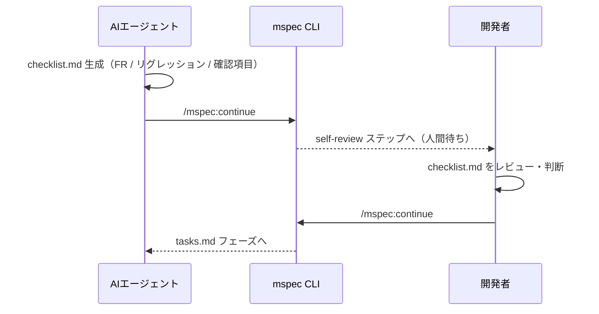

嫌なこといいますが、6月って祝日ないんですよ。

## Table of Contents

```toc
```

## 忙しい人向け

[mspec](https://github.com/tubone24/mspec) という [Claude Code](https://docs.claude.com/en/docs/claude-code/overview) 向けの仕様駆動開発（[Spec-Driven Development](https://github.blog/ai-and-ml/generative-ai/spec-driven-development-with-ai-get-started-with-a-new-open-source-toolkit/)）フレームワークを作っています。

ドキュメントは [tubone24.github.io/mspec/](https://tubone24.github.io/mspec/) にまとめています。

::github{repo="tubone24/mspec"}

## はじめに

最近AIエージェント駆動の開発では、何かしらの仕様駆動開発フレームワークを使う機会が増えました。

いろいろなフレームワークを使い込んでいくうちに、**もっとこうしたい**という気持ちがあふれてきました。

ならば作っちゃおう、ということでmspecを作りはじめることにしました。

この記事では、まず**実際にmspecで小さな機能を1つ作ってみる流れ**を見てもらい、そのあとで設計思想まで踏み込んでいきます。

まだ私自身がドッグフーディングしながら少しずつ育てている段階なので、荒削りな部分も多々あります。 が、設計の意図とともに見ていただければ嬉しいです。

## 仕様駆動開発で感じていた困りごと

mspecは、**仕様駆動開発で繰り返し遭遇する困りごと**を出発点に設計されています。

私はこのあたりがよく壁としてぶち当たりました。

### Spec Drift（仕様の漂流）

いわゆる**仕様とコードがズレている**状態です。

コードは変更されているのに元になっているはずの仕様ドキュメントは前のまま、**仕様が正しいのか、コードが正しいのか、本番の挙動から逆算しないとわからない** という事態になります。

さらに厄介なのが、**ある実装がどの仕様変更のために書かれたのか、その根拠になった仕様変更を後から追えない**点です。

コードから変更の文脈を辿れないので、リファクタや削除のたびに、このコードを本当に消していいのかという確認コストが発生します。

（git運用を整えて単一のコミット点で仕様ドキュメントとコードをコミットしていれば、git logなどで追うことは可能ではあります）

ズレたあと、ドリフトを検知して仕様と実装を揃えるのは、なかなか難しいんですよね...。

### AIが書くドキュメントの読みにくさ

仕様駆動開発フレームワークを回すと、**大量のArtifact、つまりMarkdownファイル**が生成されます。

困るのは、その中に **読み手や目的が混在しているドキュメント** が大量に含まれることです。

後続の実装タスクでAIエージェントの生成ブレを抑えるためだけに書かれた詳細な手順書と、人間が設計の意図を確認するための概説が、Artifactに混ざっています。

特に私が辛いと感じたのは、**実装を自然言語でなぞったタスクリスト**の存在です。

ある程度コードが読める人間にとって、次のような自然言語で書かれた実装手順の記述は、コードを読むよりも圧倒的にイメージしにくいものです。

> ○○クラスに△△メソッドを実装し、引数として〜〜を受け取り、〜〜を返す

コードであれば、関数ジャンプとか使って確認できるところを、自然言語で書かれるととてもじゃないけど追えないです。

そんな実装手順をレビューで人間に読ませる設計になっていると、**実装コードを直接見るよりも理解のコストが高い逆転現象**が起きていると感じました。

### LLMがLLMを採点する閉鎖ループ

そして個人的に一番気にしているのがこれです。

仕様を書くのも、レビューするのも、テストを書くのも、実装するのも、**同じくらいの能力のモデル** だったとしたらどうでしょう。

仕様駆動開発フレームワークの動き自体は、**基本的にはエージェントスキルで定義された手順**でしかありません。

それはそれでいいのですが、各ワークフローの決定的なポイントで**LLMがLLMを採点する**ような設計になっていると、**AIエージェントの確率的な振る舞いがそのまま確実性に影響する**ことになります。

LLMの確率的な振る舞いを、**どこまで許容し、どこから決定論で締めるか**が、ずっと悩みのポイントでした。

### 生成AIで形骸化するTDD

AI駆動開発をしていると、TDDの文脈によく出会います。

[Kent Beck](https://en.wikipedia.org/wiki/Kent_Beck) が2002年に書籍 [Test-Driven Development](https://www.oreilly.com/library/view/test-driven-development/0321146530/) で体系化したTDDのリズムは、 **Red → Green → Refactor** の3拍子です。

動かない小さなテストをまず書き（Red）、それが通る最小のコードを書き（Green）、重複と汚れを取り除く（Refactor）という手順です。

AI駆動開発をしていると度々**TDDで実装する**という指示に遭遇することが多いです。それはTDDがAI駆動開発においても理にかなっているからだと思います。

ところが、生成AIにこのリズムを実行させると、表面的にはRed→Greenに見えるのですが、**テストを書く時点でAIの頭の中には実装イメージができてしまっている**ような振る舞いをすることが多いです。

その結果出てくるのが、カバレッジを上げるためだけのモック差し込みテストや、実装の振る舞いではなく**実装そのものをコピーした検証**コードの類です。

しかも、テストが落ちると平気で**テストを実装に合わせて書き換える**ような変更をしてくることもあるので、Red→Greenの順序が崩れていてもAIエージェントのなかでは、**ちゃんとテスト書いて通しました**となってしまいます。

根深い問題だと思います。

## まず触ってみる

ここまでが動機です。mspecの仕組みの話に入る前に、まず**実際にmspecで小さな機能を1つ作る流れ**を見てもらうのが早いと思います。

例として、あるプロジェクトに**ドキュメント全文検索の機能を足す**ケースを考えます。

### インストールと初期化

mspecはnpmパッケージとして配布しているので、グローバルに入れます。

```bash
npm install -g @mspec/cli
mspec --version
```

プロジェクトのルートで `mspec init` を実行すると、 `.mspec/` の設定一式、 `memory/constitution.md`（プロジェクト憲法）、そしてClaude Code向けの `.claude/commands/`・`.claude/skills/`・`.claude/agents/` が生成されます。

初期化時にテスト実行コマンド（`vitest run` など）を聞かれるので、ここで合わせて設定しておきます。

### 変更を始める

mspecは**変更（change）単位**で動きます。Claude Codeのなかで `/mspec:new` スキルを叩くと、変更の名前やどんなリクエストかをAIエージェントが対話的に聞いてきて、`changes/2026-05-29-HHMMSS-add-search/`のようなディレクトリを切ってくれます。

このディレクトリに、今回の変更だけの仕様・設計・タスクがまとまっていきます。

同時に**mspec Web UIが、http://localhost:3847 でバックグラウンド起動**して、これ以降に生成される成果物をブラウザで眺められます。


### 止まるたびにアーティファクトを確認する

mspecのワークフローは、Claude Codeの**スキル**として定義されています。

なので、`/mspec:new`のあと打つコマンドは`/mspec:continue`のみで基本的に完結します。

開発者の仕事は、**各ステップが止まったときにアーティファクトを確認し、意図と合っているか判断すること**に集中します。

```bash
/mspec:new        # 変更を開始する
/mspec:continue   # ステップを進める。block: true で止まったら確認して、また叩く
```

`/mspec:continue` を叩くたびに、proposalを書く・プロトタイプを出す・Delta Specを起こす・research / designを固める...とステップが進みます。


ステップが止まったとき、何をどう確認するかは、**`doc_type`** が参考になります。

`Explanation`（理解志向）なら**設計の意図を読み込み**、`Reference`（情報参照）なら全部読み込まず**気になる箇所だけ参照**する、という具合です。

先ほどの**ドキュメント全文検索を追加する例**で、実際に追ってみましょう。

#### まずは要求を出してみる

Proposalステップでは、先ほど`/mspec:new`コマンドで作られた概要を元にClaude Codeから`AskUserQuestion`の形で、**どんな検索機能が欲しいか**、**検索対象のドキュメントは何か**といった要求の深堀り質問が次々飛んできます。

あなたは、**`docs/`配下のMarkdownを全文検索できるようにしたい**、**結果にはスニペットを出したい**といくつか提示される選択肢に返答するだけで、`proposal.md`が生成されます。


Markdownの中を開くと、Why・Goals・Non-Goals・Open Questionsがこんな形で整理されています。

> - **Why:** 現在 `docs/` 配下のMarkdownはキーワード検索ができず、目的のページを見つけるためにファイルを手動で開く必要がある
>
> - **Goals:** `docs/` 配下のMarkdownを全文検索できる。結果にはスニペットを表示する
>
> - **Non-Goals:** リアルタイムのインデックス更新。外部ドキュメントの検索
>
> - **Open Questions:** インデックスの更新タイミング（ビルド時？起動時？）→ researchステップで調査

自分の意図と食い違っていなければ `/mspec:continue`で先に進み、違っていればAIエージェントに再度返信する形で要求を整えていきます。

#### 仕様として形になっているか確かめる

次のステップは、delta specを作成する段階です。今回の要求（proposal）を満たすこのシステムへの**変更の**仕様を書いていきます。

Function Requirement(機能要件、FR)は、**EARS（Easy Approach to Requirements Syntax）** という記法で書かれます。

「〜できる」という曖昧な文体ではなく、**条件・主語・振る舞いが一意に決まる形式**として広く使われています。

> - `FR-001`: `WHEN` ユーザーがキーワードを入力したとき、システムは `SHALL` `docs/` 配下のMarkdownを全文検索し、マッチしたドキュメントの一覧を返す
> 
> - `FR-002`: `WHEN` 検索結果が表示されるとき、システムは `SHALL` マッチ箇所のスニペットをハイライト付きで表示する

と要件が整理された`spec.md`が出てきます。

そして各FRには、受け入れシナリオが **Gherkin（Given/When/Then）** で紐づきます。

> #### Scenario: キーワードで検索する（FR-001, FR-002）
> **Given** docs/ 配下に3件のMarkdownがインデックス化されている
> 
> **When**  ユーザーが "検索" というキーワードを入力する
> 
> **Then**  "検索" を含む2件のドキュメントが返される
> 
> **And**   それぞれのマッチ箇所のスニペットが表示される

この2層の記法を採用しているのは、**この変更の仕様が変更全体の実装・テスト設計の唯一の起点になる**からです。

後続の実装タスクも、E2Eテストも、すべてここに書かれたシナリオから派生します。逆に言えば、ここで仕様が曖昧なまま進むと後からの手戻りが大きくなるということです。より網羅性の高い記法が必要だった、というわけです。

EARSとGherkinで書かせることで、その曖昧さをdelta specステップでしておく、というのがmspecの思想です。

**インデックス構築のFRが抜けていないか**、**受け入れシナリオは実際に確認できる形か**を引きながら確認すると良いでしょう。

#### 設計とアーキテクチャを確かめる

次のステップは調査(research)と設計(design)です。

調査ステップでは、**既存の `docs/` ローダーを使い回せるか**、**FlexSearchとMinisearchどちらが軽量か**、といった調査が行なわれます。

調査結果は、**論点・採用案・代替案・根拠**の4列テーブルで整理されており、**なぜその案を選んだか**の根拠を参照できる形で残します。

Proposalステップで決めきれていないOpen Questionsもこのタイミングで調査され、**決定事項として整理される**ので、後から見返したときに**なぜこの設計になっているのか**が追いやすくなります。

**ドキュメント全文検索の機能を足す** 開発例だと調査結果はこんな感じで出てきます。

> | 論点 | 採用案 | 代替案 | 根拠 |
> 
> |------|--------|--------|------|
> 
> | 検索ライブラリの選定 | FlexSearch | Minisearch | バンドルサイズが小さく、既存のビルドパイプラインに追加しやすい |
> 
> | インデックス構築タイミング | ビルド時に静的生成 | 起動時にオンデマンド | ページロードを汚さず、CDNでキャッシュできる |


ただし、このMarkdownは後述するDoc Typeで`Refernce`なので気になるところがあれば確認する、程度で大丈夫です。

そしてこの調査結果を元にシステムの詳細設計である`design.md`が生成されます。

**検索APIは既存の `/api/docs` ルートに乗せる**といった技術方針やコンポーネント間の依存関係が整理されています。

アーキテクチャの大きな判断はここで確認しておくと、後半の実装ステップでの手戻りが減ります。

ちなみに、`design.md`と同時に補足資料として、以下の資料も作成されます。

- `design-rationale.md`は、**なぜその設計を選んだのかの意思決定の背景**を語る文書です。全文検索の例なら、**なぜ `src/search/` に独立モジュールを切ったのか**、**なぜFlexSearchを採用したのか**といった判断の経緯が`research.md`よりわかりやすく記載されています。
- `architecture-overview.md` は、コンポーネント間の依存関係を**俯瞰した全体図**のMermaidドキュメントです。図を用いて実装前に**全体像はこうなる**というイメージを持てます。
- `quickstart.md`は、実装完了後に**ゴールデンパスを手で確認するための手順書**です。「`localhost:3000/search` を開いてキーワードを入れると結果が出る」という確認の流れが書かれているので、実装が終わった後に開発者が実際に動かして確認できます。

これらのドキュメントは同じ設計情報を**異なる切り口**で表現しています。

細部にまでフォーカスしたければ、`design.md`を見て、設計の意図を理解したければ`design-rationale.md`を読むという選び方ができるのも特徴です。

#### 実装前にチェックリストを押さえておく

次のステップでは、`checklist.md`を作成し、AIエージェントによる`self-review`を実施します。

`checklist.md`にはFRのカバレッジ、リグレッションリスク、動作確認項目が整理されています。

このチェックリストは、人間が確認するため**だけ**のものでは**ありません**。

mspec内部でAIエージェントがセルフレビューを行なうとき、**各アーティファクト間に矛盾がないかを確認するための起点**になっています。

続く `self-review` ステップでサブエージェントがチェックリストを参照しながら全アーティファクトを横断するのも、この構造があるからです。

また、mspecでは**実装とテストは必ずセット**になっています。

チェックリストの項目のうち、自動テストで検証できるものは、テストが通ったあとに自動でチェックされます。

全文検索の例なら「`FR-001` の検索機能が動くか」は、E2Eテストが通った時点でチェック済みになります。

一方、**人間でしか確認できない項目**（UIの見た目、操作の自然さ、エッジケースの感覚的な妥当性など）については、`<!-- verify: human -->` のコメントと具体的な確認手順が併記されています。

すべてAIエージェントが品質保証するわけではなく、重要なところは人間が確認するという設計になっています。

### archiveで完了

最後の`archive`ステップでDelta Specが正式な仕様（SoT）にマージされて、1つの変更が完了します。

これがmspecの一連の体験です。

### 12ステップが重いとき

正直、12ステップは誤字修正やワンライナーのバグフィックスにはオーバースペックです。

そのため、他に`typo` / `minor` / `bugfix`の3モードを用意しています。

`typo`と`minor`は`proposal`と`quickstart`を飛ばし、`bugfix`はそれに加えて根本原因分析のために `research` だけを残す、という具合に必要なステップだけを残します。

`/mspec:new` を叩いたときにAIエージェントが判断し、モードを自動設定します。

## 仕組みの裏側 ― ~~3~~4つのM

使い方がわかったところでここからが本題です。

mspecは~~3~~4つのMを軸に設計されています。その設計意図も含めてご紹介します。

### Manifest ― 読み手の意図を宣言する

最初のMは、**AIが書くドキュメントの読みにくさ**への対策です。

ここで参考にしたのが [Daniele Procida](https://diataxis.fr/colophon/) が提唱した **[Diátaxis](https://diataxis.fr/)** というドキュメンテーションフレームワークです。

ギリシャ語の **dia（across）+ taxis（arrangement）** に由来する造語で、[Cloudflare](https://developers.cloudflare.com/workers/) のドキュメントでも採用されているので、ご存じの方も多いと思います。

Diátaxisは、技術文書を**読み手のニーズ**で4象限に分類します。


**Tutorials（学習）・How-to guides（目標達成）・Reference（情報参照）・Explanation（理解）** の4つに、読み手がいま行動したいのか理解したいのか、知識を習得する段階なのか応用する段階なのか、という2軸で分けるのが特徴です。

mspecでは、ワークフローが生成する**すべてのMarkdownアーティファクト**にYAML Front Matterで `doc_type:`の指定を必須にしています。（[doc-types リファレンス](https://tubone24.github.io/mspec/reference/doc-types)）。

たとえば `proposal.md` は変更の理由を語る `Explanation`、 `quickstart.md` は手順を追う `How-to`、 `tasks.md` や `glossary.md` は引きやすさ優先の `Reference`、という割り当てです。

ちょっと感覚がずれるところとして、 **`tasks.md`をHow-toではなくReferenceにしている** ところがあります。

これは、tasks.mdを読むのは**人間ではなく実装時のAIエージェント**であり、人間用の手順書ではないためです。

doc_typeを宣言することで、書き手のAIには**いまからReferenceを書くんだ、網羅と表形式を優先しよう**というプロンプト的な制約が入り、読み手の人間には**ここは Reference だから流し読みで該当箇所だけ引けばいい**という認知を与えられます。

大量のドキュメントで疲弊しない仕様駆動開発がしたい、という気持ちから生まれたアプローチです。

この「読み手の理解を守る」という発想は、 [Thoughtworks](https://www.thoughtworks.com/) の [Future of Software Engineering Retreat の振り返り記事](https://www.thoughtworks.com/en-us/insights/articles/reflections-future-software-engineering-retreat) で語られていた、こんな一節とも重なります。

> velocity without understanding is not sustainable

**理解を伴わない速度は続かない**、というわけです。

AIエージェントがドキュメントを大量生成できる時代だからこそ、**読み手が何を理解すべきか**を見失わない仕掛けがいると思ってます。

### Mapped ― 仕様とコードを物理的に紐づける

2つ目のMは、**Spec Drift**への答えです。

**`@mspec-delta`アンカー**というものを、実装コードの先頭にDocstringのような形で書き込みます。

```typescript{file: "src/search.ts"}
/**
 * @mspec-delta 2026-05-29-093015-add-search/specs/search-engine/spec.md
 * Requirements implemented: FR-005, FR-007
 * Change: add-search
 */
export function searchDocs() { /* ... */ }
```

配置ルールはシンプルで、ファイル先頭にコメントの形式で置きます。

1ファイルに複数アンカーを置いてもいいですし、テストファイルではファイル先頭か`describe`ブロックの先頭に置きます。

（なぜこの3行コメントなのか、というのは [Anchor Reference](https://tubone24.github.io/mspec/reference/anchors) に**採用しなかった案**とセットで書いてあります）

3行コメントはどんな [grep](https://www.gnu.org/software/grep/) でも、どんなAIエージェントのコンテキストウィンドウでも扱えます。

mspec CLIは構造チェックだけ足してあげればよい、というシンプルな分担にすることで、**コードと仕様のドリフトを物理的に防ぐ**ことができます。

#### 細かい挙動の話

（興味のある人だけ読んでください）

アンカーは3つのmspecCLIコマンドで決定論的に扱われます。

- `mspec anchor check`で仕様ファイルやFR-IDが存在しないアンカーを報告
- `mspec anchor list --orphans`で削除済み変更を参照している孤児アンカーを洗い出し
- `mspec anchor extract <change-name>`で **どのコードが何のFRを実装したか**をJSONバンドルにして書き出し

アンカーがコードや仕様に正しく対応しているかをCLIがチェックし、コードの変更に合わせてアンカーも更新されることで、**コードと仕様が物理的に紐づいている状態**を機械的に保ちます。

また、`mspec anchor extract`は少し特殊で出力したJSONをそのままClaude Code渡すことで、その変更に閉じたコード網羅レビューがLLMで回せます。

つまり、**検証ゲートではLLMを使わないが、深掘り分析にはLLMをガッツリ使える**ように、CLI側から**決定論的に集めた素材**を渡せるわけです。

そして `implement` ステップでは、**Delta Specに書かれた `FR-NNN` のうち、コードアンカーが1つもないFR-IDがあれば実装ステップを完了できない**という縛りがかかります。

合わせて、Delta Spec内の `#### Scenario:` ブロックに対応するE2Eタスクが `tasks.md` にあるかも見ており、シナリオとテストがズレないようになっています。

### Machine-checkable ― 決定論でゲートする

3つ目のMは、**LLMがLLMを採点する閉鎖ループ**と、**形骸化するTDD**への答えです。

ワークフローの**意思決定が起きる場所**では、必ずCLIが **パーサーまたは正規表現** で答えを出します。

`FR-NNN`の一意性とScenarioブロックの存在を強制したり、`enforce_anchor`・`enforce_e2e`・`enforce_tdd`というフラグでそれぞれアンカー・E2E・テスト順序を強制します。

TDDの形骸化に対しては、 [`mspec test expect-red`](https://tubone24.github.io/mspec/reference/cli) と [`mspec test expect-green`](https://tubone24.github.io/mspec/reference/cli) という2つのコマンドで、**テストの実行順序そのものを証跡として記録する**という素朴なアプローチを取っています。

CLIが期待する終了コードに合致しないと`exit 1`を返すので、`expect-red`を踏んでいないタスクの`expect-green`を拒否できます。

```yaml{file: ".mspec/config.yaml"}
test:
  runners:
    - name: main
      # mspec test expect-red/expect-green が叩くコマンド
      command: "vitest run"
      # この終了コードならテスト失敗（Red）とみなす
      expect_red_on_exit: [1, 2]
      # この終了コードならテスト成功（Green）とみなす
      expect_green_on_exit: [0]
```

デフォルト値（失敗 `[1, 2]` / 成功 `[0]`）は、 [Vitest](https://vitest.dev/) や [Jest](https://jestjs.io/)、 [pytest](https://docs.pytest.org/) みたいな主要なテストランナーをそのままカバーする想定です。

これにより、**実装に合わせてテストを後から書き換える**とか、**テストを消して実装に合わせる**といったAIエージェントの乱暴な動きを、CLIのゲートで弾くことができます。

ただ、正直に書くと、この仕組みはまだ完成にはほど遠いです。

Red→Greenの順序を守らせたところで、 **その中身が本当に振る舞いを表したテストか** までは保証できません。このあたりはドッグフーディングしながら少しずつ育てている段階です。

### Middle-loop ― どうしても人間が見たほうがいい判断には人間を置く

**どうしても人間が見たほうがいい判断** には、ちゃんと人間を置こうと思っています。

その代表が、 `checklist` と `self-review` がセットになった設計です。

`checklist.md` はAIエージェントがサブエージェントで生成する、FRカバレッジやリグレッションのリスク、動作確認項目をまとめたものです。

AIが自分でやったことを自分でチェックするための成果物ですね。

そのチェックリストのうち人間で見たほうがいいものは、AIでは完結せず**人間が見て最終確認**します。

AIの自己評価に依存せず、人間の目を通すわけです。



もう1つのこだわりが、さきほど少し触れた**問答（`ask_questions`）** です。

仕様駆動開発のドキュメントは、**AIが書くけど人間が読む** ものになります。

しかし結局のところ、一発合格とはならず**AIが下書きしたMarkdownを人間が清書する**ことが圧倒的に多くなります。

なので、mspecでは **AIが人間にチャット形式で問いかけ、その回答からMarkdownの中身を補完していく**という体験を優先しました。

`proposal / research / design / implement` には`ask_questions: true`が立っており、対応するskillがClaude Codeの `AskUserQuestion` ツールを呼べます。

人間は **膨大なMarkdownを直接編集することなく、問答に答えるだけで仕様を肉付けできる**わけです。

**すべてをAIに任せきる** のではなく、**任せきれない判断の部分に人間を賢く使う**ループこそが、トータルの品質カバレッジを上げると思います。

ちなみに**どこに人間を残すか**という問いは、どうやら私だけの悩みではないようです。

さきほども引いたThoughtworksの記事では、これからのエンジニアリングの重心が、コードを書くこととリリース管理のあいだにある **middle loop**（中間ループ）に移っていくとも論じられています。

> greater focus on the 'middle loop' of supervisory work. This is situated somewhere between writing code and release management, with its objectives being agent orchestration and governance

エージェントのオーケストレーションとガバナンスを担う、監督的な仕事のことですね。 `checklist` と `self-review`、そして各ステップの人間確認ポイントは、このmiddle loopをmspecなりに形にしたもの、と言えるのかもしれません。

Thoughtworksを読んでmspecに4つ目のMを足すことを思いつきました。Middle Loopです。

## Delta SpecとOpenSpecの系譜、Spec Kitとの比較

3つのMの設計は、当然ながらゼロから降ってきたわけではなく、 **既存の仕様駆動フレームワークの良いところをかなり拝借しています**。

特に、 [Spec Kit](https://github.com/github/spec-kit) と [OpenSpec](https://github.com/Fission-AI/OpenSpec) をすごい参考にしています。

## オマケ機能

~~3~~4つのMが骨格ですが、ドッグフーディングを続けるなかで「これも欲しい」と足してきた機能がいくつかあります。

### プロトタイプ（visual-mock）ステップ

UIの変更を仕様書に起こそうとして、うまく言葉にできなかったこと、ありませんか。

**このボタンの色をこうしたい**、**画面全体の背景はこの色で**みたいな話は、振る舞いベースの仕様の書き方ではどうにも表現しにくいんですよね。

そうして曖昧なまま作られたUIは、最後の実装ステップで実物を触ってはじめて「あれ、思ってたのと違う」となりがちです。それならバイブコーディングで実装と確認のループをたくさん回したほうが圧倒的に早いし楽です。

**仕様駆動とUIのスタイル**、特に見た目まわりの相性の悪さは、私のなかでずっと課題でした。

mspecではUIやスタイルに影響する変更と判断した際、仕様を固める前に、まず簡単なプロトタイプを作って認識を合わせることをします。

それがワークフローの `/mspec:prototype` ステップ（ステップidは `visual-mock`）です。

AIがHTMLのモックアップを生成してローカルで表示し、ユーザーからのフィードバックを `prototype-feedback.md` に収集します。

仕様策定のいちばん初期に、見た目の認識だけ先に合わせてしまうわけです。

### Web UI

仕様駆動開発を回すと、生成された大量のMarkdownを、ひたすらエディタで開いて確認することになります。疲れますよね。

私はコードを書くときはIDEの設定をダークモードにしているのですが、どうにもMarkdownを読み切れていない気がしていました。

そんな悩みを持っているときに、[ダークモードは本当に読みやすいのか？コントラスト極性の研究から考える表示モードの設計](https://qiita.com/tanay/items/1609d7989268aa3e35bf)の記事を読んでライトモードにIDEの設定を切り替えてみました。

**文字を正確に認識する・校正するようなタスク**では、正のコントラスト極性（**ライトモード**）が有利な傾向があるというものです。

なるほどと思って、仕様書を読むときだけライトモードに切り替えてみたんです。が、今度は **コードを読むときに目が痛くなりました**。困りましたね...。

そこで気づいたのが、そもそも仕様駆動開発のアーティファクトとコードは、別のUIで見たほうがいいんじゃないか、ということでした。 ならフレームワークのなかで完結させよう、と作ったのがこのWeb UIです。

実際にMarkdownを可視化するものを作ってみると、 [Kindle](https://www.amazon.co.jp/kindle) のセピアやグリーンのような色合いがとても読みやすくて、私はmspecを使うときは基本グリーンの背景にしています。

目に優しいし、視認性も高いんですよね（気のせいかも）。

### （実験的な機能）FR単位のリスク分類

AIにレビューや実装をやらせていると、**どんな変更も同じ重さで、律儀に厳密に扱おうとする**のが気になりませんか。

誤字修正も、決済まわりの根幹も、同じ厳密さで進めてしまいます。

人間のレビュアーなら、ここは軽く流す・ここは全力で見る、という強弱を自然につけるところです。

この感覚もまた、さきほど引いたThoughtworksの振り返り記事のなかで、はっきり言語化されていました。

> the possibility of tiering software in terms of importance and criticality. In other words, we may be able to circumvent code reviews where code quality is deemed of less importance

ソフトウェアを重要度と危険度で **階層化（tiering）** し、品質がさほど問われない箇所のレビューは省いて、本当に大事なところに注意を集中させられるのではないか、という指摘です。

mspecではこの考え方を、Delta SpecのFR単位で `risk_tier`（critical / standard / trivial）と `blast_radius`（local / module / system / external）を宣言する形に落とし込みました。

**どの要件がどれだけ危ないか、影響がどこまで及ぶか**に色をつけておくわけです。TierごとにProposalステップで質問される内容、特にセキュリティ周りの質問の数や質が変わってきます。

ですが、mspecを使ってもセキュリティ的な観点の洗い出しはまだ甘いですし、リスクの線引きを固定ルールで縛るべきか、AIに柔軟に判断させるべきかは、自分のなかでもまだ答えが出ていません。

### アーカイブから学ぶ

仕様駆動で進めていて、**実装ステップあたりで違ったと気づく**ことってありませんか。

要件定義から着々と下ってきたウォーターフォールの、いちばん最後の後戻りしにくいところで、お客さんとの認識がズレていたと気づく感覚に似ています。

要因はいくつもあると思っています。

Proposalの段階で自分の要求やコンテキストをAIエージェントに伝えきれていなかったのかもしれないし、出来上がったアーティファクトを人間が読みきれず、潰すべき点を見逃したのかもしれないし、単純にAIの生成のブレもあるでしょう。

だからこそ、その失敗をちゃんと振り返って次に活かしたい。**人間が振り返るのはもちろん、AIにも振り返りのきっかけを渡したい**と思ったのが、この機能の出発点です。

着想の1つになったのが、AWSが提唱する [AI-DLC（AI-Driven Development Life Cycle）](https://github.com/awslabs/aidlc-workflows) です。AI-DLCは、

> AI-DLC is an intelligent software development workflow that adapts to your needs, maintains quality standards, and keeps you in control of the process.

と定義される（[awslabs/aidlc-workflows](https://github.com/awslabs/aidlc-workflows) より）、AIを開発ライフサイクルの中心に据えつつ人間が主導権を握り続ける手法で、[AWSがオープンソースとして公開しています](https://aws.amazon.com/blogs/devops/open-sourcing-adaptive-workflows-for-ai-driven-development-life-cycle-ai-dlc/)。問題に合わせてプロセスの深さ自体を変える、という適応的な考え方に触れて、**変更が閉じたあとに学びを回収するループ**もフレームワークに組み込めないか、と考えました。

それが `mspec learn` です。アーカイブ済みの変更から、次に活かせるレッスンと、今回はやりきれなかったけれど重要なネクストアクションを拾い上げます。あわせて `mspec agent-run record` で、サブエージェントの実行ログ（コンテキストサイズや成果物、self-reviewでの修正数）も記録しています。

ただ、まだ完成形にはほど遠くて、拾ってくるレッスンが **そのセッションでしか起きないような具体的すぎる内容** に寄りがちです。このあたりのチューニングは、これからの課題ですね。

## 今後の課題

正直、mspecはまだ完成にはほど遠いです。直近で残っているのは、こんなところです。

アンカーの **追加** と **削除** は検証できるのですが、 **コード移動・リネーム** に伴うアンカー追従はまだ手作業です。 `mspec spec lint` の正規表現ルールもチューニング途中で、誤検出も誤通過もあり得ます。Constitution Checkは `mspec verify llm` で内容評価への足がかりは作ったものの、CLIが決定論的に妥当性を判断するところまではいっていません。そして、 `integrations` の枠は用意したものの、Claude Code以外のホストへの対応はまだ実装できていません。

ただ、 **設計の骨格** はかなり気に入っており、自分自身がmspecでmspec自体の変更を回すドッグフーディングを続けています。

## 最後に

長々と書きましたが、mspecは **既存の仕様駆動フレームワークに対する、私個人の違和感を埋めるためのフレームワーク** です。 [Spec Kit](https://github.com/github/spec-kit) や [OpenSpec](https://github.com/Fission-AI/OpenSpec) を否定するためのものではまったくなく、どちらも素晴らしいので **適材適所で使えばいい** と思っています。

仕様駆動開発フレームワークを自作する意味は、正直あまりないかもしれません。既存のフレームワークをカスタマイズできますので。ただ、自分で作ってみると、自分自身がAIに何を求めているのか、何が課題なのかを可視化する良い機会になります。

mspecの **M** は、最初は私の飼い犬である[むぎ](https://www.instagram.com/mugimugi.cutedog/)の **む** から取った **むぎぼーspec** でした。

で、開発を進めていくうちに **アンカーで仕様とコードを紐づける（Mapped）** という考え方から、 **読み手の意図を明示する（Manifest）**、 **CLIで決定論を保つ（Machine-checkable）** が見えてきて、 **3つのM** に育ってくれました。


最初に **む** から始まったやつが、ちゃんとした3つのMに育ってくれた、というのが個人的にはとても嬉しいです。むぎぼーすごい。

むぎぼーは2歳になりました。これからも元気に長生きしてほしいです。
